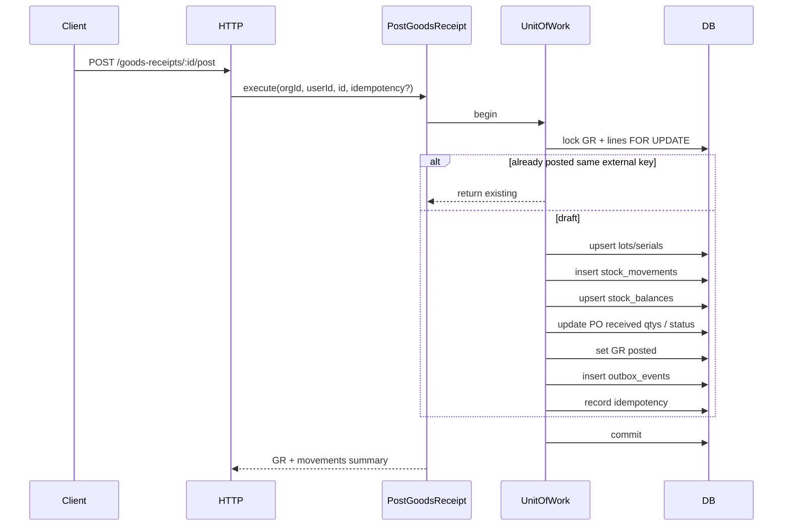

# Phase B1 — PO → Goods Receipt Implementation Plan

> **For agentic workers:** REQUIRED SUB-SKILL: Use `superpowers:subagent-driven-development` (recommended) or `superpowers:executing-plans` to implement this plan task-by-task. Steps use checkbox (`- [ ]`) syntax for tracking.

**Goal:** Ship the first vertical inventory slice — purchase orders, goods receipts (PO-linked or ad-hoc), immutable movements, balances, lots/serials, post/void with UoW + idempotency + outbox enqueue — plus thin web screens.

**Architecture:** Extend Full CA. Domain owns document/stock invariants. Application owns use cases + ports (`UnitOfWork`, document/stock repos, outbox, idempotency). Infrastructure implements Drizzle adapters and a transactional UoW. HTTP stays thin. Web stays page → hook → client. **No FIFO cost layers** (Phase C); GR lines store `unitCost` as data only.

**Tech Stack:** Fastify, TypeScript, Drizzle, PostgreSQL, Zod (`packages/shared`), Vitest, Vite/React + TanStack Query.

**Spec:** `docs/superpowers/specs/2026-07-26-phase-b-design.md`  
**Master:** `docs/superpowers/plans/2026-07-26-phase-b-inventory-loop.md`  
**Wiki:** [[Phase B]] · [[Document-Driven Inventory]] · [[Purchase to Stock]]

## Global Constraints

- Full Clean Architecture — no `apps/api/src/modules/`
- Every tenant table / query includes `org_id`
- Document-driven qty only; immutable movements; void via reverse movements
- Same TX: doc status + movements + balances + outbox (+ idempotency)
- Partial PO receive allowed; over-receive rejected; ad-hoc GR allowed
- Negative stock rejected
- Auth stub headers `X-Org-Id` + `X-User-Id`
- Coding standards: `docs/architecture/coding-standards.md`

---

## Decisions (locked)

| Topic | Choice |
|-------|--------|
| Document storage | Typed tables (`purchase_orders`/`po_lines`, `goods_receipts`/`gr_lines`, …) |
| Posting infra | UoW + idempotency + outbox **enqueue only** (no worker — B3) |
| UI | API + thin web (PO, GR, stock inquiry) |
| Cost | `unitCost` on lines only; no FIFO layers |

## Out of scope (B1)

- Issue, transfer, adjustment, count, returns
- Reservations / availability APIs (B3)
- FIFO layers, journals, outbox consumer
- Approval workflows, FEFO, barcode scanning UX

## Posting flow



## File map

| Path | Responsibility |
|------|----------------|
| `packages/domain/src/entities.ts` | Add Lot, Serial, StockBalance, StockMovement, PO, GR types |
| `packages/domain/src/errors.ts` | ConflictError, InvalidStateError, InsufficientStockError, TrackingRequiredError, OverReceiveError |
| `packages/domain/src/types.ts` | Status / movement enums |
| `packages/domain/src/inventory-rules.ts` | Pure assert helpers |
| `packages/application/src/ports/unit-of-work.ts` | UnitOfWork + UowContext |
| `packages/application/src/ports/inventory.ts` | Stock/lot/serial/outbox/idempotency ports |
| `packages/application/src/use-cases/purchase-order.ts` | PO CRUD + submit/cancel/close |
| `packages/application/src/use-cases/goods-receipt.ts` | GR draft CRUD |
| `packages/application/src/use-cases/post-goods-receipt.ts` | Post |
| `packages/application/src/use-cases/void-goods-receipt.ts` | Void |
| `packages/application/src/use-cases/stock-inquiry.ts` | Balances, movements, lot/serial, low stock |
| `packages/shared/src/inventory.ts` | Zod DTOs |
| `apps/api/src/infrastructure/db/schema/` | New tables / enums |
| `apps/api/src/infrastructure/persistence/*.repository.ts` | Drizzle adapters + UoW |
| `apps/api/src/interfaces/http/{purchase-orders,goods-receipts,stock}.routes.ts` | HTTP |
| `apps/api/src/main/composition-root.ts` | Wire services |
| `apps/web/src/hooks/inventory.ts` | TanStack Query hooks |
| `apps/web/src/api/client.ts` | API methods |
| `apps/web/src/App.tsx` (or split pages) | PO / GR / Stock UI |

Reuse patterns from: `packages/application/src/use-cases/product.ts`, `apps/api/src/main/composition-root.ts`, `apps/api/src/interfaces/http/products.routes.ts`.

---

### Task 1: Domain types, errors, pure rules

**Files:**
- Modify: `packages/domain/src/entities.ts`, `errors.ts`, `types.ts`, `index.ts`
- Create: `packages/domain/src/inventory-rules.ts`
- Test: `packages/domain/src/inventory-rules.test.ts`

**Interfaces:**
- Produces: entity types; `ConflictError` (`CONFLICT`), `InvalidStateError`, `InsufficientStockError`, `TrackingRequiredError`, `OverReceiveError`; `assertCanSubmitPo`, `assertCanPostReceipt`, `assertLotSerialRules`, `assertNoOverReceive`, `signedQtyForMovement`

- [ ] **Step 1: Write failing tests** for tracking required, over-receive, invalid PO submit from cancelled, signed qty for receipt vs void
- [ ] **Step 2: Run** `pnpm --filter @stock-management/domain test` (or root vitest path) — expect FAIL
- [ ] **Step 3: Implement** types, errors, pure helpers
- [ ] **Step 4: Run tests** — expect PASS
- [ ] **Step 5: Commit** `feat(domain): add Phase B1 inventory types and rules`

---

### Task 2: Application ports + post/void use cases (fakes)

**Files:**
- Create: `packages/application/src/ports/unit-of-work.ts`, `ports/inventory.ts`
- Create: use-case files listed above
- Modify: `packages/application/src/index.ts`, `dto/inputs.ts`
- Test: `packages/application/src/use-cases/post-goods-receipt.test.ts`

**Interfaces:**
- Consumes: domain entities/errors/rules
- Produces:

```ts
interface UnitOfWork {
  run<T>(fn: (ctx: UowContext) => Promise<T>): Promise<T>;
}
// UowContext: po, gr, stock, lots, serials, outbox, idempotency (tx-scoped)
```

- [ ] **Step 1: Define ports** (no Drizzle types)
- [ ] **Step 2: Write failing PostGoodsReceipt test** with in-memory UoW fake (post increases balance; second post with same external key returns same; over-receive throws)
- [ ] **Step 3: Implement** `PostGoodsReceipt` + `VoidGoodsReceipt` + PO/GR/Stock inquiry skeletons against ports
- [ ] **Step 4: Tests PASS**
- [ ] **Step 5: Commit** `feat(application): add B1 inventory use cases and ports`

---

### Task 3: Drizzle schema + migration

**Files:**
- Modify: `apps/api/src/infrastructure/db/schema/index.ts` (or split `inventory.ts` + re-export)
- Create: migration under `apps/api/drizzle/` (e.g. `0001_phase_b1.sql`)

**Enums:** `po_status` (`draft`|`submitted`|`partially_received`|`received`|`closed`|`cancelled`), `document_status` (`draft`|`posted`|`void`), `lot_status`, `serial_status`, `movement_type` (`receipt`|`receipt_void`), `outbox_status`.

**Tables:** `lots`, `serials`, `stock_balances`, `stock_movements`, `purchase_orders`, `purchase_order_lines`, `goods_receipts`, `goods_receipt_lines`, `goods_receipt_serials`, `outbox_events`, `idempotency_keys`.

**Balance uniqueness:** unique index on `(org_id, product_id, location_id, coalesce(lot_id, '00000000-0000-0000-0000-000000000000'::uuid))`.

- [ ] **Step 1: Add Drizzle tables/enums**
- [ ] **Step 2: Generate migration** `pnpm --filter api db:generate`
- [ ] **Step 3: Apply** `pnpm --filter api db:migrate`
- [ ] **Step 4: Commit** `feat(api): add Phase B1 inventory schema`

---

### Task 4: DrizzleUnitOfWork + persistence adapters

**Files:**
- Create: `apps/api/src/infrastructure/persistence/unit-of-work.ts`
- Create: `purchase-order.repository.ts`, `goods-receipt.repository.ts`, `stock.repository.ts`, `lot.repository.ts`, `serial.repository.ts`, `outbox.repository.ts`, `idempotency.repository.ts`
- Modify: `composition-root.ts`

**Interfaces:**
- Consumes: application ports
- Produces: `DrizzleUnitOfWork` using `db.transaction`; repos accept `tx` from context

- [ ] **Step 1: Implement UoW** wrapping transaction
- [ ] **Step 2: Implement repos** with org scoping + `FOR UPDATE` on balance/doc rows during post
- [ ] **Step 3: Wire composition root** (use cases may still be unused by HTTP)
- [ ] **Step 4: Smoke** typecheck `pnpm --filter api typecheck`
- [ ] **Step 5: Commit** `feat(api): add B1 UnitOfWork and inventory repositories`

---

### Task 5: Shared Zod + PO HTTP

**Files:**
- Create: `packages/shared/src/inventory.ts`
- Modify: `packages/shared/src/index.ts`, `enums.ts`
- Create: `apps/api/src/interfaces/http/purchase-orders.routes.ts`
- Modify: `apps/api/src/index.ts`, `error-handler.ts` (ConflictError → 409)
- Test: `apps/api/src/**/purchase-orders*.test.ts` (or integration suite)

**HTTP:**
- `GET/POST /api/v1/purchase-orders`
- `GET/PATCH /api/v1/purchase-orders/:id`
- `POST .../submit`, `/cancel`, `/close`

- [ ] **Step 1: Add Zod schemas**
- [ ] **Step 2: Failing route test** create → submit
- [ ] **Step 3: Implement routes + map errors**
- [ ] **Step 4: PASS + commit** `feat(api): purchase order HTTP for B1`

---

### Task 6: GR draft + Post/Void HTTP

**Files:**
- Create: `apps/api/src/interfaces/http/goods-receipts.routes.ts`
- Test: post/void/idempotency/over-receive/tracking integration tests

**HTTP:**
- `GET/POST /api/v1/goods-receipts`
- `GET/PATCH /api/v1/goods-receipts/:id`
- `POST .../post`, `/void`

**Post algorithm (inside UoW):** idempotency → lock draft → validate PO/location/tracking → lots/serials → movements → balances → PO qty/status → GR posted → outbox → idempotency save.

- [ ] **Step 1: Failing tests** for post balance ↑, void balance ↓, idempotent replay, over-receive 400, lot required when `trackLot`
- [ ] **Step 2: Implement GR use cases + routes**
- [ ] **Step 3: PASS**
- [ ] **Step 4: Commit** `feat(api): goods receipt post and void`

---

### Task 7: Stock inquiry HTTP

**Files:**
- Create: `apps/api/src/interfaces/http/stock.routes.ts`
- Test: list balances, low-stock filter, movements, lot/serial inquiry

**HTTP:**
- `GET /api/v1/stock/balances` (optional `lowStock=true`)
- `GET /api/v1/stock/movements`
- `GET /api/v1/stock/lots`
- `GET /api/v1/stock/serials`

- [ ] **Step 1: Failing tests**
- [ ] **Step 2: Implement**
- [ ] **Step 3: Commit** `feat(api): stock inquiry endpoints`

---

### Task 8: Thin web UI

**Files:**
- Modify: `apps/web/src/api/client.ts`, `App.tsx` (or new page modules)
- Create: `apps/web/src/hooks/inventory.ts`

- [ ] **Step 1: API client methods** for PO/GR/stock
- [ ] **Step 2: Hooks**
- [ ] **Step 3: Pages** — PO list/create/submit; GR create (from PO / ad-hoc) with lot/serial/cost; Post/Void; Stock balances + movements
- [ ] **Step 4: Manual smoke** against local API
- [ ] **Step 5: Commit** `feat(web): Phase B1 PO, GR, and stock UI`

---

### Task 9: Wiki + TASKS after B1 ships

**Files:** `wiki/features/Phase B.md`, flows, `wiki/index.md`, `wiki/log.md`, `TASKS.md`

- [ ] **Step 1: Mark B1 done** in TASKS; activate B2 waiting
- [ ] **Step 2: Update wiki** status on [[Phase B]]
- [ ] **Step 3: Append** `wiki/log.md`
- [ ] **Step 4: Commit** `docs: mark Phase B1 complete`

---

## Self-review checklist

- [ ] FEATURES.md B1 rows covered (balances, ledger, lots/serials, PO, GR, low stock, lookups, idempotency, outbox enqueue, document rules)
- [ ] No FIFO / reservations / issue-transfer in this plan
- [ ] Types consistent across tasks (`UnitOfWork`, `PostGoodsReceipt`, movement types)
