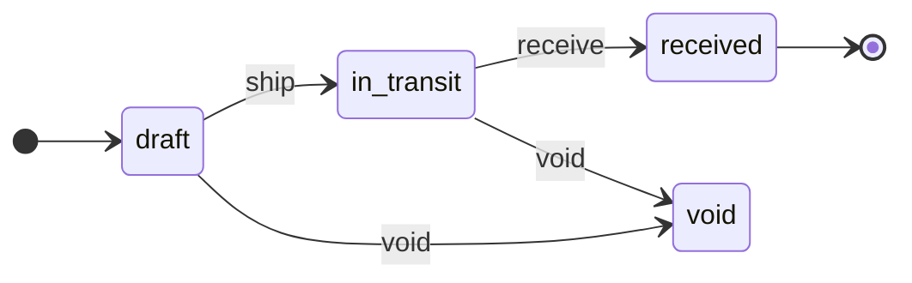
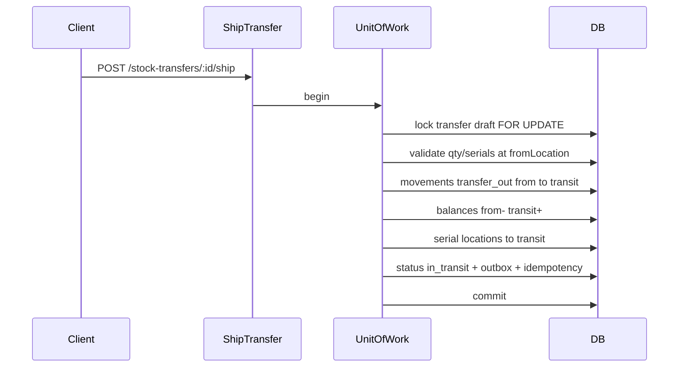

# Phase B2 — Outbound Inventory Documents Implementation Plan

> **For agentic workers:** REQUIRED SUB-SKILL: Use `superpowers:subagent-driven-development` (recommended) or `superpowers:executing-plans` to implement this plan task-by-task. Steps use checkbox (`- [ ]`) syntax for tracking.

**Goal:** Add stock issue, transfer (with explicit in-transit location), adjustment, and stock count — same document-driven posting model as B1.

**Architecture:** Reuse B1 `UnitOfWork`, stock/lot/serial repos, outbox enqueue, idempotency. New typed tables + use cases for issue / transfer ship-receive / adjustment / count. Thin web for all four. **No FIFO.** No returns/reservations (B3).

**Tech Stack:** Fastify, TypeScript, Drizzle, PostgreSQL, Zod, Vitest, Vite/React + TanStack Query.

**Spec:** `docs/superpowers/specs/2026-07-26-phase-b-design.md`  
**Master:** `docs/superpowers/plans/2026-07-26-phase-b-inventory-loop.md`  
**Prerequisite:** B1 complete — `docs/superpowers/plans/2026-07-26-phase-b1-po-goods-receipt.md`  
**Wiki:** [[Phase B]] · [[Document Posting]]

## Global Constraints

- Full Clean Architecture — no `apps/api/src/modules/`
- Org-scoped queries always
- Document-driven qty; immutable movements; void via reverse movements
- Same TX: doc status + movements + balances + outbox (+ idempotency)
- Negative on-hand rejected
- Lot/serial/expiry flags enforced on lines
- Auth stub: `X-Org-Id` + `X-User-Id`
- Coding standards: `docs/architecture/coding-standards.md`

---

## Decisions (locked)

| Topic | Choice |
|-------|--------|
| Transfer shape | Header: `fromLocationId`, `toLocationId`, `transitLocationId` (must be `type=transit`); lines: product / lot / serial / qty only |
| Transfer flow | `draft` → **ship** → `in_transit` → **receive** → `received`; ship and receive are atomic (all lines) |
| In-transit qty | Ship: from → transit; receive: transit → to (real balances, not virtual) |
| Transfer void | Only from `draft` or `in_transit`; **never** after `received` (fix with reverse transfer) |
| Issue classification | `issueType`: `consume` \| `sample` \| `write_off` \| `other` + optional `reasonNote` |
| Adjustment | Header `reasonCode` + `reasonNote`; **signed** line qty (+ increase / − decrease); no approval gate |
| Count | Snapshot `expectedQty` when line added/updated on draft; user enters `countedQty`; post variance = counted − expected; expected visible in UI |
| UI | API + thin web for all four docs |
| Posting infra | Reuse B1 UoW + idempotency + outbox enqueue |

## Out of scope (B2)

- Supplier/customer returns (B3)
- Reservations / availability (B3)
- Outbox poller (B3)
- FIFO consumptions (C)
- Approval workflows (E)
- Blind count mode, partial ship/receive, per-line from/to locations

## Transfer state machine

## Ship / receive flow

Receive mirrors: transit → to; status `received`.

Void `in_transit`: reverse ship movements (transit → from); status `void`.

---

## Schema (migration `0002_phase_b2.sql`)

**Enums (new/extend):**

- `issue_type`: `consume` | `sample` | `write_off` | `other`
- `transfer_status`: `draft` | `in_transit` | `received` | `void`
- Extend `movement_type`: `issue`, `issue_void`, `transfer_out`, `transfer_out_void`, `transfer_in`, `transfer_in_void`, `adjustment`, `adjustment_void`, `count_variance`, `count_variance_void`
- Reuse `document_status` (`draft`|`posted`|`void`) for issue / adjustment / count

**Tables:**

| Table | Role |
|-------|------|
| `stock_issues` | org, branch, locationId, doc_number, issue_type, reason_note, status, posted_at/by, external refs |
| `stock_issue_lines` | product, qty (>0), lot_number nullable, optional po-less |
| `stock_issue_serials` | issue_line_id + serial_number |
| `stock_transfers` | org, from_location_id, to_location_id, transit_location_id, doc_number, status (`transfer_status`), shipped_at/by, received_at/by, external refs |
| `stock_transfer_lines` | product, qty, lot_number nullable |
| `stock_transfer_serials` | transfer_line_id + serial_number |
| `stock_adjustments` | org, branch, location_id, doc_number, reason_code, reason_note, status, posted_at/by, external refs |
| `stock_adjustment_lines` | product, **signed** qty (≠0), lot_number nullable |
| `stock_adjustment_serials` | for serial-tracked products when decreasing (or increasing into stock) |
| `stock_counts` | org, branch, location_id, doc_number, status, posted_at/by |
| `stock_count_lines` | product, lot_number nullable, expected_qty (snapshot), counted_qty |

Branches on issue/adjust/count: derived from `location.branchId` or stored denormalized `branch_id` for query — **locked:** store `branch_id` + `location_id`, validate location belongs to branch.

Quantities: `numeric` / string in TS.

---

## Domain (`packages/domain`)

**Entities:** `StockIssue`, `StockIssueLine`, `StockTransfer`, `StockTransferLine`, `StockAdjustment`, `StockAdjustmentLine`, `StockCount`, `StockCountLine`

**Errors (reuse B1 +):** `InvalidStateError` for bad transfer transitions

**Pure helpers:**

- `assertCanShipTransfer`, `assertCanReceiveTransfer`, `assertCanVoidTransfer`
- `assertCanPostIssue`, `assertCanPostAdjustment`, `assertCanPostCount`
- `countVariance(expected, counted)` → signed delta
- `assertSignedAdjustmentQty(qty)` — non-zero
- Extend lot/serial rules for outbound (serials must be `in_stock` at source location)

---

## Application (`packages/application`)

**Extend `UowContext`** with: `issues`, `transfers`, `adjustments`, `counts` repos.

| Class | Operations |
|-------|------------|
| `StockIssueUseCases` | create/update draft, list, get |
| `PostStockIssue` / `VoidStockIssue` | post / void |
| `StockTransferUseCases` | create/update draft, list, get |
| `ShipStockTransfer` | draft → in_transit |
| `ReceiveStockTransfer` | in_transit → received |
| `VoidStockTransfer` | draft or in_transit → void |
| `StockAdjustmentUseCases` | draft CRUD |
| `PostStockAdjustment` / `VoidStockAdjustment` | post / void |
| `StockCountUseCases` | draft CRUD (snapshot expected on add/refresh line) |
| `PostStockCount` / `VoidStockCount` | post / void |

### Post issue (UoW)

1. Idempotency check
2. Lock draft; validate location/stock/serials
3. Movements `issue` (−qty); balances −; serials → `issued`
4. Status posted; outbox; idempotency

### Ship transfer (UoW)

1. Validate transit location type; from ≠ to; qty available at from
2. `transfer_out` movements from→transit; balances; serials location = transit
3. Status `in_transit`; outbox

### Receive transfer (UoW)

1. Lock `in_transit`; qty at transit
2. `transfer_in` movements transit→to; balances; serials location = to
3. Status `received`; outbox

### Post adjustment (UoW)

1. For each line: apply signed qty; reject if resulting on-hand < 0
2. Movement `adjustment` with signed qty; serial rules if tracked
3. Posted + outbox

### Post count (UoW)

1. Variance = counted − expected (use **snapshotted** expected, not live re-read)
2. If variance ≠ 0: movement `count_variance` with signed variance; update balance
3. If variance = 0: still mark posted (no movement) **or** skip movement — **locked:** no movement when variance is 0
4. Outbox only if any variance or always `document.posted` — **locked:** always enqueue `document.posted`; enqueue `stock.changed` only if any variance ≠ 0

---

## Shared Zod (`packages/shared`)

Enums + create/update/post/ship/receive schemas for all four docs; response schemas.

---

## HTTP

| Method | Path |
|--------|------|
| GET/POST | `/api/v1/stock-issues` |
| GET/PATCH | `/api/v1/stock-issues/:id` |
| POST | `/api/v1/stock-issues/:id/post` |
| POST | `/api/v1/stock-issues/:id/void` |
| GET/POST | `/api/v1/stock-transfers` |
| GET/PATCH | `/api/v1/stock-transfers/:id` |
| POST | `/api/v1/stock-transfers/:id/ship` |
| POST | `/api/v1/stock-transfers/:id/receive` |
| POST | `/api/v1/stock-transfers/:id/void` |
| GET/POST | `/api/v1/stock-adjustments` |
| GET/PATCH | `/api/v1/stock-adjustments/:id` |
| POST | `/api/v1/stock-adjustments/:id/post` |
| POST | `/api/v1/stock-adjustments/:id/void` |
| GET/POST | `/api/v1/stock-counts` |
| GET/PATCH | `/api/v1/stock-counts/:id` |
| POST | `/api/v1/stock-counts/:id/post` |
| POST | `/api/v1/stock-counts/:id/void` |

Register in `apps/api/src/index.ts`; wire in `composition-root.ts`. ConflictError → 409 (existing).

---

## File map

| Path | Responsibility |
|------|----------------|
| `packages/domain/src/inventory-rules.ts` | Transfer/issue/adjust/count asserts |
| `packages/application/src/use-cases/stock-issue.ts` | Draft + re-exports post/void or separate files |
| `packages/application/src/use-cases/post-stock-issue.ts` | Post |
| `packages/application/src/use-cases/void-stock-issue.ts` | Void |
| `packages/application/src/use-cases/stock-transfer.ts` | Draft |
| `packages/application/src/use-cases/ship-stock-transfer.ts` | Ship |
| `packages/application/src/use-cases/receive-stock-transfer.ts` | Receive |
| `packages/application/src/use-cases/void-stock-transfer.ts` | Void |
| `packages/application/src/use-cases/stock-adjustment.ts` | Draft + post/void files |
| `packages/application/src/use-cases/stock-count.ts` | Draft + post/void files |
| `packages/shared/src/inventory.ts` | Extend B1 Zod |
| `apps/api/.../schema` | B2 tables |
| `apps/api/.../persistence/*.repository.ts` | Issue/transfer/adjust/count |
| `apps/api/.../http/stock-issues.routes.ts` | HTTP |
| `apps/api/.../http/stock-transfers.routes.ts` | HTTP |
| `apps/api/.../http/stock-adjustments.routes.ts` | HTTP |
| `apps/api/.../http/stock-counts.routes.ts` | HTTP |
| `apps/web/src/hooks/inventory.ts` | Extend hooks |
| `apps/web` pages | Issue, Transfer, Adjust, Count UI |

---

### Task 1: Domain rules + types

**Files:** `packages/domain` entities, types, errors, `inventory-rules.ts`, tests

- [ ] **Step 1: Failing tests** — ship from non-draft throws; void received throws; variance math; signed adjust rejects 0; issueType enum values
- [ ] **Step 2: Implement**
- [ ] **Step 3: PASS**
- [ ] **Step 4: Commit** `feat(domain): B2 outbound and transfer rules`

---

### Task 2: Application use cases with fakes

**Files:** application use cases + port extensions; `*.test.ts` with in-memory UoW

- [ ] **Step 1: Failing tests** — issue post −balance; void restore; ship from→transit; receive transit→to; void in_transit restores from; adjust ±; count variance movement only when ≠0
- [ ] **Step 2: Implement** use cases
- [ ] **Step 3: PASS**
- [ ] **Step 4: Commit** `feat(application): B2 outbound document use cases`

---

### Task 3: Drizzle schema + migration

- [ ] **Step 1: Tables/enums**
- [ ] **Step 2: `db:generate` + `db:migrate`**
- [ ] **Step 3: Commit** `feat(api): Phase B2 document schema`

---

### Task 4: Persistence adapters

- [ ] **Step 1: Repos** implementing ports inside UoW tx
- [ ] **Step 2: Extend composition root**
- [ ] **Step 3: typecheck**
- [ ] **Step 4: Commit** `feat(api): B2 document repositories`

---

### Task 5: HTTP — stock issues

- [ ] **Step 1: Zod + routes + integration tests** (insufficient stock 400; idempotent post)
- [ ] **Step 2: Commit** `feat(api): stock issue HTTP`

---

### Task 6: HTTP — stock transfers

- [ ] **Step 1: Tests** ship/receive/void; reject void after received; reject ship without transit type
- [ ] **Step 2: Implement routes**
- [ ] **Step 3: Commit** `feat(api): stock transfer ship/receive HTTP`

---

### Task 7: HTTP — adjustments + counts

- [ ] **Step 1: Adjustment tests** (negative beyond on-hand fails)
- [ ] **Step 2: Count tests** (expected snapshot used at post; zero variance → posted, no movement)
- [ ] **Step 3: Implement**
- [ ] **Step 4: Commit** `feat(api): stock adjustment and count HTTP`

---

### Task 8: Thin web

- [ ] **Step 1: Client + hooks**
- [ ] **Step 2: Pages** — Issue (type select); Transfer (from/to/transit + ship/receive actions); Adjust (signed qty); Count (show expected, enter counted)
- [ ] **Step 3: Commit** `feat(web): Phase B2 outbound document UI`

---

### Task 9: Wiki + TASKS

- [ ] **Step 1: Mark B2 done** in TASKS; B3 waiting/active
- [ ] **Step 2: Update** [[Phase B]], [[Document Posting]], `wiki/log.md`
- [ ] **Step 3: Commit** `docs: mark Phase B2 complete`

---

## Self-review checklist

- [ ] FEATURES.md: issue, transfer, adjust, count covered
- [ ] No partial ship; no void-after-received; no blind count
- [ ] Movement type names consistent across domain/schema/HTTP
- [ ] Depends on B1 UoW/stock — no redefinition of balances/lots
