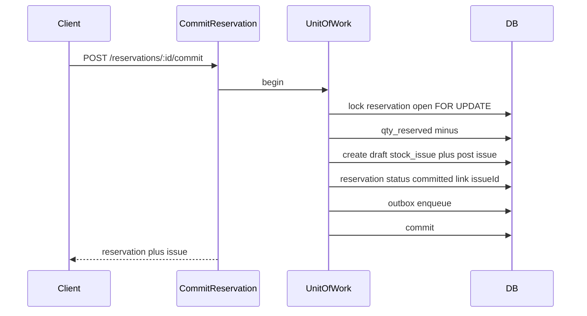

# Phase B3 — Returns, Reservations, Outbox Consumer Implementation Plan

> **For agentic workers:** REQUIRED SUB-SKILL: Use `superpowers:subagent-driven-development` (recommended) or `superpowers:executing-plans` to implement this plan task-by-task. Steps use checkbox (`- [ ]`) syntax for tracking.

**Goal:** Finish Phase B — supplier/customer return documents, reservation + availability APIs (POS stubs), minimal customers API, and an in-process outbox poller that marks events processed (no external webhooks).

**Architecture:** Reuse B1/B2 UoW, stock, lots/serials, outbox enqueue, idempotency, and `PostStockIssue`. Reservations adjust `qty_reserved` under row locks. Commit reservation posts a `stock_issue` in the same UoW. Outbox poller runs inside the API process when enabled.

**Tech Stack:** Fastify, TypeScript, Drizzle, PostgreSQL, Zod, Vitest, Vite/React + TanStack Query.

**Spec:** `docs/superpowers/specs/2026-07-26-phase-b-design.md`  
**Master:** `docs/superpowers/plans/2026-07-26-phase-b-inventory-loop.md`  
**Prerequisites:** B1 + B2 complete  
**Wiki:** [[Phase B]] · [[POS Integration Boundary]]

## Global Constraints

- Full Clean Architecture — no `apps/api/src/modules/`
- Org-scoped queries always
- Document-driven qty; immutable movements; void via reverse
- Same TX for post/void/commit: doc + movements + balances + outbox (+ idempotency)
- No oversell: reserve qty ≤ available at location (and branch availability is sum of location available)
- Auth stub: `X-Org-Id` + `X-User-Id`
- Coding standards: `docs/architecture/coding-standards.md`

---

## Decisions (locked)

| Topic | Choice |
|-------|--------|
| Reservation commit | Same UoW: decrement `qty_reserved` + create/post `stock_issue` (`issueType: other` until Phase F adds `sale`) |
| Reservation release | Decrement `qty_reserved` only; status `released` |
| Reservation expiry | Optional `expiresAt`; expired `open` rows treated as not reserved in availability math; **no** auto-release job |
| Availability | `GET /availability?productId=&branchId=` → `{ onHand, reserved, available }` (sum across branch locations; ignore expired opens) |
| Reserve grain | Requires `productId`, `locationId`, `qty`; optional `lotId` / lot number when tracked |
| Customer return | Always restock into `locationId`; draft → post → void |
| Supplier return | Simple outbound (−on-hand); required `supplierId`; optional nullable `goodsReceiptId` / line links (no qty caps vs GR in B3) |
| Customers | Minimal list + create on existing `customers` table |
| Outbox poller | In-process when `OUTBOX_POLLER_ENABLED=true`; `FOR UPDATE SKIP LOCKED`; mark `processed` or `failed`; **no HTTP webhooks** |
| UI | Thin web: supplier/customer returns; stock page shows reserved + available |

## Out of scope (B3)

- External webhook delivery (E)
- POS checkout UI (F)
- FIFO / COGS (C)
- RMA approval workflow; must-link-to-GR qty caps (D/E)
- Scrap disposition on customer return (use issue `write_off` after restock if needed)
- Reservation expiry worker

---

## Reservation commit flow



---

## Schema (migration `0003_phase_b3.sql`)

**Enums:**

- `reservation_status`: `open` | `committed` | `released`
- Extend `movement_type`: `supplier_return`, `supplier_return_void`, `customer_return`, `customer_return_void`
- Reuse `document_status` for return docs

**Tables:**

| Table | Role |
|-------|------|
| `stock_reservations` | org_id, branch_id, product_id, location_id, lot_id nullable, qty, status, expires_at nullable, external_system/id, committed_issue_id nullable, timestamps |
| `supplier_returns` | org, branch, location_id, supplier_id, doc_number, status, optional goods_receipt_id, posted_at/by, external refs |
| `supplier_return_lines` | product, qty, lot_number nullable, optional goods_receipt_line_id |
| `supplier_return_serials` | line_id + serial |
| `customer_returns` | org, branch, location_id, customer_id, doc_number, status, posted_at/by, external refs |
| `customer_return_lines` | product, qty, lot_number nullable |
| `customer_return_serials` | line_id + serial |

`customers` already exists (Phase A schema) — wire domain/application/HTTP if missing.

**Indexes:** unique idempotency on reservations when external refs present; list open reservations by org/product/location.

---

## Domain (`packages/domain`)

**Entities:** `StockReservation`, `SupplierReturn`, `CustomerReturn`, `Customer`

**Errors:** `InsufficientAvailabilityError` (reserve/oversell); reuse `InvalidStateError`, `InsufficientStockError`

**Pure helpers:**

- `availableQty(onHand, reserved)` → max(0, onHand − reserved)
- `assertCanReserve(available, qty)`
- `assertReservationOpen`, `assertCanCommit`, `assertCanRelease`
- `isReservationExpired(reservation, now)` — `expiresAt != null && expiresAt <= now`
- Return post asserts (mirrors issue / receipt rules)

**Availability math:** when summing reserved for a branch, include only reservations with `status=open` AND not expired.

---

## Application (`packages/application`)

**Extend `UowContext`:** `reservations`, `supplierReturns`, `customerReturns`, `customers` (+ existing `issues` for commit).

| Class | Operations |
|-------|------------|
| `CustomerUseCases` | list, create |
| `ReservationUseCases` | create (reserve), get, list |
| `ReleaseReservation` | release |
| `CommitReservation` | commit → post issue |
| `AvailabilityUseCases` | `getByProductBranch(orgId, productId, branchId)` |
| `SupplierReturnUseCases` | draft CRUD |
| `PostSupplierReturn` / `VoidSupplierReturn` | post / void |
| `CustomerReturnUseCases` | draft CRUD |
| `PostCustomerReturn` / `VoidCustomerReturn` | post / void |

### Create reservation (UoW)

1. Lock balance row(s) for product+location(+lot)
2. Compute available (onHand − reserved), treating expired opens as 0 reserved contribution — **locked:** expired opens should be excluded from reserved sum; optionally leave orphan reserved qty until manual release — **prefer:** on create/availability, sum only non-expired opens so `qty_reserved` column stays in sync by **not counting** expired in available math while column may still hold qty until release — **simpler locked approach:** available uses `balance.qty_reserved` which only changes on create/release/commit; expiry is soft for **new** reserves by also checking open non-expired sum ≤ onHand…  

**Clarify locked implementation for expiry vs qty_reserved:**

- `qty_reserved` on balance is updated only on create (+), release (−), commit (−)
- Soft expiry: `AvailabilityUseCases` and `assertCanReserve` compute `effectiveReserved` = sum of open reservations for that key where not expired (and should match intent). If `balance.qty_reserved` can drift from sum of non-expired opens when some expire, **locked reconciliation:** on reserve/availability, use **sum of non-expired open reservation rows** as `reserved` (source of truth for available); still update `balance.qty_reserved` on create/release/commit to equal that sum after the operation (recompute from open non-expired rows). Expired opens do not block availability and do not need a worker.

### Commit reservation (UoW)

1. Lock reservation `open` and not expired (if expired → `InvalidStateError`, suggest release)
2. Build issue at reservation location/product/lot/qty/serials if any
3. `issueType: other`, `reasonNote: "reservation commit {id}"`
4. Run same path as `PostStockIssue` (or call shared domain service)
5. Decrement reserved via recompute; status `committed`; set `committedIssueId`
6. Outbox

### Post supplier return

Like issue: −on-hand; serials `issued` or status `returned` — **locked:** reuse serial status `issued` for simplicity (or add `returned` in enum — prefer extend `serial_status` with `returned` for clarity)

**Locked:** add `returned` to `serial_status` for supplier returns; customer return sets serials back to `in_stock`.

### Post customer return

Like receipt: +on-hand; create/find lots; serials `in_stock` at location.

---

## Shared Zod

Reservation create/release/commit; availability query/response; supplier/customer return schemas; `CreateCustomerSchema`; env flag documented in `.env.example`: `OUTBOX_POLLER_ENABLED`, `OUTBOX_POLLER_INTERVAL_MS`.

---

## HTTP

| Method | Path |
|--------|------|
| GET/POST | `/api/v1/customers` |
| POST | `/api/v1/reservations` |
| GET | `/api/v1/reservations` / `/api/v1/reservations/:id` |
| POST | `/api/v1/reservations/:id/release` |
| POST | `/api/v1/reservations/:id/commit` |
| GET | `/api/v1/availability` |
| GET/POST | `/api/v1/supplier-returns` |
| GET/PATCH | `/api/v1/supplier-returns/:id` |
| POST | `/api/v1/supplier-returns/:id/post` |
| POST | `/api/v1/supplier-returns/:id/void` |
| GET/POST | `/api/v1/customer-returns` |
| GET/PATCH | `/api/v1/customer-returns/:id` |
| POST | `/api/v1/customer-returns/:id/post` |
| POST | `/api/v1/customer-returns/:id/void` |

---

## Outbox poller

**File:** `apps/api/src/infrastructure/workers/outbox-poller.ts`

```ts
// Pseudo
async function tick(db) {
  await db.transaction(async (tx) => {
    const rows = await tx.execute(
      // SELECT ... FROM outbox_events WHERE status='pending'
      // ORDER BY created_at FOR UPDATE SKIP LOCKED LIMIT batch
    );
    for (const row of rows) {
      // B3: no side effects beyond mark processed
      await markProcessed(tx, row.id);
    }
  });
}
```

Start from `apps/api/src/index.ts` when `OUTBOX_POLLER_ENABLED=true`; clear interval on shutdown.

---

## File map

| Path | Responsibility |
|------|----------------|
| `packages/domain` | Reservation/return/customer types + rules |
| `packages/application/src/use-cases/reservation.ts` | create/list/get |
| `packages/application/src/use-cases/commit-reservation.ts` | commit |
| `packages/application/src/use-cases/release-reservation.ts` | release |
| `packages/application/src/use-cases/availability.ts` | branch availability |
| `packages/application/src/use-cases/supplier-return.ts` | + post/void files |
| `packages/application/src/use-cases/customer-return.ts` | + post/void files |
| `packages/application/src/use-cases/customer.ts` | customers |
| `packages/shared` | Zod |
| `apps/api/.../schema` | B3 tables |
| `apps/api/.../persistence` | reservation, returns, customer repos |
| `apps/api/.../workers/outbox-poller.ts` | poller |
| `apps/api/.../http/*.routes.ts` | customers, reservations, availability, returns |
| `apps/api/src/infrastructure/config/env.ts` | poller env vars |
| `apps/web` | returns UI; stock reserved/available |

---

### Task 1: Domain — reservation + return rules

**Files:** `packages/domain`  
**Test:** availability math, expiry soft-ignore, commit/release state guards

- [ ] **Step 1: Failing tests**
- [ ] **Step 2: Implement**
- [ ] **Step 3: Commit** `feat(domain): reservation and return rules`

---

### Task 2: Application — reservations + availability (fakes)

- [ ] **Step 1: Tests** — reserve ok; oversell throws; release; commit creates issue and reduces on-hand; expired open does not block availability
- [ ] **Step 2: Implement**
- [ ] **Step 3: Commit** `feat(application): reservations and availability`

---

### Task 3: Application — returns + customers (fakes)

- [ ] **Step 1: Tests** — supplier return −stock; customer return +stock; void reverses
- [ ] **Step 2: Implement**
- [ ] **Step 3: Commit** `feat(application): returns and customers`

---

### Task 4: Schema + migration + serial status

- [ ] **Step 1: Tables + `returned` serial status**
- [ ] **Step 2: Migrate**
- [ ] **Step 3: Commit** `feat(api): Phase B3 schema`

---

### Task 5: Persistence + customers HTTP

- [ ] **Step 1: Repos + customer routes**
- [ ] **Step 2: Commit** `feat(api): customers API and B3 repos`

---

### Task 6: HTTP — reservations + availability

- [ ] **Step 1: Integration tests** including concurrent oversell (one wins)
- [ ] **Step 2: Implement routes**
- [ ] **Step 3: Commit** `feat(api): reservations and availability HTTP`

---

### Task 7: HTTP — supplier + customer returns

- [ ] **Step 1: Tests + routes** post/void
- [ ] **Step 2: Commit** `feat(api): supplier and customer returns HTTP`

---

### Task 8: Outbox poller

- [ ] **Step 1: Test** pending → processed
- [ ] **Step 2: Implement worker + env + wire in `index.ts`**
- [ ] **Step 3: Commit** `feat(api): outbox poller`

---

### Task 9: Thin web

- [ ] **Step 1: Client + hooks**
- [ ] **Step 2: Returns pages + stock reserved/available display**
- [ ] **Step 3: Commit** `feat(web): Phase B3 returns and availability UI`

---

### Task 10: Phase B close-out

- [ ] **Step 1: TASKS** — Phase B done; Phase C active/waiting
- [ ] **Step 2: Wiki** — [[Phase B]], [[POS Integration Boundary]], [[Feature Phases]], `log.md`, `index.md`
- [ ] **Step 3: Confirm** `docs/FEATURES.md` Phase B rows covered
- [ ] **Step 4: Commit** `docs: complete Phase B inventory loop plans execution`

---

## Self-review checklist

- [ ] FEATURES.md: returns, reservations, availability, outbox consumer covered
- [ ] Commit → stock_issue path explicit; no direct silent on-hand decrement without issue
- [ ] Availability is branch-scoped; reserve is location-scoped
- [ ] No webhook HTTP; poller marks processed only
- [ ] Expiry soft-ignore without background release job
