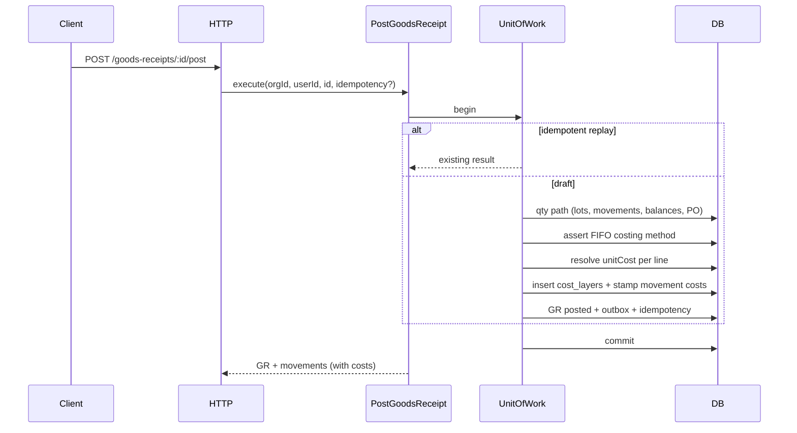

# Phase C1 — Cost Layers on Goods Receipt Implementation Plan

> **For agentic workers:** REQUIRED SUB-SKILL: Use `superpowers:subagent-driven-development` (recommended) or `superpowers:executing-plans` to implement this plan task-by-task. Steps use checkbox (`- [ ]`) syntax for tracking.

**Goal:** Ship the first costing slice — `cost_layers` / `cost_consumptions` schema, domain FIFO helpers + Strategy, `CostingPort` on UoW, goods-receipt post/void creates and closes layers, stamp `unit_cost`/`total_cost` on receipt movements, and product cost-layer inquiry API.

**Architecture:** Extend Full CA. Domain owns FIFO pure math and costing errors. Application owns `CostingPort` + `FifoCostingStrategy` and extends existing GR post/void use cases inside the same UoW. Infrastructure adds Drizzle costing adapter. HTTP stays thin. **No outbound consumption** (C2). **No landed/reval/reports/web** (C3).

**Tech Stack:** Fastify, TypeScript, Drizzle, PostgreSQL, Zod (`packages/shared`), Vitest.

**Spec:** `docs/superpowers/specs/2026-07-26-phase-c-costing-design.md`  
**Master:** `docs/superpowers/plans/2026-07-26-phase-c-fifo-costing.md`  
**Wiki:** [[Phase C]] · [[FIFO Costing]] · [[Document Posting]]

## Global Constraints

- Full Clean Architecture — no `apps/api/src/modules/`
- Every tenant table / query includes `org_id`
- Same TX: doc status + movements + balances + **layers** + outbox (+ idempotency)
- Location-scoped layers: `org + product + location + optional lot`
- FIFO only; reject `costing_method = avg` on GR post
- Auth stub headers `X-Org-Id` + `X-User-Id`
- Coding standards: `docs/architecture/coding-standards.md`
- Money/qty: Phase B `Number()` + string pattern

---

## Decisions (locked for C1)

| Topic | Choice |
|-------|--------|
| Layer create | One layer per GR line movement on post |
| `unitCost` resolve | Line → PO line → else `MissingUnitCostError` |
| Movement stamp | Receipt movement `unit_cost` = layer unit cost; `total_cost` = unit × qty (absolute qty) |
| Void GR | Reject if any sourced layer has `qty_remaining < qty_original`; else set `qty_remaining = 0`; void movement carries reversing total cost |
| Consumptions table | Created in C1 schema (empty until C2); void may insert `is_reversal` rows only if needed — **C1 void closes layers without consumption rows** (create path never consumed yet) |
| Inquiry | `GET /api/v1/stock/cost-layers?productId=&locationId=` |
| UI | No new web screens in C1 (API only); existing GR UI already captures unit cost |
| Cutover | Optional appendix script only; not required for C1 DoD |

## Out of scope (C1)

- Issue / transfer / adjust / count / returns costing (C2)
- Landed cost, revaluation, valuation/COGS reports, cost summary cache, thin cost web (C3)
- Journals (D), webhooks (E)
- Moving average, per-serial cost, reservation layer pinning

## Posting flow (C1)



## File map

| Path | Responsibility |
|------|----------------|
| `packages/domain/src/entities.ts` | `CostLayer`, `CostConsumption`; extend `StockMovement` with optional `unitCost`/`totalCost` |
| `packages/domain/src/errors.ts` | `MissingUnitCostError`, `UnsupportedCostingMethodError`, `InsufficientCostError`, `LayerInUseError` (void blocked) |
| `packages/domain/src/fifo-costing.ts` | Pure helpers: resolve unit cost, assert method, plan layer create, assert layers voidable, close-layer plan |
| `packages/domain/src/fifo-costing.test.ts` | Domain unit tests |
| `packages/application/src/ports/costing.ts` | `CostingPort` |
| `packages/application/src/ports/unit-of-work.ts` | Add `costing: CostingPort` to `UowContext` |
| `packages/application/src/costing/fifo-costing-strategy.ts` | Strategy wrapper calling domain pure functions + port writes |
| `packages/application/src/use-cases/post-goods-receipt.ts` | Hook layer create + movement cost stamp |
| `packages/application/src/use-cases/void-goods-receipt.ts` | Hook layer close + void movement costs |
| `packages/application/src/use-cases/cost-inquiry.ts` | List open layers |
| `packages/application/src/use-cases/post-goods-receipt.test.ts` | Extend fakes for costing |
| `packages/shared/src/inventory.ts` (or `costing.ts`) | Zod for cost-layer response / query |
| `apps/api/src/infrastructure/db/schema/index.ts` | Tables + movement cost columns |
| `apps/api/drizzle/000N_phase_c1.sql` | Migration |
| `apps/api/src/infrastructure/persistence/costing.repository.ts` | Drizzle `CostingPort` |
| `apps/api/src/infrastructure/persistence/unit-of-work.ts` | Wire `costing` |
| `apps/api/src/infrastructure/persistence/stock.repository.ts` | Persist movement `unitCost`/`totalCost` |
| `apps/api/src/interfaces/http/stock.routes.ts` | Cost-layers GET |
| `apps/api/src/main/composition-root.ts` | Wire inquiry use case |

Reuse: existing GR post/void tests and `makeFake` in `post-goods-receipt.test.ts`.

---

### Task 1: Domain types, errors, FIFO pure helpers

**Files:**
- Modify: `packages/domain/src/entities.ts`, `errors.ts`, `index.ts`
- Create: `packages/domain/src/fifo-costing.ts`
- Test: `packages/domain/src/fifo-costing.test.ts`

**Interfaces:**
- Produces:

```ts
export type CostLayer = {
  id: string;
  orgId: string;
  productId: string;
  locationId: string;
  lotId: string | null;
  sourceDocumentType: string;
  sourceDocumentId: string;
  sourceDocumentLineId: string | null;
  sourceMovementId: string;
  receivedAt: Date;
  unitCost: string;
  qtyOriginal: string;
  qtyRemaining: string;
};

export type CostConsumption = {
  id: string;
  orgId: string;
  costLayerId: string;
  movementId: string;
  qty: string;
  unitCost: string;
  totalCost: string;
  isReversal: boolean;
  createdAt: Date;
};

// StockMovement gains:
// unitCost: string | null;
// totalCost: string | null;

function resolveReceiptUnitCost(
  lineUnitCost: string | null | undefined,
  poLineUnitCost: string | null | undefined,
): string; // throws MissingUnitCostError

function assertFifoCostingMethod(method: CostingMethod): void;
// throws UnsupportedCostingMethodError if method !== "fifo"

function planCreateLayer(input: {
  qty: string;
  unitCost: string;
  receivedAt: Date;
  // + ids...
}): { unitCost: string; qtyOriginal: string; qtyRemaining: string; totalCost: string };

function assertLayersFullyOpen(layers: Pick<CostLayer, "qtyOriginal" | "qtyRemaining">[]): void;
// throws LayerInUseError if any qtyRemaining < qtyOriginal

function totalCost(unitCost: string, qty: string): string;
// String(Number(unitCost) * Math.abs(Number(qty))) with fixed formatting consistent with B tests
```

- [ ] **Step 1: Write failing tests**

```ts
import { describe, expect, it } from "vitest";
import {
  assertFifoCostingMethod,
  assertLayersFullyOpen,
  resolveReceiptUnitCost,
  totalCost,
} from "./fifo-costing.js";
import {
  LayerInUseError,
  MissingUnitCostError,
  UnsupportedCostingMethodError,
} from "./errors.js";

describe("resolveReceiptUnitCost", () => {
  it("prefers line unit cost", () => {
    expect(resolveReceiptUnitCost("12.5", "9")).toBe("12.5");
  });
  it("falls back to PO line", () => {
    expect(resolveReceiptUnitCost(null, "9")).toBe("9");
  });
  it("throws when both missing", () => {
    expect(() => resolveReceiptUnitCost(null, null)).toThrow(MissingUnitCostError);
  });
});

describe("assertFifoCostingMethod", () => {
  it("allows fifo", () => {
    expect(() => assertFifoCostingMethod("fifo")).not.toThrow();
  });
  it("rejects avg", () => {
    expect(() => assertFifoCostingMethod("avg")).toThrow(UnsupportedCostingMethodError);
  });
});

describe("assertLayersFullyOpen", () => {
  it("rejects partially consumed layer", () => {
    expect(() =>
      assertLayersFullyOpen([{ qtyOriginal: "10", qtyRemaining: "4" }]),
    ).toThrow(LayerInUseError);
  });
});

describe("totalCost", () => {
  it("multiplies unit cost by abs qty", () => {
    expect(totalCost("10", "3")).toBe("30");
  });
});
```

- [ ] **Step 2: Run** `pnpm --filter @stock-management/domain test` — expect FAIL (module / errors missing)

- [ ] **Step 3: Implement** entities, errors (`code` properties consistent with existing domain errors), `fifo-costing.ts`, export from `index.ts`

- [ ] **Step 4: Run tests** — expect PASS

- [ ] **Step 5: Commit**

```bash
git add packages/domain
git commit -m "$(cat <<'EOF'
feat(domain): add FIFO costing types and pure helpers for Phase C1

EOF
)"
```

---

### Task 2: CostingPort + extend Post/Void GR use cases (fakes)

**Files:**
- Create: `packages/application/src/ports/costing.ts`
- Create: `packages/application/src/costing/fifo-costing-strategy.ts` (optional thin helper; may inline in use case if tiny)
- Modify: `packages/application/src/ports/unit-of-work.ts` — `costing: CostingPort`
- Modify: `packages/application/src/ports/inventory.ts` — `insertMovement` accepts optional `unitCost`/`totalCost`; movement type includes costs
- Modify: `packages/application/src/use-cases/post-goods-receipt.ts`, `void-goods-receipt.ts`
- Create: `packages/application/src/use-cases/cost-inquiry.ts`
- Modify: `packages/application/src/index.ts`
- Test: `packages/application/src/use-cases/post-goods-receipt.test.ts` (extend fake)

**Interfaces:**
- Consumes: domain FIFO helpers / errors
- Produces:

```ts
export type CostLayerKey = {
  orgId: string;
  productId: string;
  locationId: string;
  lotId: string | null;
};

export interface CostingPort {
  insertLayer(
    layer: Omit<CostLayer, "id"> & { id?: string },
  ): Promise<CostLayer>;
  listOpenLayers(
    orgId: string,
    filter: { productId?: string; locationId?: string },
  ): Promise<CostLayer[]>;
  listLayersBySourceDocument(
    orgId: string,
    documentType: string,
    documentId: string,
  ): Promise<CostLayer[]>;
  setQtyRemaining(orgId: string, layerId: string, qtyRemaining: string): Promise<void>;
  // C2 will add: lockOpenLayersFifo, insertConsumption, etc.
}
```

**PostGoodsReceipt costing steps (after qty movement insert per line):**
1. `assertFifoCostingMethod(product.costingMethod)`
2. `unitCost = resolveReceiptUnitCost(line.unitCost, poLine?.unitCost)`
3. `total = totalCost(unitCost, line.qty)`
4. Ensure movement is inserted/updated with `unitCost`/`totalCost` (prefer pass at `insertMovement` time)
5. `ctx.costing.insertLayer({ …, sourceMovementId: movement.id, qtyOriginal: line.qty, qtyRemaining: line.qty, unitCost, receivedAt: now, locationId: receipt.locationId, lotId: line.lotId, … })`

**VoidGoodsReceipt costing steps:**
1. `layers = ctx.costing.listLayersBySourceDocument(orgId, "goods_receipt", receipt.id)`
2. `assertLayersFullyOpen(layers)`
3. For each layer: `setQtyRemaining(…, "0")`
4. Void movements include `unitCost`/`totalCost` matching original receipt movement costs (negate total or use abs with void type — match qty sign convention; store positive unit cost and signed total consistent with movement qty sign)

- [ ] **Step 1: Define `CostingPort` and add `costing` to `UowContext`**

- [ ] **Step 2: Extend `makeFake` with in-memory layers; write failing tests**

```ts
it("creates a cost layer and stamps movement cost on post", async () => {
  const { uow, balances /* expose layers store */ } = makeFake("3");
  const result = await new PostGoodsReceipt(uow).execute("org-1", "user-1", "gr-1");
  expect(result.movements[0].unitCost).toBe("10");
  expect(result.movements[0].totalCost).toBe("30");
  const layers = await uow.run((ctx) =>
    ctx.costing.listOpenLayers("org-1", { productId: "product-1" }),
  );
  expect(layers).toHaveLength(1);
  expect(layers[0].qtyRemaining).toBe("3");
  expect(layers[0].unitCost).toBe("10");
});

it("rejects post when unit cost missing and no PO cost", async () => {
  const { uow } = makeFakeAdHocWithoutCost();
  await expect(
    new PostGoodsReceipt(uow).execute("org-1", "user-1", "gr-1"),
  ).rejects.toBeInstanceOf(MissingUnitCostError);
});

it("rejects post when product costing method is avg", async () => {
  const { uow } = makeFakeWithAvgProduct();
  await expect(
    new PostGoodsReceipt(uow).execute("org-1", "user-1", "gr-1"),
  ).rejects.toBeInstanceOf(UnsupportedCostingMethodError);
});

it("void closes open layers", async () => {
  const { uow } = makeFake("3");
  await new PostGoodsReceipt(uow).execute("org-1", "user-1", "gr-1");
  await new VoidGoodsReceipt(uow).execute("org-1", "user-1", "gr-1");
  const open = await uow.run((ctx) =>
    ctx.costing.listOpenLayers("org-1", { productId: "product-1" }),
  );
  expect(open).toHaveLength(0);
});

it("void rejects when layer partially consumed", async () => {
  const { uow, partiallyConsumeLayer } = makeFake("3");
  await new PostGoodsReceipt(uow).execute("org-1", "user-1", "gr-1");
  partiallyConsumeLayer("gr-line-1", "1"); // test-only helper on fake
  await expect(
    new VoidGoodsReceipt(uow).execute("org-1", "user-1", "gr-1"),
  ).rejects.toBeInstanceOf(LayerInUseError);
});
```

- [ ] **Step 3: Implement post/void hooks + `CostInquiryUseCases.listCostLayers`**

- [ ] **Step 4: Tests PASS** — `pnpm --filter @stock-management/application test`

- [ ] **Step 5: Commit**

```bash
git add packages/application
git commit -m "$(cat <<'EOF'
feat(application): create cost layers on goods receipt post and void

EOF
)"
```

---

### Task 3: Drizzle schema + migration

**Files:**
- Modify: `apps/api/src/infrastructure/db/schema/index.ts`
- Create: migration under `apps/api/drizzle/` (e.g. `0004_phase_c1_cost_layers.sql`)

**Schema:**

```ts
export const costLayers = pgTable(
  "cost_layers",
  {
    id: uuid("id").defaultRandom().primaryKey(),
    orgId: uuid("org_id").notNull().references(() => organizations.id),
    productId: uuid("product_id").notNull().references(() => products.id),
    locationId: uuid("location_id").notNull().references(() => locations.id),
    lotId: uuid("lot_id").references(() => lots.id),
    sourceDocumentType: text("source_document_type").notNull(),
    sourceDocumentId: uuid("source_document_id").notNull(),
    sourceDocumentLineId: uuid("source_document_line_id"),
    sourceMovementId: uuid("source_movement_id")
      .notNull()
      .references(() => stockMovements.id),
    receivedAt: timestamp("received_at", { withTimezone: true }).notNull(),
    unitCost: numeric("unit_cost", { precision: 18, scale: 4 }).notNull(),
    qtyOriginal: numeric("qty_original", { precision: 18, scale: 4 }).notNull(),
    qtyRemaining: numeric("qty_remaining", { precision: 18, scale: 4 }).notNull(),
  },
  (t) => ({
    fifoIdx: index("cost_layers_fifo_idx").on(
      t.orgId,
      t.productId,
      t.locationId,
      t.lotId,
      t.receivedAt,
    ),
  }),
);

export const costConsumptions = pgTable("cost_consumptions", {
  id: uuid("id").defaultRandom().primaryKey(),
  orgId: uuid("org_id").notNull().references(() => organizations.id),
  costLayerId: uuid("cost_layer_id")
    .notNull()
    .references(() => costLayers.id),
  movementId: uuid("movement_id")
    .notNull()
    .references(() => stockMovements.id),
  qty: numeric("qty", { precision: 18, scale: 4 }).notNull(),
  unitCost: numeric("unit_cost", { precision: 18, scale: 4 }).notNull(),
  totalCost: numeric("total_cost", { precision: 18, scale: 4 }).notNull(),
  isReversal: boolean("is_reversal").notNull().default(false),
  createdAt: timestamp("created_at", { withTimezone: true }).notNull().defaultNow(),
});

// stock_movements: add
// unitCost: numeric("unit_cost", { precision: 18, scale: 4 }),
// totalCost: numeric("total_cost", { precision: 18, scale: 4 }),
```

- [ ] **Step 1: Add Drizzle tables/columns**
- [ ] **Step 2: Generate migration** `pnpm --filter api db:generate`
- [ ] **Step 3: Apply** `pnpm --filter api db:migrate`
- [ ] **Step 4: Commit** `feat(api): add Phase C1 cost layer schema`

---

### Task 4: Drizzle CostingPort + UoW + stock movement costs

**Files:**
- Create: `apps/api/src/infrastructure/persistence/costing.repository.ts`
- Modify: `unit-of-work.ts`, `stock.repository.ts`, `composition-root.ts`

**Interfaces:**
- Consumes: `CostingPort`
- Produces: `DrizzleCostingRepository` bound to `tx`

**Lock note (prepare for C2):** `listOpenLayersForUpdate` not required in C1; document that C2 will add `FOR UPDATE` ordered by `received_at, id` after balance locks.

- [ ] **Step 1: Implement costing repository** (org-scoped inserts/lists/`setQtyRemaining`)
- [ ] **Step 2: Extend stock `insertMovement` / mappers for `unitCost`/`totalCost`**
- [ ] **Step 3: Wire `costing` on `DrizzleUnitOfWork` context**
- [ ] **Step 4: `pnpm --filter api typecheck`**
- [ ] **Step 5: Commit** `feat(api): wire CostingPort into UnitOfWork`

---

### Task 5: Shared Zod + cost-layers HTTP + GR post integration coverage

**Files:**
- Modify: `packages/shared/src/inventory.ts` or create `packages/shared/src/costing.ts` + export
- Modify: `apps/api/src/interfaces/http/stock.routes.ts`
- Modify: `apps/api/src/interfaces/http/goods-receipts.routes.ts` error mapping if needed (`MissingUnitCostError` → 400, `UnsupportedCostingMethodError` → 400, `LayerInUseError` → 409)
- Modify: `apps/api/src/interfaces/http/error-handler.ts` (or existing mapper)
- Test: extend `apps/api/src/interfaces/http/goods-receipts.routes.test.ts` and/or `stock.routes.test.ts`

**HTTP:**
- `GET /api/v1/stock/cost-layers?productId=&locationId=`  
  Returns open layers (`qty_remaining > 0`) for org from headers.

**Zod response item:**

```ts
export const costLayerSchema = z.object({
  id: z.string().uuid(),
  productId: z.string().uuid(),
  locationId: z.string().uuid(),
  lotId: z.string().uuid().nullable(),
  receivedAt: z.string().datetime(),
  unitCost: z.string(),
  qtyOriginal: z.string(),
  qtyRemaining: z.string(),
  sourceDocumentType: z.string(),
  sourceDocumentId: z.string().uuid(),
});
```

- [ ] **Step 1: Add Zod schemas**
- [ ] **Step 2: Failing tests** — post GR with unitCost → GET cost-layers returns layer; post without cost → 400; void → layers empty; void after manual partial consume (if test can update layer) → 409
- [ ] **Step 3: Implement route + error mapping**
- [ ] **Step 4: PASS**
- [ ] **Step 5: Commit** `feat(api): stock cost-layers inquiry and GR costing errors`

---

### Task 6: Wiki + TASKS after C1 ships

**Files:** `wiki/features/Phase C.md`, `wiki/concepts/FIFO Costing.md`, `wiki/flows/Document Posting.md`, `wiki/index.md`, `wiki/log.md`, `TASKS.md`

> Note: **Planning Pass 1** already updates wiki to “C1 plan ready.” This task runs when **implementation** of C1 completes.

- [ ] **Step 1: Mark C1 done** in TASKS; activate C2 waiting (deep plan still pending until Pass 2)
- [ ] **Step 2: Update [[Phase C]] / [[FIFO Costing]] with C1 shipped notes
- [ ] **Step 3: Append** `wiki/log.md`
- [ ] **Step 4: Commit** `docs: mark Phase C1 complete`

---

## Appendix: optional cutover script (not DoD)

Dev-only script: for each posted GR line with `unit_cost` and no `cost_layers` row for that line, insert a layer using the receipt movement id. Skip if movement costs null and inventing cost would be wrong. Document in script header: demo/dev only.

---

## Self-review checklist

- [ ] FEATURES.md C1 rows: FIFO create path, inbound movement cost, product cost inquiry
- [ ] No outbound consume / landed / reval / reports / cost web in this plan
- [ ] Types consistent: `CostingPort`, `CostLayer`, movement `unitCost`/`totalCost`
- [ ] Void gate `LayerInUseError` matches design
- [ ] `avg` rejected on post
- [ ] Spec + master links correct
