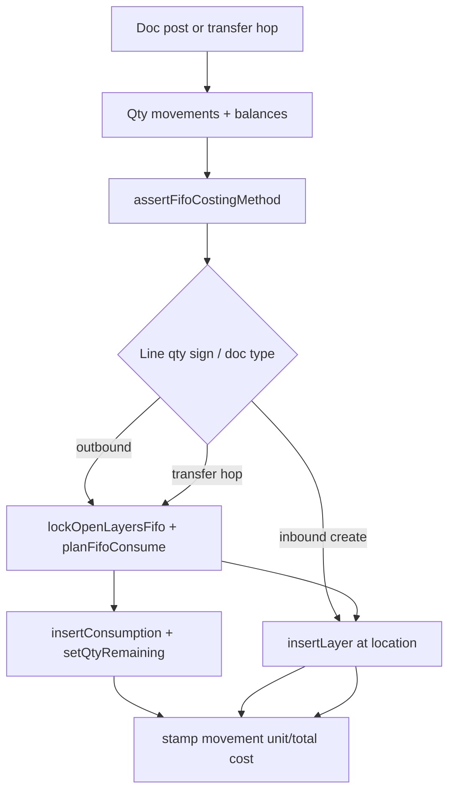

# Phase C2 — FIFO Consumption on Inventory Documents Implementation Plan

> **For agentic workers:** REQUIRED SUB-SKILL: Use `superpowers:subagent-driven-development` (recommended) or `superpowers:executing-plans` to implement this plan task-by-task. Steps use checkbox (`- [ ]`) syntax for tracking.

**Prerequisite:** Phase **C1 implemented** (cost layers schema, `CostingPort` on UoW, GR create/void layers, movement cost columns, domain FIFO helpers). Do not start C2 code until C1 DoD is met.

**Goal:** Hook FIFO consume/create into every remaining inventory document post/void (and transfer ship/receive) so qty and cost stay in the same UoW. Stamp outbound movement `unit_cost`/`total_cost`. Add `unitCost` on lines that create layers (positive adjust, positive count variance, customer return).

**Architecture:** Extend C1 `CostingPort` + domain `planFifoConsume` / restore helpers. Introduce a small application costing applicator used by all doc use cases (avoid copy-paste). Transfer moves layers via transit location. **No** landed/reval/reports/web dashboards (C3). Minimal API/Zod (+ thin web fields where those docs already have UI) for new `unitCost` inputs only.

**Tech Stack:** Fastify, TypeScript, Drizzle, PostgreSQL, Zod, Vitest, Vite/React (minimal line field only).

**Spec:** `docs/superpowers/specs/2026-07-26-phase-c-costing-design.md`  
**Master:** `docs/superpowers/plans/2026-07-26-phase-c-fifo-costing.md`  
**Prior:** `docs/superpowers/plans/2026-07-26-phase-c1-cost-layers-receipt.md`  
**Wiki:** [[Phase C]] · [[FIFO Costing]] · [[Document Posting]]

## Global Constraints

- Full Clean Architecture — no `apps/api/src/modules/`
- Org-scoped; same TX: doc + movements + balances + layers/consumptions + outbox (+ idempotency)
- Location-scoped FIFO; lock balances first, then layers `ORDER BY received_at, id FOR UPDATE`
- FIFO only; `avg` → `UnsupportedCostingMethodError` on cost-affecting posts
- Auth stub `X-Org-Id` / `X-User-Id`
- Coding standards: `docs/architecture/coding-standards.md`

---

## Decisions (locked for C2)

| Topic | Choice |
|-------|--------|
| Shared applicator | `packages/application/src/costing/apply-document-costing.ts` — `consumeFifoForMovement`, `createLayerForMovement`, `moveLayersForTransferHop`, `restoreConsumptionsForVoidedMovements` |
| Outbound consume | Issue, supplier return, adjust qty &lt; 0, count variance &lt; 0 |
| Inbound create | Adjust qty &gt; 0, count variance &gt; 0, customer return — **require line `unitCost`** |
| Zero variance count line | No cost side effect |
| Supplier return + `goodsReceiptLineId` | Prefer open layers with matching `source_document_line_id`; if insufficient, fall back to FIFO at location |
| Transfer ship | For each line: FIFO consume at `fromLocation` against `transfer_out` movement; create layers at `transitLocation` with same `unit_cost` + preserved `received_at`; stamp both out/in movements with same total cost |
| Transfer receive | Consume at transit against `transfer_out` from transit; create at `toLocation` (preserve `received_at`/`unit_cost`); stamp movements |
| Transfer ≠ COGS | Costs move with stock; reports in C3 exclude transfer movement types |
| Movement stamp (outbound) | If single layer: that `unit_cost`. If multi: weighted average `totalCost/qty` as string via `Number()`; always set `total_cost` = sum of consumption totals |
| Void outbound | Load consumptions for forward movements of this doc; restore `qty_remaining`; insert `is_reversal` consumption rows linked to void movements; stamp void movement costs |
| Void inbound create | Same as C1 GR: `assertLayersFullyOpen` then close layers (`qty_remaining = 0`) |
| Void transfer | Only while `draft`/`in_transit` (existing B2 rules); restore ship (and receive if any) cost side effects in reverse |
| Reservation commit | Uses `postStockIssueInCtx` — inherits issue costing automatically |
| Insufficient open layer qty | `InsufficientCostError` (should align with on-hand; treat as hard fail) |
| UI | Add `unitCost` input on existing adjust / count / customer-return web forms; no new cost report pages |

## Out of scope (C2)

- Landed cost, revaluation, valuation/COGS reports, cost summary cache, cost dashboard web (C3)
- Journals (D), webhooks (E)
- Changing GR costing (already C1)
- Moving average / serial cost / reservation layer pinning

## Consume / create flow



## File map

| Path | Responsibility |
|------|----------------|
| `packages/domain/src/fifo-costing.ts` | `planFifoConsume`, `sumConsumptionTotals`, `weightedUnitCost`, restore planning helpers |
| `packages/domain/src/fifo-costing.test.ts` | Pure consume order / insufficient / multi-layer tests |
| `packages/application/src/ports/costing.ts` | Extend port: lock, consumptions, list by movement / by source line |
| `packages/application/src/costing/apply-document-costing.ts` | Shared applicator |
| `packages/application/src/use-cases/stock-issue.ts` | Hook post + void (+ `postStockIssueInCtx`) |
| `packages/application/src/use-cases/stock-transfer.ts` | Hook ship / receive / void via `applyMovement` / `moveTransferLines` |
| `packages/application/src/use-cases/stock-adjustment.ts` | Hook post/void; require `unitCost` on + lines |
| `packages/application/src/use-cases/stock-count.ts` | Hook post/void; require `unitCost` when variance &gt; 0 |
| `packages/application/src/use-cases/supplier-return.ts` | Hook post/void; prefer GR-line layers |
| `packages/application/src/use-cases/customer-return.ts` | Hook post/void; require `unitCost` |
| `packages/application/src/dto/inputs.ts` | `unitCost?` on adjust/count/customer-return line inputs |
| `packages/shared/src/inventory.ts` | Zod `unitCost` on create/update schemas for those docs |
| `apps/api/.../schema/index.ts` + migration | `unit_cost` on `stock_adjustment_lines`, `stock_count_lines`, `customer_return_lines` |
| `apps/api/.../persistence/costing.repository.ts` | Implement new port methods + `FOR UPDATE` |
| `apps/api/.../interfaces/http/*.routes.ts` | Error mapping; pass `unitCost` |
| `apps/web` adjust/count/customer-return forms | `unitCost` field when creating inbound value |
| Tests | Extend `outbound-documents.test.ts`, `returns-customers.test.ts`, route tests |

---

### Task 1: Domain FIFO consume / restore pure functions

**Files:**
- Modify: `packages/domain/src/fifo-costing.ts`
- Test: `packages/domain/src/fifo-costing.test.ts`

**Interfaces:**
- Consumes: `CostLayer`, `InsufficientCostError` (C1)
- Produces:

```ts
export type FifoConsumeSlice = {
  layerId: string;
  qty: string;       // positive qty taken from layer
  unitCost: string;
  totalCost: string;
  receivedAt: Date;  // preserved for transfer recreate
};

export type FifoConsumePlan = {
  slices: FifoConsumeSlice[];
  totalCost: string;
  unitCost: string; // weighted if multi-slice
};

/** layers must already be sorted oldest receivedAt, id ascending */
export function planFifoConsume(
  openLayers: ReadonlyArray<Pick<CostLayer, "id" | "qtyRemaining" | "unitCost" | "receivedAt">>,
  qtyNeeded: string, // positive
): FifoConsumePlan; // throws InsufficientCostError

export function planPreferSourceLineThenFifo(
  preferred: typeof openLayers,
  fallbackFifoSorted: typeof openLayers,
  qtyNeeded: string,
): FifoConsumePlan;

export function weightedUnitCost(totalCost: string, qty: string): string;
```

- [ ] **Step 1: Write failing tests**

```ts
it("consumes oldest layer first", () => {
  const plan = planFifoConsume(
    [
      { id: "a", qtyRemaining: "2", unitCost: "10", receivedAt: new Date("2026-01-01") },
      { id: "b", qtyRemaining: "5", unitCost: "12", receivedAt: new Date("2026-01-02") },
    ],
    "3",
  );
  expect(plan.slices).toEqual([
    expect.objectContaining({ layerId: "a", qty: "2", unitCost: "10", totalCost: "20" }),
    expect.objectContaining({ layerId: "b", qty: "1", unitCost: "12", totalCost: "12" }),
  ]);
  expect(plan.totalCost).toBe("32");
  expect(plan.unitCost).toBe(weightedUnitCost("32", "3"));
});

it("throws InsufficientCostError when layers short", () => {
  expect(() =>
    planFifoConsume(
      [{ id: "a", qtyRemaining: "1", unitCost: "10", receivedAt: new Date() }],
      "2",
    ),
  ).toThrow(InsufficientCostError);
});

it("prefers source-line layers then FIFO", () => {
  const plan = planPreferSourceLineThenFifo(
    [{ id: "pref", qtyRemaining: "1", unitCost: "8", receivedAt: new Date("2026-01-03") }],
    [
      { id: "old", qtyRemaining: "9", unitCost: "10", receivedAt: new Date("2026-01-01") },
      { id: "pref", qtyRemaining: "1", unitCost: "8", receivedAt: new Date("2026-01-03") },
    ],
    "2",
  );
  expect(plan.slices[0].layerId).toBe("pref");
  expect(plan.slices[1].layerId).toBe("old");
});
```

- [ ] **Step 2: Run domain tests — expect FAIL**
- [ ] **Step 3: Implement**
- [ ] **Step 4: PASS**
- [ ] **Step 5: Commit** `feat(domain): add FIFO consume planning helpers for Phase C2`

---

### Task 2: Extend CostingPort + shared applicator (fakes)

**Files:**
- Modify: `packages/application/src/ports/costing.ts`
- Create: `packages/application/src/costing/apply-document-costing.ts`
- Test: `packages/application/src/costing/apply-document-costing.test.ts` (fake port)

**Interfaces:**
- Extends C1 `CostingPort`:

```ts
export interface CostingPort {
  // C1 methods...
  lockOpenLayersFifo(
    key: CostLayerKey, // orgId, productId, locationId, lotId
  ): Promise<CostLayer[]>; // FOR UPDATE, qty_remaining > 0, order received_at, id

  listOpenLayersBySourceLine(
    orgId: string,
    sourceDocumentLineId: string,
  ): Promise<CostLayer[]>;

  insertConsumption(input: Omit<CostConsumption, "id" | "createdAt"> & { id?: string }): Promise<CostConsumption>;

  listConsumptionsByMovementIds(
    orgId: string,
    movementIds: string[],
  ): Promise<CostConsumption[]>;

  // setQtyRemaining already from C1
}
```

**Applicator signatures:**

```ts
export async function consumeFifoForMovement(
  ctx: Pick<UowContext, "costing" | "products">,
  args: {
    orgId: string;
    productId: string;
    locationId: string;
    lotId: string | null;
    qty: string; // positive abs qty to consume
    movementId: string;
    preferSourceDocumentLineId?: string | null;
  },
): Promise<{ unitCost: string; totalCost: string }>;

export async function createLayerForMovement(
  ctx: Pick<UowContext, "costing" | "products">,
  args: {
    orgId: string;
    productId: string;
    locationId: string;
    lotId: string | null;
    qty: string;
    unitCost: string;
    movementId: string;
    sourceDocumentType: string;
    sourceDocumentId: string;
    sourceDocumentLineId: string | null;
    receivedAt?: Date; // default now; transfer passes preserved
  },
): Promise<{ unitCost: string; totalCost: string }>;

export async function moveLayersForTransferHop(
  ctx: Pick<UowContext, "costing" | "products">,
  args: {
    orgId: string;
    productId: string;
    lotId: string | null;
    qty: string;
    fromLocationId: string;
    toLocationId: string;
    outMovementId: string;
    inMovementId: string;
    sourceDocumentType: "stock_transfer";
    sourceDocumentId: string;
    sourceDocumentLineId: string | null;
  },
): Promise<{ unitCost: string; totalCost: string }>;
// implement as: consume at from (stamp out) → createLayer at to per slice preserving receivedAt/unitCost (stamp in)

export async function restoreConsumptionsForVoidedMovements(
  ctx: Pick<UowContext, "costing">,
  args: {
    orgId: string;
    forwardMovementIds: string[];
    voidMovementIdByForwardId: Map<string, string>;
  },
): Promise<void>;
// for each consumption on forward movement: setQtyRemaining(+qty), insertConsumption is_reversal on void movement
```

- [ ] **Step 1: Extend port types**
- [ ] **Step 2: Failing applicator tests** with in-memory fake (multi-layer consume updates remaining; transfer preserves `receivedAt`; void restore)
- [ ] **Step 3: Implement applicator**
- [ ] **Step 4: PASS**
- [ ] **Step 5: Commit** `feat(application): add document costing applicator for C2`

---

### Task 3: Schema — `unit_cost` on inbound-create lines

**Files:**
- Modify: `apps/api/src/infrastructure/db/schema/index.ts`
- Migration: `apps/api/drizzle/000N_phase_c2_line_unit_cost.sql`
- Domain entities: `StockAdjustmentLine`, count line type, `CustomerReturnLine` — add `unitCost: string | null`
- Shared Zod + DTO inputs
- Persistence mappers for adjust/count/customer-return repos

- [ ] **Step 1: Add nullable `unit_cost` columns** (required at **post** time when creating layers, not necessarily at draft create)
- [ ] **Step 2: Generate + migrate**
- [ ] **Step 3: Thread through domain/shared/repos**
- [ ] **Step 4: Commit** `feat(api): add unit_cost on adjust, count, and customer-return lines`

---

### Task 4: Hook issue + supplier return (+ reservation commit path)

**Files:**
- Modify: `stock-issue.ts`, `supplier-return.ts`
- Test: extend `outbound-documents.test.ts`, `returns-customers.test.ts`

**Post issue / supplier return (per line, after qty movement):**
1. `assertFifoCostingMethod`
2. `costs = await consumeFifoForMovement(..., preferSourceDocumentLineId: supplierReturnLine.goodsReceiptLineId)`
3. Ensure movement row has `unitCost`/`totalCost` (update insert call or `stock.updateMovementCosts` if insert already happened — **prefer pass costs into `insertMovement`** by restructuring to compute cost before insert, or insert then patch; **lock: compute plan first with locks, then insertMovement with costs, then write consumptions**)

**Recommended order inside UoW for outbound line:**
1. Lock balance (existing)
2. `lockOpenLayersFifo` / prefer source line
3. `planFifoConsume`
4. `insertMovement` with costs
5. `setBalance`
6. Apply `setQtyRemaining` + `insertConsumption` per slice

**Void:** after creating void movements, `restoreConsumptionsForVoidedMovements`.

- [ ] **Step 1: Failing tests** — two GR layers then issue 3 units → costs 32 example; void restores open qty; supplier return prefers GR line layer
- [ ] **Step 2: Implement**
- [ ] **Step 3: PASS**
- [ ] **Step 4: Commit** `feat(application): FIFO consume on stock issue and supplier return`

---

### Task 5: Hook adjustment + count

**Files:**
- Modify: `stock-adjustment.ts`, `stock-count.ts`
- Tests in `outbound-documents.test.ts`

**Per line:**
- `qty > 0` or variance `> 0`: require `unitCost` (`MissingUnitCostError`) → `createLayerForMovement`
- `qty < 0` or variance `< 0`: `consumeFifoForMovement` with `abs(qty)`
- `qty === 0` / variance `0`: skip

**Void:** inbound-created layers → `assertLayersFullyOpen` + close; outbound consumptions → restore.

- [ ] **Step 1: Failing tests** for +adjust create layer, −adjust consume, count up/down, missing unitCost on + line
- [ ] **Step 2: Implement**
- [ ] **Step 3: PASS + commit** `feat(application): cost layers on adjustment and count post`

---

### Task 6: Hook customer return

**Files:**
- Modify: `customer-return.ts`
- Test: `returns-customers.test.ts`

- Post: require `unitCost` → `createLayerForMovement` at return location
- Void: close layers if fully open else `LayerInUseError`

- [ ] **Step 1–4:** TDD + commit `feat(application): create cost layers on customer return`

---

### Task 7: Hook transfer ship / receive / void

**Files:**
- Modify: `stock-transfer.ts` (`applyMovement` / `moveTransferLines`)
- Test: extend transfer cases in `outbound-documents.test.ts`

**Ship line:** `moveLayersForTransferHop` from → transit using the paired out/in movement ids from existing qty logic.

**Receive line:** hop transit → to.

**Void in_transit:** restore consumptions for ship movements; close/remove transit layers created on ship (if receive not done, transit layers should still be fully open — `assertLayersFullyOpen` then `qty_remaining = 0`, and restore from-location via reversing consumptions).

Concrete void ship algorithm:
1. List ship `transfer_out` movements at from-location
2. `restoreConsumptionsForVoidedMovements` (restores from-location layers)
3. List layers sourced by this transfer at transit → `assertLayersFullyOpen` → set `qty_remaining = 0`
4. Stamp void movements with costs

- [ ] **Step 1: Failing tests** — ship preserves total value at transit; receive moves value to to-location; void ship restores from layers and clears transit layers
- [ ] **Step 2: Implement**
- [ ] **Step 3: PASS + commit** `feat(application): move FIFO layers through transfer transit`

---

### Task 8: Drizzle port methods + HTTP/Zod/errors + thin form fields

**Files:**
- `costing.repository.ts` — `lockOpenLayersFifo` (`SELECT … FOR UPDATE`), consumptions CRUD/list
- HTTP routes + error handler for `InsufficientCostError` → 409/400 (match `InsufficientStockError` mapping)
- Shared Zod `unitCost` on adjust/count/customer-return write schemas
- Web: existing pages for those docs — show unit cost when line increases stock

- [ ] **Step 1: Implement repo lock + consumptions**
- [ ] **Step 2: Route/integration tests** for issue post with costs; adjust + without unitCost → 400
- [ ] **Step 3: Minimal web fields**
- [ ] **Step 4: `pnpm typecheck` + targeted tests PASS**
- [ ] **Step 5: Commit** `feat(api): C2 costing persistence and unitCost on inbound lines`

---

### Task 9: Wiki + TASKS after C2 ships

**Files:** `wiki/features/Phase C.md`, `wiki/concepts/FIFO Costing.md`, `wiki/log.md`, `TASKS.md`

> Planning Pass 2 updates wiki to “C2 plan ready.” This task runs when **implementation** completes.

- [ ] Mark C2 done; C3 waiting (deep plan pending until Pass 3)
- [ ] Append log
- [ ] Commit `docs: mark Phase C2 complete`

---

## Self-review checklist

- [ ] FEATURES: cost on outbound movements; FIFO consume path for all qty docs
- [ ] Transfer preserves `unit_cost` + `received_at`; not treated as COGS
- [ ] Supplier return prefers `goods_receipt_line_id` layers
- [ ] `unitCost` required on +adjust / +count / customer return
- [ ] Reservation commit covered via `postStockIssueInCtx`
- [ ] No landed/reval/reports (C3)
- [ ] Depends on C1 types: `CostingPort`, `CostLayer`, movement costs
- [ ] Lock order documented and implemented in repository
