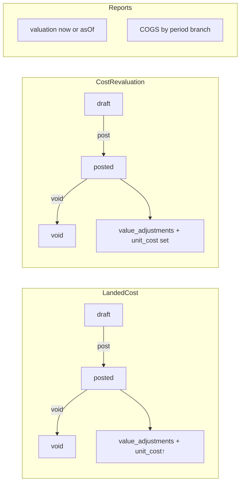

# Phase C3 — Landed Cost, Revaluation, Reports & Web Implementation Plan

> **For agentic workers:** REQUIRED SUB-SKILL: Use `superpowers:subagent-driven-development` (recommended) or `superpowers:executing-plans` to implement this plan task-by-task. Steps use checkbox (`- [ ]`) syntax for tracking.

**Prerequisite:** Phase **C1** and **C2** implemented (layers, consumptions, all doc costing, transfer hops, movement costs). Do not start C3 code until C2 DoD is met.

**Goal:** Finish Phase C — landed-cost documents, cost revaluations/write-downs, `cost_layer_value_adjustments` audit, current + **as-of** valuation, COGS by period/branch, `product_cost_summaries` cache, Phase-D-ready outbox cost fields, and thin web for cost inquiry / valuation / COGS / landed / reval.

**Architecture:** Full CA verticals for two new document types; pure domain for allocation + as-of reconstruction; report use cases read via ports (no SQL in HTTP). Upsert cost summary inside the same costing writes (extend C2 applicator or dedicated `refreshCostSummary`). Thin web: page → hook → API client only.

**Tech Stack:** Fastify, TypeScript, Drizzle, PostgreSQL, Zod, Vitest, Vite/React + TanStack Query.

**Spec:** `docs/superpowers/specs/2026-07-26-phase-c-costing-design.md`  
**Master:** `docs/superpowers/plans/2026-07-26-phase-c-fifo-costing.md`  
**Prior:** C1 `…phase-c1-cost-layers-receipt.md` · C2 `…phase-c2-fifo-consumption.md`  
**Wiki:** [[Phase C]] · [[FIFO Costing]] · [[Inventory Accounting]] (boundary only)

## Global Constraints

- Full Clean Architecture — no `apps/api/src/modules/`
- Org-scoped; document draft → post → void
- Landed/reval post in UoW: doc status + layer `unit_cost` updates + `cost_layer_value_adjustments` + cost summary upsert + outbox (+ idempotency)
- **No qty movements** on landed/reval (value only)
- Landed/reval only touch layers with `qty_remaining > 0`
- Auth stub `X-Org-Id` / `X-User-Id`
- Coding standards: `docs/architecture/coding-standards.md`
- **No GL journals** (Phase D) — only enrich outbox payloads

---

## Decisions (locked for C3)

| Topic | Choice |
|-------|--------|
| Landed cost doc | Header: `branchId`, optional `supplierId`, `currency` default org, `totalAmount`, `costType` (`freight`\|`duty`\|`other`), status draft/posted/void; lines: `goodsReceiptLineId` **or** `costLayerId`, `amount` (allocation share) |
| Landed allocation | Sum of line `amount` must equal header `totalAmount` on post. Each line targets an **open** layer (resolve GR line → open layers for that source line; if multiple, allocate proportional to `qty_remaining`). New `unit_cost = (qty_remaining * old_unit + amount) / qty_remaining` |
| Revaluation doc | Header: `branchId`, `reasonCode`, `reasonNote`; lines: `costLayerId`, `newUnitCost` (must be ≥ 0). Post sets layer `unit_cost` |
| Value adjustments | Immutable `cost_layer_value_adjustments`: `layer_id`, `effective_at`, `old_unit_cost`, `new_unit_cost`, `amount` (landed: allocated amount; reval: value delta = qty_remaining * (new−old)), `source_document_type`, `source_document_id`, `source_document_line_id` |
| Void landed/reval | Only if no **later** value adjustment exists on those layers; reverse by writing compensating adjustment back to pre-post unit costs and restore (or set) layer `unit_cost`; mark doc void. If later adjustments exist → `LayerInUseError` / conflict |
| Valuation now | `Σ qty_remaining × unit_cost` grouped by branch/location/product/lot filters |
| Valuation as-of | For each layer with `received_at ≤ asOf`: `qtyAt = qty_original − netConsumed(≤ asOf)` where netConsumed = sum(consumption qty) − sum(reversal qty) with `created_at ≤ asOf`. `unitCostAt` = last adjustment with `effective_at ≤ asOf`’s `new_unit_cost`, else the unit cost implied by layer creation (store `original_unit_cost` on `cost_layers` in C3 migration — copy current `unit_cost` for existing rows). Value = `qtyAt × unitCostAt` (skip if qtyAt ≤ 0) |
| COGS report | Sum `stock_movements.total_cost` where `movement_type` in (`issue`,`supplier_return`,`adjustment` with negative qty, `count_variance` with negative qty) and `created_at` in range; join location → branch; **exclude** transfer_* types and voids’ forward types (include only non-void forward movements — void rows are separate types; sum absolute COGS from forward outbound only, do not double-count voids as negative COGS in v1 — **lock: report posted outbound COGS only; voided docs’ forward movements remain in DB but filter `document status = posted` via join or exclude if doc void**). Practical lock: sum movements whose document is still `posted` (not void) |
| Cost summary cache | `product_cost_summaries` unique `(org_id, product_id, location_id, coalesce(lot_id, zero-uuid))`: `qty_remaining_sum`, `on_hand_value`, `updated_at`. Refresh on every layer create/consume/close/unit-cost change |
| Outbox enrichment | Add to payloads when present: `inventoryValueDelta`, `cogsTotal` (outbound posts), `landedAmount` / `revaluationValueDelta` |
| UI | Thin pages: Cost layers inquiry (enhance Stock), Valuation report, COGS report, Landed costs, Revaluations |
| Idempotency | Optional external keys on landed/reval post |

## Out of scope (C3)

- GL journals / AP / 3-way match (D)
- Webhook HTTP (E)
- Moving average, per-serial cost, reservation layer pinning
- Snapshot table for as-of (reconstruction only)
- Multi-currency conversion math beyond storing amounts in org currency

## Document flows



## File map

| Path | Responsibility |
|------|----------------|
| `packages/domain/src/entities.ts` | `LandedCostDocument`, lines, `CostRevaluation`, lines, `CostLayerValueAdjustment`; add `originalUnitCost` on `CostLayer` |
| `packages/domain/src/fifo-costing.ts` or `valuation.ts` | `allocateLandedToLayer`, `planRevaluation`, `qtyRemainingAt`, `unitCostAt`, `valueAt` |
| `packages/domain/src/errors.ts` | `AllocationMismatchError`, extend as needed |
| `packages/application/src/ports/costing.ts` | Adjustments, summaries, list layers for valuation |
| `packages/application/src/ports/landed-cost.ts` / `revaluation.ts` | Doc ports (or fold into inventory ports file) |
| `packages/application/src/ports/unit-of-work.ts` | `landedCosts`, `revaluations` on context |
| `packages/application/src/use-cases/landed-cost.ts` | CRUD + post/void |
| `packages/application/src/use-cases/cost-revaluation.ts` | CRUD + post/void |
| `packages/application/src/use-cases/valuation-report.ts` | Current + as-of |
| `packages/application/src/use-cases/cogs-report.ts` | Period/branch |
| `packages/application/src/costing/refresh-cost-summary.ts` | Upsert helper; call from applicator + landed/reval |
| `packages/shared/src/costing.ts` | Zod DTOs |
| `apps/api/.../schema/index.ts` + migration | New tables + `original_unit_cost` |
| `apps/api/.../persistence/*.ts` | Repos + UoW wire |
| `apps/api/.../interfaces/http/landed-costs.routes.ts` | REST |
| `apps/api/.../interfaces/http/cost-revaluations.routes.ts` | REST |
| `apps/api/.../interfaces/http/cost-reports.routes.ts` | Valuation + COGS |
| `apps/web/src/pages/CostValuationPage.tsx` etc. | Thin UI |
| `apps/web/src/hooks/costing.ts`, `api/client.ts`, `App.tsx` | Wire routes |

---

### Task 1: Domain — allocation, revaluation, as-of pure helpers

**Files:**
- Create/modify: `packages/domain/src/valuation.ts` (or extend `fifo-costing.ts`)
- Modify: `entities.ts`, `errors.ts`, `index.ts`
- Test: `packages/domain/src/valuation.test.ts`

**Interfaces:**

```ts
export function allocateLandedUnitCost(
  qtyRemaining: string,
  oldUnitCost: string,
  allocatedAmount: string,
): { newUnitCost: string; valueDelta: string };
// new = (qty*old + amount) / qty; throws if qtyRemaining <= 0

export function revaluationValueDelta(
  qtyRemaining: string,
  oldUnitCost: string,
  newUnitCost: string,
): string; // qty * (new - old)

export function netConsumedQty(
  consumptions: ReadonlyArray<{ qty: string; isReversal: boolean; createdAt: Date }>,
  asOf: Date,
): string;

export function unitCostAtAsOf(
  originalUnitCost: string,
  adjustments: ReadonlyArray<{ effectiveAt: Date; newUnitCost: string }>,
  asOf: Date,
): string; // last adjustment <= asOf, else original

export function layerValueAtAsOf(input: {
  receivedAt: Date;
  qtyOriginal: string;
  originalUnitCost: string;
  consumptions: …;
  adjustments: …;
  asOf: Date;
}): { qty: string; unitCost: string; value: string } | null;
// null if receivedAt > asOf or qty <= 0

export function assertAllocationSumsToTotal(
  lineAmounts: string[],
  totalAmount: string,
): void; // AllocationMismatchError
```

- [ ] **Step 1: Write failing tests** (landed unit cost math; as-of with partial consume + later reval; allocation sum)
- [ ] **Step 2: Run — expect FAIL**
- [ ] **Step 3: Implement**
- [ ] **Step 4: PASS**
- [ ] **Step 5: Commit** `feat(domain): add landed cost and as-of valuation helpers`

---

### Task 2: Schema migration — C3 tables + `original_unit_cost`

**Files:**
- Modify: `apps/api/src/infrastructure/db/schema/index.ts`
- Migration under `apps/api/drizzle/`

**Tables:**

```text
cost_layers: ADD original_unit_cost numeric(18,4) NOT NULL
  — backfill: original_unit_cost = unit_cost for existing rows

cost_layer_value_adjustments (
  id, org_id, cost_layer_id, effective_at,
  old_unit_cost, new_unit_cost, amount,
  source_document_type, source_document_id, source_document_line_id,
  created_at
)

landed_cost_documents (
  id, org_id, branch_id, supplier_id null, cost_type, total_amount,
  status, created_at, updated_at, posted_at, voided_at
)
landed_cost_lines (
  id, org_id, landed_cost_document_id, line_number,
  goods_receipt_line_id null, cost_layer_id null, amount
)

cost_revaluations (
  id, org_id, branch_id, reason_code, reason_note null, status, timestamps…
)
cost_revaluation_lines (
  id, org_id, cost_revaluation_id, line_number, cost_layer_id, new_unit_cost
)

product_cost_summaries (
  id, org_id, product_id, location_id, lot_id null,
  qty_remaining_sum, on_hand_value, updated_at
  UNIQUE (org_id, product_id, location_id, coalesce(lot_id, zero-uuid))
)
```

Enums: reuse `document_status`; add `landed_cost_type` (`freight`|`duty`|`other`).

- [ ] **Step 1: Drizzle schema**
- [ ] **Step 2: Generate + migrate**
- [ ] **Step 3: Commit** `feat(api): add Phase C3 costing report and value-adjustment schema`

---

### Task 3: Ports + cost summary refresh + outbox payload helpers

**Files:**
- Extend `CostingPort`: `insertValueAdjustment`, `listAdjustmentsForLayers`, `listLayersForValuation`, `upsertProductCostSummary`, `recomputeProductCostSummary(key)`
- Add doc ports for landed / revaluation
- Create `refresh-cost-summary.ts`
- Wire UoW
- Call `recomputeProductCostSummary` from C2 applicator paths (consume/create/close) and C3 posts

**Outbox helper:**

```ts
export function costingOutboxFields(input: {
  inventoryValueDelta?: string;
  cogsTotal?: string;
  landedAmount?: string;
  revaluationValueDelta?: string;
}): Record<string, string>;
```

Patch existing post use cases’ `outbox.enqueue` payloads to merge these fields where applicable (GR/issue/etc. already in C1/C2 — **C3 task: add deltas** once summary math available).

- [ ] **Step 1: Port types + fake tests for summary upsert**
- [ ] **Step 2: Implement refresh; hook applicator**
- [ ] **Step 3: Commit** `feat(application): product cost summary cache and outbox cost fields`

---

### Task 4: Landed cost use cases (CRUD + post/void)

**Files:**
- `packages/application/src/use-cases/landed-cost.ts`
- Test: `landed-cost.test.ts` with UoW fake

**Post algorithm:**
1. Idempotency check
2. Lock draft; `assertAllocationSumsToTotal`
3. For each line: resolve target open layer(s); if GR line has multiple open layers, split `amount` proportional to `qty_remaining`
4. For each target: `allocateLandedUnitCost`; `update layer.unit_cost`; `insertValueAdjustment`; refresh summary
5. Status posted; outbox `document.posted` + `landedAmount`
6. Save idempotency

**Void:** reject if any layer has a later adjustment from another doc; else reverse unit costs via compensating adjustments; void status.

- [ ] **Step 1: Failing tests** (post increases unit cost; void restores; mismatch amounts fail; fully consumed layer rejected)
- [ ] **Step 2: Implement**
- [ ] **Step 3: PASS + commit** `feat(application): landed cost document post and void`

---

### Task 5: Cost revaluation use cases (CRUD + post/void)

**Files:**
- `packages/application/src/use-cases/cost-revaluation.ts`
- Test: `cost-revaluation.test.ts`

**Post:** set `newUnitCost` on each open layer; write adjustments; refresh summaries; outbox with `revaluationValueDelta`.

**Void:** same later-adjustment gate as landed.

- [ ] **Step 1–4:** TDD + commit `feat(application): cost revaluation post and void`

---

### Task 6: Valuation + COGS report use cases

**Files:**
- `valuation-report.ts`, `cogs-report.ts`
- Tests with fakes / in-memory movements & layers

**Valuation API shape:**

```ts
listValuation(orgId, {
  asOf?: Date; // default now → use qty_remaining * unit_cost shortcut
  branchId?: string;
  locationId?: string;
  productId?: string;
}): Promise<{
  rows: Array<{
    productId: string;
    locationId: string;
    branchId: string;
    lotId: string | null;
    qty: string;
    unitCost: string;
    value: string;
  }>;
  totalValue: string;
}>;
```

**COGS API shape:**

```ts
listCogs(orgId, {
  from: Date;
  to: Date;
  branchId?: string;
}): Promise<{
  rows: Array<{
    branchId: string;
    movementType: string;
    documentType: string;
    totalCost: string;
  }>; // may aggregate by branch + type
  totalCogs: string;
}>;
```

- [ ] **Step 1: Failing tests** — current valuation; as-of after consume; as-of after reval; COGS excludes transfers and voided docs
- [ ] **Step 2: Implement**
- [ ] **Step 3: PASS + commit** `feat(application): valuation and COGS report use cases`

---

### Task 7: Drizzle adapters + HTTP routes

**Files:**
- Persistence repos for new tables; extend costing repo
- `landed-costs.routes.ts`, `cost-revaluations.routes.ts`, `cost-reports.routes.ts`
- Shared Zod in `packages/shared/src/costing.ts`
- Error mapping: `AllocationMismatchError` → 400
- Composition root wire
- Route tests

**HTTP:**

```text
GET/POST /api/v1/landed-costs
GET/PATCH /api/v1/landed-costs/:id
POST /api/v1/landed-costs/:id/post
POST /api/v1/landed-costs/:id/void

GET/POST /api/v1/cost-revaluations
GET/PATCH /api/v1/cost-revaluations/:id
POST /api/v1/cost-revaluations/:id/post
POST /api/v1/cost-revaluations/:id/void

GET /api/v1/cost-reports/valuation?asOf=&branchId=&locationId=&productId=
GET /api/v1/cost-reports/cogs?from=&to=&branchId=
GET /api/v1/stock/cost-summaries?productId=&locationId=   # optional thin read of cache
```

- [ ] **Step 1: Failing route tests**
- [ ] **Step 2: Implement**
- [ ] **Step 3: typecheck + PASS**
- [ ] **Step 4: Commit** `feat(api): landed cost, revaluation, and cost report HTTP`

---

### Task 8: Thin web UI

**Files:**
- `apps/web/src/api/client.ts` — client methods
- `apps/web/src/hooks/costing.ts`
- Pages: `CostValuationPage.tsx`, `CogsReportPage.tsx`, `LandedCostsPage.tsx`, `CostRevaluationsPage.tsx`; enhance `StockPage.tsx` with cost layers / summary
- `App.tsx` nav links

**UX (keep thin, match existing inventory pages):**
- Valuation: filters + as-of datetime + table of qty/value + total
- COGS: from/to + optional branch + total
- Landed / Reval: list, create draft with lines, post/void

- [ ] **Step 1: API client + hooks**
- [ ] **Step 2: Pages + nav**
- [ ] **Step 3: Manual smoke**
- [ ] **Step 4: Commit** `feat(web): Phase C3 costing reports and documents UI`

---

### Task 9: Wiki + TASKS — mark Phase C complete

**Files:** `wiki/features/Phase C.md`, `FIFO Costing.md`, `Feature Phases.md`, `Document Posting.md`, `index.md`, `log.md`, `TASKS.md`, optionally `wiki/concepts/Inventory Accounting.md` note that C enriches outbox for D

- [ ] **Step 1: Mark C1–C3 done; Phase D unblocked / next**
- [ ] **Step 2: FEATURES.md Phase C rows all reflected as shipped in wiki**
- [ ] **Step 3: Append log**
- [ ] **Step 4: Commit** `docs: mark Phase C complete and unblock Phase D`

---

## Self-review checklist

- [ ] FEATURES.md Phase C: landed, valuation (+ as-of), COGS, revaluation, cost summary cache, cost on movements (via C1/C2), product inquiry (C1)
- [ ] `original_unit_cost` + adjustments enable honest as-of
- [ ] Landed only on open layers; allocation sums validated
- [ ] Transfer excluded from COGS
- [ ] Outbox cost fields present; no journals
- [ ] Thin web only; no domain imports in web
- [ ] Prerequisite C1+C2 stated
- [ ] Phase C DoD closes wiki/TASKS and unblocks D
