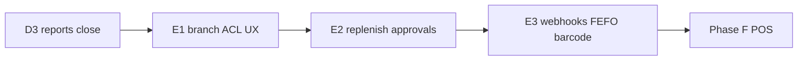

# Phase E — Multi-branch Hardening (Master Plan)

> **For agentic workers:** Do **not** start coding until the user explicitly starts a slice. Execute **E1 → E2 → E3** using `superpowers:subagent-driven-development` or `superpowers:executing-plans` against each deep slice plan. Master indexes E1–E3; deep plans are written in follow-on tasks — implement only after the user starts a slice.

**Goal:** Complete Phase E multi-branch hardening across three vertical slices, each producing working, testable software: branch ACL/UX/attribution, replenishment/reservations/approvals, then webhooks/FEFO/barcode.

**Architecture:** Full Clean Architecture. Extend existing membership/`membership_branches`, stock transfers, reservations, and outbox poller — no new inventory ledger model. Auth stub stays `X-Org-Id` + `X-User-Id`; E1 loads membership into request context. Spec: [`docs/superpowers/specs/2026-07-26-phase-e-multi-branch-design.md`](../specs/2026-07-26-phase-e-multi-branch-design.md).

**Tech Stack:** Fastify, Drizzle, PostgreSQL, Zod, Vitest, Vite/React, TanStack Query/Router, Tailwind. Webhooks: Node `fetch` + HMAC-SHA256.

**Status:** Plans ready — not implemented

## Global Constraints

- Full Clean Architecture — no `apps/api/src/modules/`
- Org-scoped queries always; branch ACL on top
- Document-driven qty only; immutable movements; void via reverse
- Auth stub: `X-Org-Id` + `X-User-Id`; resolve membership from DB
- Money/qty: Phase B/C `Number()` + string pattern; org currency only
- Outbox poller: **journal then webhook** for the same event (E3)
- Coding standards: `docs/architecture/coding-standards.md`
- Features checklist: `docs/FEATURES.md` § Phase E

---

## Slice index

| Order | Slice | Deliverable | Plan | Implement after |
|-------|-------|-------------|------|-----------------|
| 1 | **E1** | Membership→context ACL, branch-filtered lists, web branch switcher, HQ vs branch reports, outbox `branchId` attribution | [phase-e1-branch-hardening.md](./2026-07-26-phase-e1-branch-hardening.md) | Explicit start |
| 2 | **E2** | Cross-branch replenishment transfers, reservation locking/expiry, approval policies for PO + adjustments | [phase-e2-ops-approvals.md](./2026-07-26-phase-e2-ops-approvals.md) | E1 shipped |
| 3 | **E3** | Webhook subscriptions + HMAC delivery via outbox, FEFO/quarantine hard rules, barcode lookup + scan UX | [phase-e3-webhooks-fefo-barcode.md](./2026-07-26-phase-e3-webhooks-fefo-barcode.md) | E2 shipped |



---

## FEATURES.md coverage map

| Feature area | Slice |
|--------------|-------|
| Branch-scoped UX (managers vs HQ) | E1 |
| Consolidated vs branch reports | E1 |
| Inter-branch replenishment (HQ→branch, supplier→branch) | E2 |
| Reservation discipline / no oversell | E2 |
| Approval policies (adjustments & POs) | E2 |
| Webhooks | E3 |
| Quarantine / FEFO | E3 |
| Barcode scanning UX | E3 |

---

## Locked decisions (summary)

Full table: design spec. Highlights:

| Topic | Choice |
|-------|--------|
| Slice order | **E1** ACL/UX/attribution → **E2** replenishment/reservations/approvals → **E3** webhooks/FEFO/barcode |
| HQ access | Membership with **no** `membership_branches` rows = all branches (HQ). `org_admin` typically HQ; branch roles should have ≥1 branch |
| Active branch | Optional `X-Branch-Id`. Branch users: must be in grant list (or omitted → first grant). HQ: omit = consolidated; set = act as that branch |
| Roles (existing enum) | `org_admin`, `branch_manager`, `warehouse`, `purchasing`, `accountant` — enforce create/post/approve matrices in E1/E2 |
| List filtering | Branch-scoped users only see docs/locations for granted branches; HQ sees all unless `X-Branch-Id` set |
| Journal `branchId` | E1: every inventory outbox money/`document.*` payload includes `branchId` when resolvable |
| Inter-branch move | **No new document type** — extend stock-transfer with `purpose: standard \| replenishment`, derive/store `fromBranchId`/`toBranchId` from locations |
| Supplier→branch | Existing PO `branchId` + GR; E2 enforces ACL + UX |
| Approvals | PO `submitted` → approved before GR path; adjustments require approved before post. Approvers: `org_admin` or `branch_manager` with branch access. Policy table defaults on |
| Reservation harden | Row-lock balance on reserve; expire open past `expiresAt` |
| Webhooks | Subscriptions + delivery log; outbox poller runs **journal then webhook**; HMAC-SHA256 signature header |
| FEFO | Prefer earliest expiry; **hard-block** expired lots (except quarantine rules) |
| Quarantine | Cannot sell/issue from quarantine location/lot without release path |
| Barcode | `GET /products/by-barcode/:code`; scan-first UX on GR/issue/count/transfer receive |
| Auth | Keep stub `X-Org-Id` + `X-User-Id`; resolve membership from DB |
| Architecture | Full Clean Architecture for all slices |

---

## Out of scope (whole Phase E)

- JWT/OAuth (keep header stub)
- Webhook transform DSL beyond eventTypes + optional branch
- Camera SDK
- In-transit GL / intercompany accounting
- Phase F POS UI
- Soft FEFO warn-only mode

---

## Suggested TASKS.md board

```
Active:
- [ ] Phase E1 — branch ACL / UX / attribution (plan ready) — implement first
- [ ] Phase E2 — replenishment / reservations / approvals (plan ready) — after E1
- [ ] Phase E3 — webhooks / FEFO / barcode (plan ready) — after E2

Someday:
- [ ] Phase F — POS & channels
```

---

## Related artifacts

| Artifact | Path |
|----------|------|
| Design spec | [`docs/superpowers/specs/2026-07-26-phase-e-multi-branch-design.md`](../specs/2026-07-26-phase-e-multi-branch-design.md) |
| Deep E1 | [`2026-07-26-phase-e1-branch-hardening.md`](./2026-07-26-phase-e1-branch-hardening.md) |
| Deep E2 | [`2026-07-26-phase-e2-ops-approvals.md`](./2026-07-26-phase-e2-ops-approvals.md) |
| Deep E3 | [`2026-07-26-phase-e3-webhooks-fefo-barcode.md`](./2026-07-26-phase-e3-webhooks-fefo-barcode.md) |
| Wiki | [[Phase E]] · [[Org Branch Location]] · [[POS Integration Boundary]] · [[Feature Phases]] · [[Clean Architecture]] |
| Features | `docs/FEATURES.md` § Phase E |

---

## Definition of done (whole Phase E)

- All three deep plans implemented and checkboxes complete
- All `docs/FEATURES.md` Phase E rows implemented and tested
- Branch ACL enforced; HQ consolidated vs branch views work
- Replenishment + approvals + reservation harden ship
- Signed webhooks from outbox; FEFO/quarantine hard-block; barcode scan UX
- `pnpm typecheck` + Phase E tests green
- Wiki [[Phase E]] marked complete; Phase F unblocked
