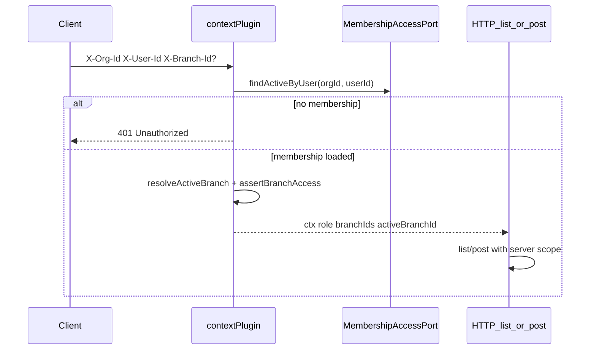

# Phase E1 — Branch Hardening Implementation Plan

> **For agentic workers:** REQUIRED SUB-SKILL: Use `superpowers:subagent-driven-development` (recommended) or `superpowers:executing-plans` to implement this plan task-by-task. Steps use checkbox (`- [ ]`) syntax for tracking.

**Goal:** Enforce membership branch ACL in request context, branch-scoped document lists, denormalized transfer branch columns, outbox `branchId` attribution for journals, and a thin web branch switcher — so branch users cannot see or act outside their grants while HQ keeps consolidated views.

**Architecture:** Full Clean Architecture. Domain owns access helpers (`assertBranchAccess`, `resolveActiveBranch`, `canPerform`). Application adds `MembershipAccessPort` and branch filters on document list ports. Infrastructure loads `memberships` + `membership_branches` and migrates `stock_transfers.from_branch_id` / `to_branch_id`. HTTP expands `apps/api/src/interfaces/plugins/context.ts` with role / branchIds / activeBranchId from optional `X-Branch-Id`. Web shell sends the header and defaults reports to the active branch. **No** webhooks, approvals, FEFO, barcode, or transfer `purpose` (those are E2/E3).

**Tech Stack:** Fastify, TypeScript, Drizzle, PostgreSQL, Zod (`packages/shared`), Vitest, Vite/React, TanStack Query/Router, Tailwind.

**Spec:** `docs/superpowers/specs/2026-07-26-phase-e-multi-branch-design.md`  
**Master:** `docs/superpowers/plans/2026-07-26-phase-e-multi-branch.md`  
**Wiki:** [[Phase E]] · [[Org Branch Location]] · [[Feature Phases]] · [[Clean Architecture]]

## Global Constraints

- Full Clean Architecture — no `apps/api/src/modules/`
- Every tenant table / query includes `org_id`; branch ACL on top of org scope
- Document-driven qty only; immutable movements; void via reverse
- Auth stub: `X-Org-Id` + `X-User-Id`; resolve membership from DB (no JWT)
- Optional `X-Branch-Id` for active branch; server never trusts client to widen scope
- Money/qty: Phase B/C `Number()` + string pattern; org currency only
- Outbox journal mapper already reads `payload.branchId` — E1 must populate it when resolvable
- Coding standards: `docs/architecture/coding-standards.md`
- Features checklist: `docs/FEATURES.md` § Phase E (branch-scoped UX + consolidated vs branch reports only)

---

## Decisions (locked for E1)

| Topic | Choice |
|-------|--------|
| HQ access | Membership with **no** `membership_branches` rows → `branchIds: []` = all branches (HQ) |
| Active branch | Optional `X-Branch-Id`. Branch users: must be in grant list; omitted → first grant. HQ: omit = consolidated (`activeBranchId: null`); set = act as that branch |
| Roles | Existing enum: `org_admin`, `branch_manager`, `warehouse`, `purchasing`, `accountant` |
| `canPerform` | E1 enforces create/post/list/report matrices minimally; approve gates deferred to E2 |
| List filtering | Scope from context only — `activeBranchId` when set; HQ with null = all orgs docs; never accept client `branchIds` that widen access |
| Transfers | Add `from_branch_id` / `to_branch_id` only (derive from locations). **No** `purpose` column in E1 |
| Outbox `branchId` | Every `document.posted` / `document.voided` money payload includes `branchId` when resolvable (doc header, or transfer from-location branch on ship/void) |
| Reports | Existing TB/P&L/BS already take `branchId?`; clamp to `ctx.activeBranchId` for branch users; HQ omit = consolidated |
| Auth failures | No active membership → `UnauthorizedError` (401). Bad `X-Branch-Id` / role denial → `ForbiddenError` (403) |
| Transfer list filter | Row visible if `fromBranchId` **or** `toBranchId` matches active branch (or is in grant set when HQ filters to one) |
| UI | Branch switcher in `Shell` (`apps/web/src/App.tsx`); persist `activeBranchId` in `localStorage`; send `X-Branch-Id` via API client |

### Role matrix (E1 minimum)

| Action key | org_admin | branch_manager | warehouse | purchasing | accountant |
|------------|-----------|----------------|-----------|------------|------------|
| `masters.write` | Y | Y (branch locs only — enforce location branch on create) | N | N | N |
| `inventory.post` | Y | Y (branch) | Y (branch) | N | N |
| `po.write` | Y | Y | N | Y | N |
| `accounting.read` | Y | Y (own branch) | N | N | Y |

Approve / webhook admin are **out of E1**.

## Out of scope (E1)

- Transfer `purpose: standard \| replenishment` (E2)
- Reservation row-lock / expiry job (E2)
- Approval policies / submit→approve (E2)
- Webhook subscriptions / HMAC delivery (E3)
- FEFO / quarantine hard rules (E3)
- Barcode lookup / scan UX (E3)
- JWT/OAuth

## Request context flow (E1)



## File map

| Path | Responsibility |
|------|----------------|
| `packages/domain/src/entities.ts` | `Membership.branchIds: string[]`; `StockTransfer.fromBranchId` / `toBranchId` |
| `packages/domain/src/errors.ts` | `ForbiddenError` (`FORBIDDEN`) |
| `packages/domain/src/access.ts` | `assertBranchAccess`, `resolveActiveBranch`, `canPerform`, `AccessAction` |
| `packages/domain/src/access.test.ts` | Domain unit tests |
| `packages/application/src/ports/membership-access.ts` | `MembershipAccessPort` |
| `packages/application/src/ports/inventory.ts` | `BranchListFilter` on document `list` methods |
| `packages/application/src/ports/repositories.ts` | Users repo returns memberships with `branchIds`; access finder |
| `packages/application/src/use-cases/users.ts` | Return `branchIds` on list/get/create membership |
| Document use cases | Pass filter through `list(orgId, filter?)` |
| Outbox enqueue sites | Add `branchId` to `document.*` payloads |
| `packages/application/src/accounting/journal-event-mapper.ts` | Already reads `payload.branchId` — verify only |
| `packages/shared/src/index.ts` | `MembershipSchema` with `branchIds`; keep `CreateMembershipSchema.branchIds` |
| `apps/api/src/infrastructure/db/schema/index.ts` | `stock_transfers.from_branch_id`, `to_branch_id` |
| `apps/api/drizzle/0009_phase_e1_branch_hardening.sql` | Migration (next after `0008_phase_d2_ap.sql`) |
| `apps/api/src/infrastructure/persistence/users.repository.ts` | Load `membership_branches`; implement `MembershipAccessPort` |
| `apps/api/src/infrastructure/persistence/*-*.repository.ts` | Branch filters on list SQL |
| `apps/api/src/infrastructure/persistence/stock-transfer.repository.ts` | Persist denormalized branch ids from locations |
| `apps/api/src/interfaces/plugins/context.ts` | Expand `RequestContext`; load membership; parse `X-Branch-Id` |
| `apps/api/src/interfaces/plugins/error-handler.ts` | Map `ForbiddenError` → 403 |
| `apps/api/src/interfaces/http/*.routes.ts` | Apply list scope from `request.ctx`; gate writes with `canPerform` / `assertBranchAccess` |
| `apps/api/src/index.ts` | Wire context factory; CORS allow `X-Branch-Id` |
| `apps/api/src/main/composition-root.ts` | Export membership access port |
| `apps/web/src/api/client.ts` | `ApiHeaders.branchId?` → `X-Branch-Id` |
| `apps/web/src/hooks/masters.ts` | `useApiContext` reads `activeBranchId` |
| `apps/web/src/App.tsx` | Branch switcher in `Shell` |
| Report pages | Default `branchId` from active branch context |

Reuse: existing `memberships` + `membership_branches` tables, report `branchId?` filters, journal mapper `branchIdFromPayload`, composition root, auth stub headers.

---

### Task 1: Domain access model (`Membership.branchIds` + helpers)

**Files:**
- Modify: `packages/domain/src/entities.ts`, `packages/domain/src/errors.ts`, `packages/domain/src/index.ts`
- Create: `packages/domain/src/access.ts`
- Test: `packages/domain/src/access.test.ts`

**Interfaces:**
- Produces:

```ts
// entities.ts — extend Membership
export type Membership = {
  id: string;
  orgId: string;
  userId: string;
  role: MembershipRole;
  status: MasterStatus;
  branchIds: string[]; // empty = HQ / all branches
  createdAt: Date;
  updatedAt: Date;
};

// errors.ts
export class ForbiddenError extends DomainError {
  constructor(message = "Forbidden") {
    super(message, "FORBIDDEN");
    this.name = "ForbiddenError";
  }
}

// access.ts
export type AccessAction =
  | "masters.write"
  | "inventory.post"
  | "po.write"
  | "accounting.read";

export type MembershipAccess = Pick<Membership, "role" | "branchIds">;

/** HQ = empty branchIds. Throws ForbiddenError if branch not granted. */
export function assertBranchAccess(
  membership: MembershipAccess,
  branchId: string,
): void;

/**
 * Branch user (branchIds.length > 0):
 *   header set → must be in branchIds; omitted → branchIds[0]
 * HQ (branchIds.length === 0):
 *   header set → that id (no grant check beyond org); omitted → null (consolidated)
 * Throws ForbiddenError when branch user header not in grants.
 */
export function resolveActiveBranch(
  membership: MembershipAccess,
  headerBranchId: string | null | undefined,
): string | null;

export function canPerform(
  role: MembershipRole,
  action: AccessAction,
): boolean;
```

- [ ] **Step 1: Write the failing test**

```ts
import { describe, expect, it } from "vitest";
import {
  assertBranchAccess,
  canPerform,
  resolveActiveBranch,
} from "./access.js";
import { ForbiddenError } from "./errors.js";

const branchUser = {
  role: "warehouse" as const,
  branchIds: ["b1", "b2"],
};
const hq = { role: "org_admin" as const, branchIds: [] as string[] };

describe("assertBranchAccess", () => {
  it("allows HQ any branch", () => {
    expect(() => assertBranchAccess(hq, "b99")).not.toThrow();
  });
  it("allows granted branch", () => {
    expect(() => assertBranchAccess(branchUser, "b1")).not.toThrow();
  });
  it("rejects ungranted branch", () => {
    expect(() => assertBranchAccess(branchUser, "b99")).toThrow(ForbiddenError);
  });
});

describe("resolveActiveBranch", () => {
  it("HQ omit → null", () => {
    expect(resolveActiveBranch(hq, null)).toBeNull();
    expect(resolveActiveBranch(hq, undefined)).toBeNull();
  });
  it("HQ set → that branch", () => {
    expect(resolveActiveBranch(hq, "b3")).toBe("b3");
  });
  it("branch omit → first grant", () => {
    expect(resolveActiveBranch(branchUser, null)).toBe("b1");
  });
  it("branch set granted → that branch", () => {
    expect(resolveActiveBranch(branchUser, "b2")).toBe("b2");
  });
  it("branch set ungranted → ForbiddenError", () => {
    expect(() => resolveActiveBranch(branchUser, "b9")).toThrow(ForbiddenError);
  });
});

describe("canPerform", () => {
  it("warehouse can inventory.post but not po.write", () => {
    expect(canPerform("warehouse", "inventory.post")).toBe(true);
    expect(canPerform("warehouse", "po.write")).toBe(false);
  });
  it("purchasing can po.write but not inventory.post", () => {
    expect(canPerform("purchasing", "po.write")).toBe(true);
    expect(canPerform("purchasing", "inventory.post")).toBe(false);
  });
  it("accountant can accounting.read only among write actions", () => {
    expect(canPerform("accountant", "accounting.read")).toBe(true);
    expect(canPerform("accountant", "inventory.post")).toBe(false);
    expect(canPerform("accountant", "masters.write")).toBe(false);
  });
  it("org_admin can all E1 actions", () => {
    for (const a of [
      "masters.write",
      "inventory.post",
      "po.write",
      "accounting.read",
    ] as const) {
      expect(canPerform("org_admin", a)).toBe(true);
    }
  });
});
```

- [ ] **Step 2: Run test to verify it fails**

Run: `pnpm --filter @stock-management/domain test -- src/access.test.ts`  
Expected: FAIL (module / `branchIds` / `ForbiddenError` missing)

- [ ] **Step 3: Write minimal implementation**

1. Add `branchIds: string[]` to `Membership` in `entities.ts`.
2. Add `ForbiddenError` in `errors.ts`.
3. Implement `access.ts` with the matrix above (`branch_manager` = masters.write + inventory.post + po.write + accounting.read; `warehouse` = inventory.post only; `purchasing` = po.write; `accountant` = accounting.read; `org_admin` = all).
4. Export from `packages/domain/src/index.ts`: `export * from "./access.js";`

Do **not** change `StockTransfer` in this task — Task 4 adds `fromBranchId` / `toBranchId` with the migration (and never adds `purpose` in E1).

- [ ] **Step 4: Run test to verify it passes**

Run: `pnpm --filter @stock-management/domain test -- src/access.test.ts`  
Expected: PASS

- [ ] **Step 5: Commit**

```bash
git add packages/domain
git commit -m "$(cat <<'EOF'
feat(domain): add membership branchIds and access helpers for Phase E1

EOF
)"
```

---

### Task 2: MembershipAccessPort + context plugin (`X-Branch-Id`)

**Files:**
- Create: `packages/application/src/ports/membership-access.ts`
- Modify: `packages/application/src/ports/repositories.ts`, `packages/application/src/use-cases/users.ts`, `packages/application/src/index.ts`
- Modify: `packages/shared/src/index.ts` (Membership response schema)
- Modify: `apps/api/src/infrastructure/persistence/users.repository.ts`
- Modify: `apps/api/src/interfaces/plugins/context.ts`
- Modify: `apps/api/src/interfaces/plugins/error-handler.ts`
- Modify: `apps/api/src/main/composition-root.ts`, `apps/api/src/index.ts`
- Modify: `apps/api/src/interfaces/http/users.routes.ts` (response shape)
- Test: `packages/domain/src/access.test.ts` (already green); add `apps/api/src/interfaces/plugins/context.test.ts` **or** application-level fake tests in `packages/application/src/use-cases/users-membership-branches.test.ts`

**Interfaces:**
- Consumes: `Membership`, `resolveActiveBranch`, `ForbiddenError`, `UnauthorizedError`
- Produces:

```ts
// packages/application/src/ports/membership-access.ts
import type { Membership } from "@stock-management/domain";

export interface MembershipAccessPort {
  /** Active membership for org+user, including branchIds (empty = HQ). */
  findActiveByUser(orgId: string, userId: string): Promise<Membership | null>;
}

// RequestContext in apps/api/src/interfaces/plugins/context.ts
export type RequestContext = {
  orgId: string;
  userId: string;
  role: MembershipRole;
  branchIds: string[];
  activeBranchId: string | null;
};
```

Shared Zod (response):

```ts
export const MembershipSchema = z.object({
  id: UuidSchema,
  orgId: UuidSchema,
  userId: UuidSchema,
  role: MembershipRoleSchema,
  status: MasterStatusSchema,
  branchIds: z.array(UuidSchema),
  createdAt: z.string(), // or Date coercion matching existing masters style
  updatedAt: z.string(),
});
```

Match existing date serialization style used by other master DTOs in `packages/shared`.

- [ ] **Step 1: Write failing tests**

```ts
// packages/application/src/use-cases/users-membership-branches.test.ts
import { describe, expect, it } from "vitest";
import { UsersUseCases } from "./users.js";
import type { UsersRepository } from "../ports/repositories.js";
import type { Membership, User } from "@stock-management/domain";

function mem(partial: Partial<Membership> & Pick<Membership, "id" | "branchIds">): Membership {
  return {
    orgId: "org-1",
    userId: "user-1",
    role: "warehouse",
    status: "active",
    createdAt: new Date("2026-01-01"),
    updatedAt: new Date("2026-01-01"),
    ...partial,
  };
}

describe("UsersUseCases membership branchIds", () => {
  it("listMemberships returns branchIds from repo", async () => {
    const repo: UsersRepository = {
      listUsers: async () => [],
      createUser: async () => null as unknown as User,
      listMemberships: async () => [mem({ id: "m1", branchIds: ["b1"] })],
      createMembership: async () => mem({ id: "m1", branchIds: ["b1"] }),
      findMembership: async () => mem({ id: "m1", branchIds: ["b1"] }),
    };
    const uc = new UsersUseCases(repo);
    const rows = await uc.listMemberships("org-1");
    expect(rows[0]?.branchIds).toEqual(["b1"]);
  });
});
```

Context plugin behavior (unit with fake port — place beside plugin or as integration):

```ts
// apps/api/src/interfaces/plugins/context.access.test.ts
import { describe, expect, it, vi } from "vitest";
import { ForbiddenError, UnauthorizedError } from "@stock-management/domain";
import { resolveRequestContext } from "./context.js"; // extract pure helper from plugin

describe("resolveRequestContext", () => {
  const membership = {
    id: "m1",
    orgId: "org-1",
    userId: "user-1",
    role: "warehouse" as const,
    status: "active" as const,
    branchIds: ["b1"],
    createdAt: new Date(),
    updatedAt: new Date(),
  };

  it("401 when no membership", async () => {
    await expect(
      resolveRequestContext({
        orgId: "org-1",
        userId: "user-1",
        headerBranchId: null,
        findActiveByUser: async () => null,
      }),
    ).rejects.toBeInstanceOf(UnauthorizedError);
  });

  it("sets activeBranchId from first grant when header omitted", async () => {
    const ctx = await resolveRequestContext({
      orgId: "org-1",
      userId: "user-1",
      headerBranchId: null,
      findActiveByUser: async () => membership,
    });
    expect(ctx).toMatchObject({
      role: "warehouse",
      branchIds: ["b1"],
      activeBranchId: "b1",
    });
  });

  it("403 when header branch not granted", async () => {
    await expect(
      resolveRequestContext({
        orgId: "org-1",
        userId: "user-1",
        headerBranchId: "b9",
        findActiveByUser: async () => membership,
      }),
    ).rejects.toBeInstanceOf(ForbiddenError);
  });
});
```

Extract `resolveRequestContext` from the plugin so it is unit-testable without booting Fastify.

- [ ] **Step 2: Run tests to verify they fail**

Run:
```bash
pnpm --filter @stock-management/application test -- src/use-cases/users-membership-branches.test.ts
pnpm --filter @stock-management/api test -- src/interfaces/plugins/context.access.test.ts
```
Expected: FAIL until port / helper / repo load branches

- [ ] **Step 3: Implement port, repo, plugin, error map**

**Repo** (`users.repository.ts`): when listing/finding/creating memberships, load branch ids:

```ts
async function branchIdsFor(
  db: Db,
  orgId: string,
  membershipId: string,
): Promise<string[]> {
  const rows = await db
    .select({ branchId: membershipBranches.branchId })
    .from(membershipBranches)
    .where(
      and(
        eq(membershipBranches.orgId, orgId),
        eq(membershipBranches.membershipId, membershipId),
      ),
    );
  return rows.map((r) => r.branchId);
}

// After createMembership insert + optional membershipBranches insert,
// return { ...membership, branchIds: input.branchIds ?? [] }

// findActiveByUser:
async findActiveByUser(orgId: string, userId: string): Promise<Membership | null> {
  const [row] = await this.db
    .select()
    .from(memberships)
    .where(
      and(
        eq(memberships.orgId, orgId),
        eq(memberships.userId, userId),
        eq(memberships.status, "active"),
      ),
    )
    .limit(1);
  if (!row) return null;
  const branchIds = await branchIdsFor(this.db, orgId, row.id);
  return { ...(row as Omit<Membership, "branchIds">), branchIds };
}
```

Implement `MembershipAccessPort` on `DrizzleUsersRepository` (same class) **or** a thin wrapper — either way export from composition root as `membershipAccess`.

**Context plugin** — change to factory:

```ts
export function createContextPlugin(
  membershipAccess: MembershipAccessPort,
): FastifyPluginAsync {
  return fp(async (app) => {
    app.addHook("preHandler", async (request) => {
      const path = request.url.split("?")[0] ?? request.url;
      if (path === "/health") return;
      if (request.method === "POST" && path === "/api/v1/orgs") {
        request.ctx = {
          orgId: "00000000-0000-0000-0000-000000000000",
          userId: requireHeader(request, "x-user-id"),
          role: "org_admin",
          branchIds: [],
          activeBranchId: null,
        };
        return;
      }
      const orgId = requireHeader(request, "x-org-id");
      const userId = requireHeader(request, "x-user-id");
      const rawBranch = request.headers["x-branch-id"];
      const headerBranchId =
        typeof rawBranch === "string" && rawBranch.trim()
          ? rawBranch.trim()
          : null;
      request.ctx = await resolveRequestContext({
        orgId,
        userId,
        headerBranchId,
        findActiveByUser: (o, u) => membershipAccess.findActiveByUser(o, u),
      });
    });
  }, { name: "context" });
}
```

**index.ts:**
- `await app.register(createContextPlugin(services.membershipAccess));`
- CORS: add `X-Branch-Id` to `Access-Control-Allow-Headers`

**error-handler.ts:** before Unauthorized check or after:

```ts
if (error instanceof ForbiddenError) {
  return reply.status(403).send(envelope(request, error.code, error.message));
}
```

- [ ] **Step 4: Run tests to verify they pass**

```bash
pnpm --filter @stock-management/application test -- src/use-cases/users-membership-branches.test.ts
pnpm --filter @stock-management/api test -- src/interfaces/plugins/context.access.test.ts
pnpm --filter @stock-management/api typecheck
```
Expected: PASS

- [ ] **Step 5: Commit**

```bash
git add packages/application packages/shared packages/domain \
  apps/api/src/infrastructure/persistence/users.repository.ts \
  apps/api/src/interfaces/plugins \
  apps/api/src/main/composition-root.ts \
  apps/api/src/index.ts \
  apps/api/src/interfaces/http/users.routes.ts
git commit -m "$(cat <<'EOF'
feat(api): load membership branches into request context with X-Branch-Id

EOF
)"
```

---

### Task 3: Branch-scoped document list filters + write gates

**Files:**
- Modify: `packages/application/src/ports/inventory.ts` (`BranchListFilter`; `list` signatures)
- Modify: use cases — `purchase-order.ts`, `goods-receipt.ts`, `stock-issue.ts`, `stock-transfer.ts`, `stock-adjustment.ts`, `stock-count.ts`, `supplier-return.ts`, `customer-return.ts`, `reservation.ts`, `landed-cost.ts`, `cost-revaluation.ts` (list only where applicable)
- Modify: Drizzle repos under `apps/api/src/infrastructure/persistence/` matching those ports
- Modify: HTTP routes that call `list` / create / post — apply scope from `request.ctx`
- Modify: `apps/api/src/interfaces/http/locations.routes.ts` — clamp `branchId` query to grants
- Modify: `apps/api/src/interfaces/http/financial-reports.routes.ts` (+ cost reports) — clamp `branchId`
- Helper (optional): `packages/application/src/access/list-scope.ts` or `apps/api/src/interfaces/http/branch-scope.ts`
- Test: `packages/application/src/use-cases/branch-list-filter.test.ts` (fake repos)

**Interfaces:**
- Consumes: `RequestContext.activeBranchId`, `branchIds`, `canPerform`, `assertBranchAccess`
- Produces:

```ts
/** Server-computed filter — never take arbitrary widen from client. */
export type BranchListFilter =
  | { kind: "all" }
  | { kind: "branch"; branchId: string };

export function listFilterFromContext(ctx: {
  activeBranchId: string | null;
}): BranchListFilter {
  if (ctx.activeBranchId) return { kind: "branch", branchId: ctx.activeBranchId };
  return { kind: "all" };
}

// Example port change (PurchaseOrderPort and peers with branchId column):
list(orgId: string, filter?: BranchListFilter): Promise<PurchaseOrder[]>;

// StockTransferPort.list filter is implemented in Task 4 after from_branch_id /
// to_branch_id exist. Task 3 covers every document type that already has branchId.
```

**Document types with `branchId` today** (filter `eq(table.branchId, filter.branchId)` when `kind === "branch"`):
- purchase orders, goods receipts, stock issues, stock adjustments, stock counts, reservations, supplier returns, customer returns, landed costs, cost revaluations, supplier invoices (AP)

**Stock transfers:** implement list filter in Task 4 (`from_branch_id` OR `to_branch_id` match).

- [ ] **Step 1: Write failing tests**

```ts
import { describe, expect, it } from "vitest";
import { listFilterFromContext } from "../access/list-scope.js";
import { PurchaseOrderUseCases } from "./purchase-order.js";
import type { PurchaseOrderPort } from "../ports/inventory.js";
import type { PurchaseOrder } from "@stock-management/domain";

describe("listFilterFromContext", () => {
  it("HQ consolidated → all", () => {
    expect(listFilterFromContext({ activeBranchId: null })).toEqual({
      kind: "all",
    });
  });
  it("active branch → branch filter", () => {
    expect(listFilterFromContext({ activeBranchId: "b1" })).toEqual({
      kind: "branch",
      branchId: "b1",
    });
  });
});

describe("PurchaseOrderUseCases.list filter", () => {
  it("passes filter to port", async () => {
    const seen: unknown[] = [];
    const repo = {
      list: async (_org: string, filter?: unknown) => {
        seen.push(filter);
        return [] as PurchaseOrder[];
      },
    } as unknown as PurchaseOrderPort;
    const uc = new PurchaseOrderUseCases(repo);
    await uc.list("org-1", { kind: "branch", branchId: "b1" });
    expect(seen[0]).toEqual({ kind: "branch", branchId: "b1" });
  });
});
```

Add one HTTP-level or use-case gate test for `canPerform`:

```ts
import { canPerform } from "@stock-management/domain";

it("warehouse cannot po.write", () => {
  expect(canPerform("warehouse", "po.write")).toBe(false);
});
```

In routes, on create/post:

```ts
if (!canPerform(request.ctx.role, "po.write")) {
  throw new ForbiddenError("Role cannot write purchase orders");
}
if (request.ctx.activeBranchId) {
  assertBranchAccess(
    { role: request.ctx.role, branchIds: request.ctx.branchIds },
    body.branchId,
  );
} else if (request.ctx.branchIds.length > 0) {
  // should not happen after resolveActiveBranch — belt and suspenders
  assertBranchAccess(
    { role: request.ctx.role, branchIds: request.ctx.branchIds },
    body.branchId,
  );
} else {
  // HQ: still valid to create for any branch in org
}
```

For HQ with `activeBranchId` set, creating a PO for a *different* branch than active is allowed only if you choose “act as branch” strictly — **lock:** when `activeBranchId` is set, create/post `branchId` must equal `activeBranchId` (assert). When HQ consolidated (`null`), any org branch is allowed for `org_admin` / roles that can write.

- [ ] **Step 2: Run test to verify it fails**

Run: `pnpm --filter @stock-management/application test -- src/use-cases/branch-list-filter.test.ts`  
Expected: FAIL (`listFilterFromContext` / list signature)

- [ ] **Step 3: Implement filters + route wiring**

Example repo filter:

```ts
list(orgId: string, filter?: BranchListFilter): Promise<PurchaseOrder[]> {
  const conditions = [eq(purchaseOrders.orgId, orgId)];
  if (filter?.kind === "branch") {
    conditions.push(eq(purchaseOrders.branchId, filter.branchId));
  }
  return this.db
    .select()
    .from(purchaseOrders)
    .where(and(...conditions)) as Promise<PurchaseOrder[]>;
}
```

HTTP list:

```ts
app.get("/purchase-orders", async (request) =>
  useCases.list(
    request.ctx.orgId,
    listFilterFromContext(request.ctx),
  ),
);
```

Reports clamp:

```ts
const query = TrialBalanceQuerySchema.parse(request.query);
const branchId =
  request.ctx.activeBranchId ?? query.branchId; // branch user always has activeBranchId
// If branch user somehow sent another branchId in query, ignore client — use ctx only:
const effectiveBranchId = request.ctx.branchIds.length
  ? request.ctx.activeBranchId ?? undefined
  : (request.ctx.activeBranchId ?? query.branchId);
```

Locations: if `request.ctx.activeBranchId`, force `list(orgId, activeBranchId)` and ignore query widen.

Update all call sites that compile against old `list(orgId)` — tests/fakes included.

- [ ] **Step 4: Run tests to verify they pass**

```bash
pnpm --filter @stock-management/application test -- src/use-cases/branch-list-filter.test.ts
pnpm --filter @stock-management/application test
pnpm --filter @stock-management/api typecheck
```
Expected: PASS (fix any broken fakes)

- [ ] **Step 5: Commit**

```bash
git add packages/application apps/api/src/infrastructure/persistence \
  apps/api/src/interfaces/http
git commit -m "$(cat <<'EOF'
feat: enforce branch-scoped document lists and write gates for Phase E1

EOF
)"
```

---

### Task 4: Transfer `from_branch_id` / `to_branch_id` + outbox `branchId`

**Files:**
- Modify: `packages/domain/src/entities.ts` (`StockTransfer.fromBranchId`, `toBranchId`)
- Modify: `apps/api/src/infrastructure/db/schema/index.ts`
- Create: `apps/api/drizzle/0009_phase_e1_branch_hardening.sql`
- Modify: `apps/api/src/infrastructure/persistence/stock-transfer.repository.ts` (set branches from locations on create/update; list filter)
- Modify: `packages/application/src/ports/inventory.ts` / `stock-transfer.ts` list filter
- Modify outbox enqueue sites (add `branchId` when resolvable):
  - `packages/application/src/use-cases/post-goods-receipt.ts`
  - `packages/application/src/use-cases/void-goods-receipt.ts`
  - `packages/application/src/use-cases/stock-issue.ts` (`enqueueIssueEvents`)
  - `packages/application/src/use-cases/stock-adjustment.ts` (`enqueueAdjustmentEvents`)
  - `packages/application/src/use-cases/stock-count.ts`
  - `packages/application/src/use-cases/supplier-return.ts`
  - `packages/application/src/use-cases/customer-return.ts`
  - `packages/application/src/use-cases/landed-cost.ts`
  - `packages/application/src/use-cases/cost-revaluation.ts`
  - `packages/application/src/use-cases/stock-transfer.ts` (`enqueueTransferEvents` — use `fromBranchId`)
- Verify: `packages/application/src/accounting/journal-event-mapper.ts` + existing mapper tests
- Test: `packages/application/src/accounting/journal-event-mapper.test.ts` (branchId passthrough); `packages/application/src/use-cases/outbox-branch-id.test.ts` OR extend existing post tests

**Interfaces:**
- Consumes: document `branchId` fields; transfer location→branch resolution via `LocationLookupPort` / locations table
- Produces:

```ts
export type StockTransfer = {
  id: string;
  orgId: string;
  fromLocationId: string;
  toLocationId: string;
  transitLocationId: string;
  fromBranchId: string;
  toBranchId: string;
  documentNumber: string | null;
  status: TransferStatus;
  createdAt: Date;
  updatedAt: Date;
  shippedAt: Date | null;
  receivedAt: Date | null;
  voidedAt: Date | null;
};
```

Schema addition:

```ts
// stockTransfers table columns
fromBranchId: uuid("from_branch_id")
  .notNull()
  .references(() => branches.id),
toBranchId: uuid("to_branch_id")
  .notNull()
  .references(() => branches.id),
```

Migration SQL sketch:

```sql
ALTER TABLE stock_transfers
  ADD COLUMN from_branch_id uuid REFERENCES branches(id),
  ADD COLUMN to_branch_id uuid REFERENCES branches(id);

UPDATE stock_transfers st
SET from_branch_id = fl.branch_id,
    to_branch_id = tl.branch_id
FROM locations fl, locations tl
WHERE fl.id = st.from_location_id
  AND tl.id = st.to_location_id;

ALTER TABLE stock_transfers
  ALTER COLUMN from_branch_id SET NOT NULL,
  ALTER COLUMN to_branch_id SET NOT NULL;
```

**Do not** add `purpose` in this migration.

Outbox payload enrichment example (GR):

```ts
await ctx.outbox.enqueue({
  orgId,
  eventType: "document.posted",
  aggregateType: "goods_receipt",
  aggregateId: receipt.id,
  payload: {
    receiptId: receipt.id,
    userId,
    branchId: receipt.branchId,
    ...costingOutboxFields({ inventoryValueDelta }),
  },
});
```

Transfer:

```ts
payload: {
  transferId,
  userId,
  action,
  branchId: transfer.fromBranchId, // resolvable attribution for ship/receive/void
},
```

Journal mapper already:

```ts
function branchIdFromPayload(payload: Record<string, unknown>): string | null {
  const v = payload.branchId;
  return typeof v === "string" && v.length > 0 ? v : null;
}
```

Transfer list filter when `kind === "branch"`:

```ts
.where(
  and(
    eq(stockTransfers.orgId, orgId),
    or(
      eq(stockTransfers.fromBranchId, filter.branchId),
      eq(stockTransfers.toBranchId, filter.branchId),
    ),
  ),
)
```

- [ ] **Step 1: Write failing tests**

```ts
// packages/application/src/accounting/journal-event-mapper.test.ts — add case
it("passes branchId from payload into journal plan", () => {
  const plan = mapOutboxEventToJournalPlan({
    id: "e1",
    orgId: "org-1",
    eventType: "document.posted",
    aggregateType: "goods_receipt",
    aggregateId: "gr-1",
    payload: {
      inventoryValueDelta: "10",
      branchId: "branch-9",
    },
  });
  expect(plan.kind).toBe("create");
  if (plan.kind === "create") {
    expect(plan.branchId).toBe("branch-9");
  }
});
```

```ts
// packages/application/src/use-cases/post-goods-receipt-branch-outbox.test.ts
// Reuse existing fake UoW pattern from post-goods-receipt.test.ts:
// after post, assert document.posted payload includes branchId: receipt.branchId
```

- [ ] **Step 2: Run tests to verify fail / confirm mapper gap**

Run:
```bash
pnpm --filter @stock-management/application test -- src/accounting/journal-event-mapper.test.ts
pnpm --filter @stock-management/application test -- src/use-cases/post-goods-receipt
```
Expected: mapper case may already PASS (reads branchId); GR outbox assertion FAIL until enrichment

- [ ] **Step 3: Migration + repo + enrich all enqueue sites**

1. Update Drizzle schema + `pnpm --filter @stock-management/api db:generate` **or** hand-write `0009_phase_e1_branch_hardening.sql` matching repo convention.
2. On transfer `create`/`update`, look up `fromLocation.branchId` and `toLocation.branchId`; persist.
3. Add `branchId` to every `document.posted` / `document.voided` payload listed above (`stock.changed` may omit — journals skip it anyway).
4. Wire transfer list filter from Task 3.
5. Run migrate in dev: `pnpm --filter @stock-management/api db:migrate`

- [ ] **Step 4: Run tests to verify they pass**

```bash
pnpm --filter @stock-management/application test
pnpm --filter @stock-management/api test
pnpm --filter @stock-management/api typecheck
```
Expected: PASS

- [ ] **Step 5: Commit**

```bash
git add packages/domain packages/application \
  apps/api/src/infrastructure/db/schema/index.ts \
  apps/api/drizzle/0009_phase_e1_branch_hardening.sql \
  apps/api/src/infrastructure/persistence/stock-transfer.repository.ts
git commit -m "$(cat <<'EOF'
feat: denormalize transfer branch ids and attribute outbox branchId for E1

EOF
)"
```

---

### Task 5: Thin web — branch switcher + `X-Branch-Id` + report defaults

**Files:**
- Modify: `apps/web/src/api/client.ts` (`ApiHeaders`, `headers()`)
- Modify: `apps/web/src/hooks/masters.ts` (`useApiContext`)
- Modify: `apps/web/src/App.tsx` (`Shell` branch switcher)
- Modify report pages that already have local `branchId` state:
  - `apps/web/src/pages/TrialBalancePage.tsx`
  - `apps/web/src/pages/PnlReportPage.tsx`
  - `apps/web/src/pages/BalanceSheetPage.tsx`
  - `apps/web/src/pages/CogsReportPage.tsx`
  - `apps/web/src/pages/CostValuationPage.tsx`
- Optional: `apps/web/src/hooks/branch-context.ts` if you extract persistence helpers
- Test: manual / light Vitest if web test harness exists; otherwise typecheck + smoke

**Interfaces:**
- Consumes: `api.listBranches`, server list scoping from Task 3
- Produces:

```ts
export type ApiHeaders = {
  orgId: string;
  userId: string;
  branchId?: string; // when set → X-Branch-Id
};

function headers(ctx: ApiHeaders, init?: HeadersInit): Headers {
  const h = new Headers(init);
  h.set("Content-Type", "application/json");
  h.set("X-Org-Id", ctx.orgId);
  h.set("X-User-Id", ctx.userId);
  if (ctx.branchId) {
    h.set("X-Branch-Id", ctx.branchId);
  }
  if (!h.has("X-Request-Id")) {
    h.set("X-Request-Id", crypto.randomUUID());
  }
  return h;
}
```

Persistence keys: `localStorage.activeBranchId` — empty string / missing = omit header (HQ consolidated). Branch users still omit client-side and let server default to first grant **or** set explicitly after loading memberships — **lock for UX:** switcher options = all org branches for HQ; for branch-scoped seed users pick from grants when membership API is available. Minimum viable: switcher lists `useBranches()` results; selecting “All branches” clears `activeBranchId` (HQ only meaningful; branch users who clear will get server first-grant).

- [ ] **Step 1: Write the failing test (or type-level check)**

If no web Vitest suite for Shell, add a small pure helper test:

```ts
// apps/web/src/lib/active-branch.test.ts
import { describe, expect, it } from "vitest";
import { branchIdForHeaders } from "./active-branch.js";

describe("branchIdForHeaders", () => {
  it("omits when All branches", () => {
    expect(branchIdForHeaders("")).toBeUndefined();
  });
  it("returns id when selected", () => {
    expect(branchIdForHeaders("b1")).toBe("b1");
  });
});
```

```ts
// apps/web/src/lib/active-branch.ts
export function branchIdForHeaders(
  activeBranchId: string,
): string | undefined {
  const t = activeBranchId.trim();
  return t.length > 0 ? t : undefined;
}
```

- [ ] **Step 2: Run test to verify it fails**

Run: `pnpm --filter @stock-management/web test -- src/lib/active-branch.test.ts`  
Expected: FAIL until helper exists (create test script if missing — follow package.json; if web has no test script, use `vitest` via package or skip to implement + `pnpm --filter @stock-management/web typecheck`)

- [ ] **Step 3: Implement switcher + client header + report defaults**

In `Shell` (`App.tsx`), above `<Outlet />` or in sidebar footer:

```tsx
function BranchSwitcher() {
  const { data: branches } = useBranches();
  const [active, setActive] = useState(
    () => localStorage.getItem("activeBranchId") ?? "",
  );
  return (
    <label className="mt-4 block text-xs text-slate-500">
      Branch
      <select
        className="mt-1 w-full rounded border border-slate-300 px-2 py-1 text-sm text-slate-900"
        value={active}
        onChange={(e) => {
          const v = e.target.value;
          setActive(v);
          if (v) localStorage.setItem("activeBranchId", v);
          else localStorage.removeItem("activeBranchId");
          window.location.reload(); // simplest cache bust for query keys
        }}
      >
        <option value="">All branches</option>
        {(branches ?? []).map((b) => (
          <option key={b.id} value={b.id}>
            {b.code} — {b.name}
          </option>
        ))}
      </select>
    </label>
  );
}
```

`useApiContext`:

```ts
export function useApiContext(): ApiHeaders {
  return {
    orgId: localStorage.getItem("orgId") ?? "",
    userId:
      localStorage.getItem("userId") ??
      "00000000-0000-0000-0000-000000000001",
    branchId: branchIdForHeaders(
      localStorage.getItem("activeBranchId") ?? "",
    ),
  };
}
```

Report pages: initialize `branchId` state from `localStorage.activeBranchId` so HQ consolidated stays empty and branch selection matches shell.

Document list pages need no client-side branch query param — server filters via header.

- [ ] **Step 4: Verify**

```bash
pnpm --filter @stock-management/web typecheck
# if test script exists:
pnpm --filter @stock-management/web test -- src/lib/active-branch.test.ts
```
Expected: PASS

Manual smoke: create two branches + branch-scoped membership; with `X-Branch-Id` for branch A, list POs — only A; HQ without header — all; post GR and process outbox — journal `branch_id` set.

- [ ] **Step 5: Commit**

```bash
git add apps/web
git commit -m "$(cat <<'EOF'
feat(web): add branch switcher and X-Branch-Id for Phase E1

EOF
)"
```

---

### Task 6: E1 verification gate + wiki note (after code ships)

**Files:** `wiki/features/Phase E.md`, `wiki/concepts/Org Branch Location.md`, `wiki/index.md`, `wiki/log.md`, `TASKS.md`

> Note: Run when **implementation** of E1 completes — not during plan-only work. Planning Pass already points at this deep plan.

- [ ] **Step 1: Run full verification**

```bash
pnpm --filter @stock-management/domain test
pnpm --filter @stock-management/application test
pnpm --filter @stock-management/api test
pnpm --filter @stock-management/api typecheck
pnpm --filter @stock-management/web typecheck
```

- [ ] **Step 2: Mark E1 done** in `TASKS.md`; keep E2/E3 waiting

- [ ] **Step 3: Update wiki** [[Phase E]] / [[Org Branch Location]] with E1 shipped notes (context ACL, list filters, transfer branch columns, outbox `branchId`, web switcher)

- [ ] **Step 4: Append** `wiki/log.md`

- [ ] **Step 5: Commit** `docs: mark Phase E1 complete`

---

## Definition of done (E1)

- [ ] `Membership.branchIds` loaded; empty = HQ
- [ ] `assertBranchAccess` / `resolveActiveBranch` / `canPerform` tested in domain
- [ ] `RequestContext` includes `role`, `branchIds`, `activeBranchId` from DB + optional `X-Branch-Id`
- [ ] No active membership → 401; bad branch / role denial → 403
- [ ] Document lists filtered by server scope; client cannot widen
- [ ] Create/post gated by role matrix + branch assert when scoped
- [ ] `stock_transfers.from_branch_id` / `to_branch_id` migrated and set from locations
- [ ] `document.posted` / `document.voided` outbox payloads include `branchId` when resolvable; journals carry `branch_id`
- [ ] Web branch switcher sends `X-Branch-Id`; reports default to active branch; HQ “All branches” consolidated
- [ ] No E2/E3 features landed (`purpose`, approvals, webhooks, FEFO, barcode)
- [ ] `pnpm` domain/application/api tests + api/web typecheck green

## Self-review checklist

- [x] Spec E1 rows: membership→context ACL, branch-filtered lists, web branch switcher, HQ vs branch reports, outbox `branchId`, transfer branch columns
- [x] No webhooks / approvals / FEFO / barcode / transfer `purpose` in this plan
- [x] Types consistent: `Membership.branchIds`, `RequestContext`, `BranchListFilter`, `StockTransfer.fromBranchId`/`toBranchId`
- [x] Real paths cited: `context.ts`, `users.repository.ts`, document use cases, outbox enqueue sites, `App.tsx` Shell, `api/client.ts`
- [x] Migration filename after `0008_phase_d2_ap.sql` → `0009_phase_e1_branch_hardening.sql`
- [x] Journal mapper reuse documented (no rewrite)
- [x] Spec + master links correct
- [x] Test commands use real filters: `pnpm --filter @stock-management/{domain,application,api,web}`

---

**Plan complete.** Implementation options when the user starts E1:

1. **Subagent-Driven (recommended)** — fresh subagent per task + review between tasks  
2. **Inline Execution** — `executing-plans` with checkpoints  

Do **not** start coding until the user explicitly starts the E1 slice.
