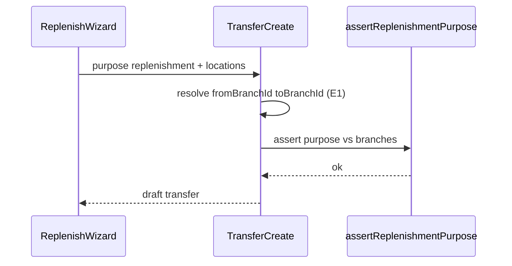
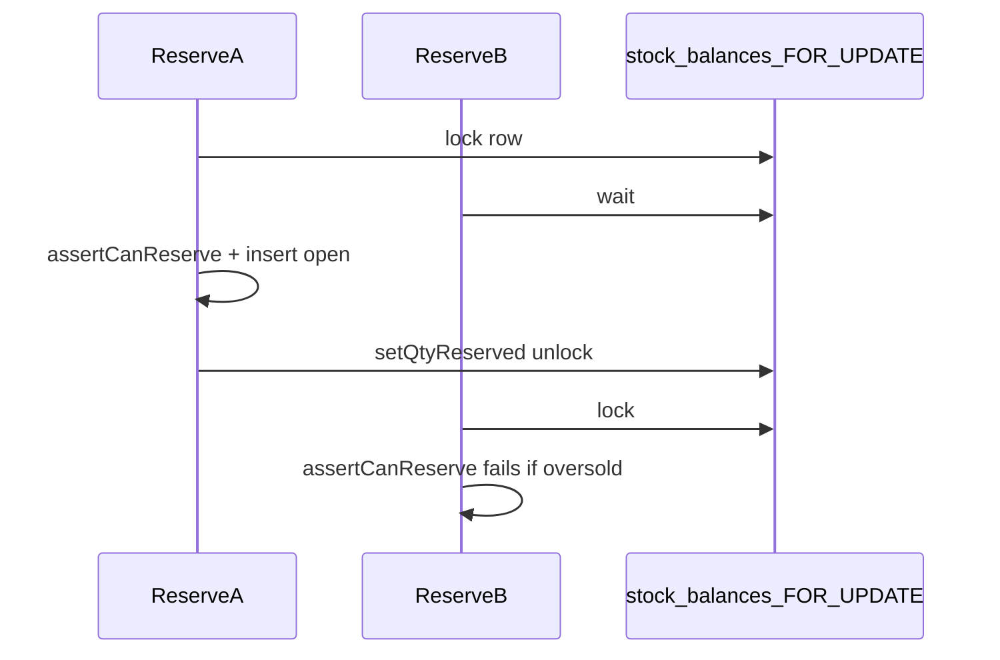
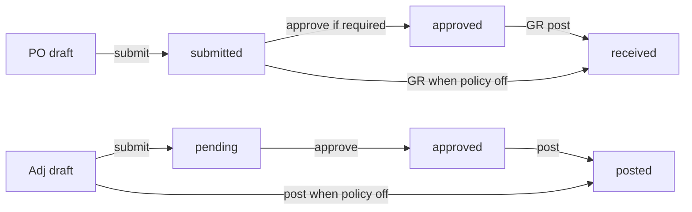

# Phase E2 — Ops / Approvals Implementation Plan

> **For agentic workers:** REQUIRED SUB-SKILL: Use `superpowers:subagent-driven-development` (recommended) or `superpowers:executing-plans` to implement this plan task-by-task. Steps use checkbox (`- [ ]`) syntax for tracking.

**Prerequisite:** Phase **E1 implemented** (membership `branchIds` + `MembershipAccessPort`, `RequestContext` with `role` / `branchIds` / `activeBranchId`, branch-scoped lists, `StockTransfer.fromBranchId` / `toBranchId`, outbox `branchId`). Do not start E2 code until E1 DoD is met. Deep E1: [`2026-07-26-phase-e1-branch-hardening.md`](./2026-07-26-phase-e1-branch-hardening.md).

**Goal:** Harden multi-branch ops: replenishment stock-transfers (`purpose`), reservation row-lock + expire job (no concurrent oversell), and approval policies for purchase orders and stock adjustments — without inventing a new ledger document type.

**Architecture:** Full Clean Architecture. Extend existing stock-transfer / reservation / PO / adjustment use cases. Domain owns `TransferPurpose`, `ApprovalPolicy`, PO `approved` status, adjustment `pending_approval` / `approved`, and approve/receivable/post asserts. Application adds `ApprovalPolicyPort`, `ExpireReservations`, submit/approve use cases, and GR/post gates that read policy. Infrastructure: migration `0010_phase_e2_ops_approvals.sql`, Drizzle adapters, reservation expire poller (mirror `OutboxPoller`). HTTP under existing transfer/PO/adjustment routes + `/approval-policies`. Thin web: replenish wizard, approve actions, policy toggles. **No** webhooks, FEFO, quarantine, or barcode (E3).

**Tech Stack:** Fastify, TypeScript, Drizzle, PostgreSQL, Zod (`packages/shared`), Vitest, Vite/React, TanStack Query/Router, Tailwind.

**Spec:** `docs/superpowers/specs/2026-07-26-phase-e-multi-branch-design.md`  
**Master:** `docs/superpowers/plans/2026-07-26-phase-e-multi-branch.md`  
**Prior:** `docs/superpowers/plans/2026-07-26-phase-e1-branch-hardening.md`  
**Wiki:** [[Phase E]] · [[Org Branch Location]] · [[Document-Driven Inventory]] · [[Feature Phases]] · [[Clean Architecture]]

## Global Constraints

- Full Clean Architecture — no `apps/api/src/modules/`
- Every tenant table / query includes `org_id`; branch ACL from E1 on top of org scope
- Document-driven qty only; immutable movements; void via reverse
- Auth stub: `X-Org-Id` + `X-User-Id` + optional `X-Branch-Id` (E1 context)
- Money/qty: Phase B/C `Number()` + string pattern; org currency only
- **No new transfer document type** — only `purpose` on existing `stock_transfers`
- Approvers: `org_admin` or `branch_manager` with branch access to the document’s branch
- Approval policy defaults **on** (`required: true`) for both `purchase_order` and `stock_adjustment`
- Coding standards: `docs/architecture/coding-standards.md`
- Features checklist: `docs/FEATURES.md` § Phase E (inter-branch replenishment, reservation discipline, approval policies only)

---

## Decisions (locked for E2)

| Topic | Choice |
|-------|--------|
| Transfer purpose | `standard` \| `replenishment`; default `standard`. Column on `stock_transfers` |
| Replenishment rule | `purpose === "replenishment"` **requires** `fromBranchId !== toBranchId` (cross-branch). Standard may be same-branch or cross-branch |
| Branch columns | **Consumed from E1** — create/update already denormalizes `fromBranchId`/`toBranchId` from locations |
| Supplier→branch | Existing PO `branchId` + GR; E2 adds approve gate before GR when policy required |
| PO statuses | Add `approved`. Flow: `draft` → `submitted` → `approved` → `partially_received` / `received` |
| PO receivable | Policy `required`: status ∈ `{approved, partially_received, received}`. Policy off: also allow `submitted` |
| Adjustment statuses | Extend `DocumentStatus` with `pending_approval` \| `approved`. Flow when required: `draft` → `pending_approval` → `approved` → `posted`. Policy off: post from `draft` (current) |
| Approvers | `canPerform(role, "document.approve")` → `org_admin` \| `branch_manager`; plus `assertBranchAccess` on doc branch |
| Policy table | `approval_policies`: unique `(org_id, document_type)`; seed both types `required=true` via `ensureDefaults(orgId)` |
| No audit table | Status fields only — no `document_approvals` rows in E2 |
| Reservation lock | Reserve always in UoW; `findBalance` with `FOR UPDATE` (already when `lockForUpdate=true`); **prove** with concurrent oversell test |
| Soft vs hard expiry | Domain still ignores soft-expired opens in `effectiveReservedQty`; E2 job **hard-releases** `open` rows with `expiresAt <= now` and recomputes `qtyReserved` |
| Expire worker | In-process interval like `OutboxPoller`; env `RESERVATION_EXPIRE_ENABLED` / `RESERVATION_EXPIRE_INTERVAL_MS` |
| Concurrent oversell | Two overlapping reserve TX against same balance key; one commits, other throws `InsufficientAvailabilityError`. **Harness:** in-memory locking fake only (Task 5) — proves use-case serialization contract; Postgres `FOR UPDATE` already in `DrizzleStockRepository.findBalance` |
| UI | Replenish wizard on transfers page (or `/transfers/replenish` section); Approve on PO + adjustment lists; Policies settings page (org_admin) |

### Role matrix (E2 approve gate)

| Action key | org_admin | branch_manager | warehouse | purchasing | accountant |
|------------|-----------|----------------|-----------|------------|------------|
| `document.approve` | Y | Y (branch) | N | N | N |

E1 actions (`masters.write`, `inventory.post`, `po.write`, `accounting.read`) unchanged. Purchasing may create/submit PO; cannot approve.

## Out of scope (E2)

- Webhooks / HMAC / delivery log (E3)
- FEFO / quarantine hard-block (E3)
- Barcode lookup / scan UX (E3)
- JWT/OAuth
- In-transit GL / intercompany accounting
- New inventory ledger document types
- Re-implementing E1 ACL / branch switcher / outbox `branchId`

## Consumes (E1 interfaces)

Implementers must treat these as already shipped (see E1 plan Interfaces/Produces):

```ts
// packages/domain — Membership.branchIds; access helpers
assertBranchAccess(membership, branchId): void
resolveActiveBranch(membership, headerBranchId): string | null
canPerform(role, action): boolean  // E2 extends AccessAction with "document.approve"

// packages/application/src/ports/membership-access.ts
interface MembershipAccessPort {
  findActiveByUser(orgId: string, userId: string): Promise<Membership | null>;
}

// apps/api/src/interfaces/plugins/context.ts
type RequestContext = {
  orgId: string;
  userId: string;
  role: MembershipRole;
  branchIds: string[];
  activeBranchId: string | null;
};

// packages/domain StockTransfer after E1 (E2 adds purpose in Task 1)
type StockTransfer = {
  id: string;
  orgId: string;
  fromLocationId: string;
  toLocationId: string;
  transitLocationId: string;
  fromBranchId: string;
  toBranchId: string;
  documentNumber: string | null;
  status: TransferStatus;
  createdAt: Date;
  updatedAt: Date;
  shippedAt: Date | null;
  receivedAt: Date | null;
  voidedAt: Date | null;
};
```

## Flows







## File map

| Path | Responsibility |
|------|----------------|
| `packages/domain/src/types.ts` | `TransferPurpose`; extend `PoStatus` / `DocumentStatus` |
| `packages/domain/src/entities.ts` | `StockTransfer.purpose`; `ApprovalPolicy` |
| `packages/domain/src/access.ts` | Add `document.approve` to `AccessAction` / `canPerform` (E1 file) |
| `packages/domain/src/inventory-rules.ts` | Purpose assert; PO approve/receivable; adjustment submit/approve/post asserts |
| `packages/domain/src/transfer-purpose.test.ts` | Purpose unit tests |
| `packages/domain/src/approval-rules.test.ts` | Approval lifecycle unit tests |
| `packages/application/src/ports/approval-policy.ts` | `ApprovalPolicyPort` |
| `packages/application/src/ports/inventory.ts` | Transfer create input `purpose?`; reservation expire list helpers |
| `packages/application/src/dto/inputs.ts` | `purpose` on transfer inputs |
| `packages/application/src/use-cases/stock-transfer.ts` | Persist/validate purpose |
| `packages/application/src/use-cases/reservation.ts` | Keep UoW + locked balance; document lock invariant |
| `packages/application/src/use-cases/expire-reservations.ts` | `ExpireReservations` use case |
| `packages/application/src/use-cases/approval-policy.ts` | `ensureDefaults`, list, upsert |
| `packages/application/src/use-cases/purchase-order.ts` | `approve`; cancel/close status sets |
| `packages/application/src/use-cases/post-goods-receipt.ts` | `assertPoReceivable` when PO linked |
| `packages/application/src/use-cases/stock-adjustment.ts` | `submitForApproval`, `approve`; post gate |
| `packages/shared/src/enums.ts` | Zod enums for purpose, statuses, policy document types |
| `packages/shared/src/inventory.ts` | Transfer `purpose`; approval schemas |
| `apps/api/drizzle/0010_phase_e2_ops_approvals.sql` | purpose, enums, `approval_policies` |
| `apps/api/src/infrastructure/db/schema/index.ts` | Drizzle mirror |
| `apps/api/src/infrastructure/persistence/approval-policy.repository.ts` | Port impl |
| `apps/api/src/infrastructure/persistence/stock-transfer.repository.ts` | purpose column |
| `apps/api/src/infrastructure/persistence/reservation.repository.ts` | `listExpiredOpen` |
| `apps/api/src/infrastructure/workers/reservation-expire-poller.ts` | Interval worker |
| `apps/api/src/infrastructure/config/env.ts` | Expire env flags |
| `apps/api/src/interfaces/http/stock-transfers.routes.ts` | Accept purpose |
| `apps/api/src/interfaces/http/purchase-orders.routes.ts` | `POST .../approve` |
| `apps/api/src/interfaces/http/stock-adjustments.routes.ts` | `POST .../submit`, `.../approve` |
| `apps/api/src/interfaces/http/approval-policies.routes.ts` | `GET` / `PUT` |
| `apps/api/src/main/composition-root.ts` | Wire ports + use cases |
| `apps/api/src/index.ts` | Start/stop expire poller |
| `apps/web/src/pages/StockTransfersPage.tsx` | Replenish wizard section |
| `apps/web/src/pages/PurchaseOrdersPage.tsx` | Approve button |
| `apps/web/src/pages/StockAdjustmentsPage.tsx` | Submit / approve / post gating |
| `apps/web/src/pages/ApprovalPoliciesPage.tsx` | Policy toggles |
| `apps/web/src/hooks/inventory.ts` / `masters.ts` | Hooks |
| `apps/web/src/api/client.ts` | Client methods |
| `apps/web/src/App.tsx` | Nav link for policies |

Reuse: E1 context/ACL, UoW `lockForUpdate`, `OutboxPoller` lifecycle pattern, existing transfer ship/receive, reservation create/release/commit, PO submit, adjustment post.

---

### Task 1: Domain — transfer `purpose`

**Files:**
- Modify: `packages/domain/src/types.ts`, `packages/domain/src/entities.ts`, `packages/domain/src/inventory-rules.ts`, `packages/domain/src/index.ts` (re-exports if needed)
- Test: `packages/domain/src/transfer-purpose.test.ts`

**Interfaces:**
- Consumes: E1 `StockTransfer.fromBranchId` / `toBranchId`
- Produces:

```ts
// types.ts
export type TransferPurpose = "standard" | "replenishment";

// entities.ts — extend StockTransfer
export type StockTransfer = {
  id: string;
  orgId: string;
  fromLocationId: string;
  toLocationId: string;
  transitLocationId: string;
  fromBranchId: string;
  toBranchId: string;
  purpose: TransferPurpose;
  documentNumber: string | null;
  status: TransferStatus;
  createdAt: Date;
  updatedAt: Date;
  shippedAt: Date | null;
  receivedAt: Date | null;
  voidedAt: Date | null;
};

// inventory-rules.ts
import type { TransferPurpose } from "./types.js";
import { InvalidStateError } from "./errors.js";

/**
 * replenishment requires distinct branches.
 * standard: always ok (same or cross branch).
 */
export function assertTransferPurpose(
  purpose: TransferPurpose,
  fromBranchId: string,
  toBranchId: string,
): void {
  if (purpose === "replenishment" && fromBranchId === toBranchId) {
    throw new InvalidStateError(
      "Replenishment transfers require distinct from and to branches",
    );
  }
}
```

- [ ] **Step 1: Write the failing test**

```ts
// packages/domain/src/transfer-purpose.test.ts
import { describe, expect, it } from "vitest";
import { assertTransferPurpose } from "./inventory-rules.js";
import { InvalidStateError } from "./errors.js";

describe("assertTransferPurpose", () => {
  it("allows standard same-branch", () => {
    expect(() =>
      assertTransferPurpose("standard", "b1", "b1"),
    ).not.toThrow();
  });

  it("allows standard cross-branch", () => {
    expect(() =>
      assertTransferPurpose("standard", "b1", "b2"),
    ).not.toThrow();
  });

  it("allows replenishment cross-branch", () => {
    expect(() =>
      assertTransferPurpose("replenishment", "hq", "store"),
    ).not.toThrow();
  });

  it("rejects replenishment same-branch", () => {
    expect(() =>
      assertTransferPurpose("replenishment", "b1", "b1"),
    ).toThrow(InvalidStateError);
  });
});
```

- [ ] **Step 2: Run test to verify it fails**

```bash
pnpm --filter @stock-management/domain test -- src/transfer-purpose.test.ts
```

Expected: FAIL — `assertTransferPurpose` not exported / not defined

- [ ] **Step 3: Minimal implementation**

1. Add `TransferPurpose` to `packages/domain/src/types.ts`.
2. Add `purpose: TransferPurpose` to `StockTransfer` in `entities.ts`.
3. Implement `assertTransferPurpose` in `inventory-rules.ts` and ensure barrel export via existing `export * from "./inventory-rules.js"`.

- [ ] **Step 4: Run test to verify it passes**

```bash
pnpm --filter @stock-management/domain test -- src/transfer-purpose.test.ts
```

Expected: PASS

- [ ] **Step 5: Commit**

```bash
git add packages/domain/src/types.ts packages/domain/src/entities.ts \
  packages/domain/src/inventory-rules.ts packages/domain/src/transfer-purpose.test.ts
git commit -m "$(cat <<'EOF'
feat(domain): add stock transfer purpose and replenishment branch assert

EOF
)"
```

---

### Task 2: Domain — approval policy + PO/adjustment lifecycle

**Files:**
- Modify: `packages/domain/src/types.ts`, `packages/domain/src/entities.ts`, `packages/domain/src/access.ts`, `packages/domain/src/inventory-rules.ts`
- Modify: `packages/domain/src/access.test.ts`, `packages/domain/src/inventory-rules.test.ts`
- Test: `packages/domain/src/approval-rules.test.ts`

**Interfaces:**
- Consumes: E1 `AccessAction` / `canPerform` / `MembershipAccess`
- Produces:

```ts
// types.ts
export type PoStatus =
  | "draft"
  | "submitted"
  | "approved"
  | "partially_received"
  | "received"
  | "closed"
  | "cancelled";

export type DocumentStatus =
  | "draft"
  | "pending_approval"
  | "approved"
  | "posted"
  | "void";

export type ApprovalDocumentType = "purchase_order" | "stock_adjustment";

// entities.ts
export type ApprovalPolicy = {
  id: string;
  orgId: string;
  documentType: ApprovalDocumentType;
  required: boolean;
  createdAt: Date;
  updatedAt: Date;
};

// access.ts — extend
export type AccessAction =
  | "masters.write"
  | "inventory.post"
  | "po.write"
  | "accounting.read"
  | "document.approve";

// canPerform matrix addition:
// document.approve → org_admin, branch_manager only

// inventory-rules.ts
export function assertCanApprovePo(po: Pick<PurchaseOrder, "status">): void;
// submitted → ok; else InvalidStateError

export function assertPoReceivable(
  po: Pick<PurchaseOrder, "status">,
  policy: Pick<ApprovalPolicy, "required">,
): void;
// required: approved | partially_received | received
// !required: submitted | approved | partially_received | received

export function assertCanSubmitAdjustment(
  adj: Pick<StockAdjustment, "status">,
): void;
// draft only

export function assertCanApproveAdjustment(
  adj: Pick<StockAdjustment, "status">,
): void;
// pending_approval only

export function assertCanPostAdjustment(
  adj: Pick<StockAdjustment, "status">,
  policy: Pick<ApprovalPolicy, "required">,
): void;
// required → must be approved; !required → draft or approved
```

Replace the existing `assertCanPostAdjustment(adjustment)` (draft-only) signature with the policy-aware overload above. Update all call sites in later tasks (adjustment post). Update `inventory-rules.test.ts` draft-only cases to pass `{ required: false }` expecting draft OK.

- [ ] **Step 1: Write the failing tests**

```ts
// packages/domain/src/approval-rules.test.ts
import { describe, expect, it } from "vitest";
import {
  assertCanApproveAdjustment,
  assertCanApprovePo,
  assertCanPostAdjustment,
  assertCanSubmitAdjustment,
  assertPoReceivable,
} from "./inventory-rules.js";
import { InvalidStateError } from "./errors.js";
import { canPerform } from "./access.js";

describe("canPerform document.approve", () => {
  it("allows org_admin and branch_manager only", () => {
    expect(canPerform("org_admin", "document.approve")).toBe(true);
    expect(canPerform("branch_manager", "document.approve")).toBe(true);
    expect(canPerform("warehouse", "document.approve")).toBe(false);
    expect(canPerform("purchasing", "document.approve")).toBe(false);
    expect(canPerform("accountant", "document.approve")).toBe(false);
  });
});

describe("PO approve / receivable", () => {
  it("approve only from submitted", () => {
    expect(() => assertCanApprovePo({ status: "submitted" })).not.toThrow();
    expect(() => assertCanApprovePo({ status: "draft" })).toThrow(
      InvalidStateError,
    );
    expect(() => assertCanApprovePo({ status: "approved" })).toThrow(
      InvalidStateError,
    );
  });

  it("blocks GR on submitted when policy required", () => {
    expect(() =>
      assertPoReceivable({ status: "submitted" }, { required: true }),
    ).toThrow(InvalidStateError);
  });

  it("allows GR on approved when policy required", () => {
    expect(() =>
      assertPoReceivable({ status: "approved" }, { required: true }),
    ).not.toThrow();
  });

  it("allows GR on submitted when policy not required", () => {
    expect(() =>
      assertPoReceivable({ status: "submitted" }, { required: false }),
    ).not.toThrow();
  });
});

describe("adjustment approval lifecycle", () => {
  it("submit from draft only", () => {
    expect(() =>
      assertCanSubmitAdjustment({ status: "draft" }),
    ).not.toThrow();
    expect(() =>
      assertCanSubmitAdjustment({ status: "pending_approval" }),
    ).toThrow(InvalidStateError);
  });

  it("approve from pending_approval only", () => {
    expect(() =>
      assertCanApproveAdjustment({ status: "pending_approval" }),
    ).not.toThrow();
    expect(() =>
      assertCanApproveAdjustment({ status: "draft" }),
    ).toThrow(InvalidStateError);
  });

  it("post requires approved when policy on", () => {
    expect(() =>
      assertCanPostAdjustment({ status: "draft" }, { required: true }),
    ).toThrow(InvalidStateError);
    expect(() =>
      assertCanPostAdjustment({ status: "approved" }, { required: true }),
    ).not.toThrow();
  });

  it("post allows draft when policy off", () => {
    expect(() =>
      assertCanPostAdjustment({ status: "draft" }, { required: false }),
    ).not.toThrow();
  });
});
```

- [ ] **Step 2: Run tests to verify they fail**

```bash
pnpm --filter @stock-management/domain test -- src/approval-rules.test.ts
pnpm --filter @stock-management/domain test -- src/access.test.ts
```

Expected: FAIL on missing symbols / `document.approve` / new assert signatures

- [ ] **Step 3: Minimal implementation**

1. Extend `PoStatus` and `DocumentStatus` in `types.ts`.
2. Add `ApprovalDocumentType` + `ApprovalPolicy` entity.
3. Extend `AccessAction` + `canPerform` matrix in `access.ts`; update `access.test.ts`.
4. Implement asserts in `inventory-rules.ts`; update `assertCanPostAdjustment` signature and existing tests in `inventory-rules.test.ts`.

```ts
export function assertCanApprovePo(po: Pick<PurchaseOrder, "status">): void {
  if (po.status !== "submitted") {
    throw new InvalidStateError(
      `Cannot approve purchase order in status ${po.status}`,
    );
  }
}

export function assertPoReceivable(
  po: Pick<PurchaseOrder, "status">,
  policy: Pick<ApprovalPolicy, "required">,
): void {
  const allowed = policy.required
    ? (["approved", "partially_received", "received"] as const)
    : (["submitted", "approved", "partially_received", "received"] as const);
  if (!(allowed as readonly string[]).includes(po.status)) {
    throw new InvalidStateError(
      policy.required
        ? `Purchase order must be approved before goods receipt (status ${po.status})`
        : `Cannot receive against purchase order in status ${po.status}`,
    );
  }
}

export function assertCanSubmitAdjustment(
  adj: Pick<StockAdjustment, "status">,
): void {
  if (adj.status !== "draft") {
    throw new InvalidStateError(
      `Cannot submit stock adjustment in status ${adj.status}`,
    );
  }
}

export function assertCanApproveAdjustment(
  adj: Pick<StockAdjustment, "status">,
): void {
  if (adj.status !== "pending_approval") {
    throw new InvalidStateError(
      `Cannot approve stock adjustment in status ${adj.status}`,
    );
  }
}

export function assertCanPostAdjustment(
  adj: Pick<StockAdjustment, "status">,
  policy: Pick<ApprovalPolicy, "required">,
): void {
  if (policy.required) {
    if (adj.status !== "approved") {
      throw new InvalidStateError(
        `Cannot post stock adjustment in status ${adj.status}; approval required`,
      );
    }
    return;
  }
  if (adj.status !== "draft" && adj.status !== "approved") {
    throw new InvalidStateError(
      `Cannot post stock adjustment in status ${adj.status}`,
    );
  }
}
```

- [ ] **Step 4: Run domain tests**

```bash
pnpm --filter @stock-management/domain test
```

Expected: PASS (update any broken draft-only adjustment tests)

- [ ] **Step 5: Commit**

```bash
git add packages/domain
git commit -m "$(cat <<'EOF'
feat(domain): approval policy entity and PO/adjustment approve asserts

EOF
)"
```

---

### Task 3: Migration + Drizzle schema + approval policy repository

**Files:**
- Create: `apps/api/drizzle/0010_phase_e2_ops_approvals.sql`
- Modify: `apps/api/drizzle/meta/_journal.json` (if hand-writing migration, keep journal consistent with repo convention)
- Modify: `apps/api/src/infrastructure/db/schema/index.ts`
- Create: `packages/application/src/ports/approval-policy.ts`
- Create: `apps/api/src/infrastructure/persistence/approval-policy.repository.ts`
- Modify: `apps/api/src/infrastructure/persistence/stock-transfer.repository.ts` (map `purpose`)
- Modify: `apps/api/src/main/composition-root.ts` (export repo — full wiring in later tasks OK to stub)
- Test: `apps/api/src/infrastructure/persistence/approval-policy.repository.test.ts` **or** application fake-port tests in Task 7 — prefer a focused repo/integration test if DB test harness exists; otherwise unit-test port via fake in Task 7 and keep this task schema+SQL+Drizzle types only with typecheck

**Interfaces:**
- Consumes: domain `ApprovalPolicy`, `TransferPurpose`
- Produces:

```ts
// packages/application/src/ports/approval-policy.ts
import type {
  ApprovalDocumentType,
  ApprovalPolicy,
} from "@stock-management/domain";

export interface ApprovalPolicyPort {
  list(orgId: string): Promise<ApprovalPolicy[]>;
  findByDocumentType(
    orgId: string,
    documentType: ApprovalDocumentType,
  ): Promise<ApprovalPolicy | null>;
  upsert(
    orgId: string,
    documentType: ApprovalDocumentType,
    required: boolean,
  ): Promise<ApprovalPolicy>;
}
```

Migration SQL (after E1 `0009_phase_e1_branch_hardening.sql`):

```sql
-- 0010_phase_e2_ops_approvals.sql

CREATE TYPE transfer_purpose AS ENUM ('standard', 'replenishment');

ALTER TABLE stock_transfers
  ADD COLUMN purpose transfer_purpose NOT NULL DEFAULT 'standard';

ALTER TYPE po_status ADD VALUE IF NOT EXISTS 'approved';

ALTER TYPE document_status ADD VALUE IF NOT EXISTS 'pending_approval';
ALTER TYPE document_status ADD VALUE IF NOT EXISTS 'approved';

CREATE TABLE approval_policies (
  id uuid PRIMARY KEY DEFAULT gen_random_uuid(),
  org_id uuid NOT NULL REFERENCES organizations(id),
  document_type text NOT NULL,
  required boolean NOT NULL DEFAULT true,
  created_at timestamptz NOT NULL DEFAULT now(),
  updated_at timestamptz NOT NULL DEFAULT now(),
  CONSTRAINT approval_policies_document_type_chk
    CHECK (document_type IN ('purchase_order', 'stock_adjustment')),
  CONSTRAINT approval_policies_org_type_uidx UNIQUE (org_id, document_type)
);

CREATE INDEX approval_policies_org_idx ON approval_policies (org_id);
```

> Note: If Postgres version lacks `IF NOT EXISTS` on `ADD VALUE`, omit it and make migration idempotent via journal only (run once). Prefer matching existing migration style in `0007`/`0008`.

Drizzle sketch:

```ts
export const transferPurposeEnum = pgEnum("transfer_purpose", [
  "standard",
  "replenishment",
]);

// poStatusEnum — insert "approved" after "submitted"
// documentStatusEnum — add "pending_approval", "approved"

// stockTransfers columns:
purpose: transferPurposeEnum("purpose").notNull().default("standard"),

export const approvalPolicies = pgTable(
  "approval_policies",
  {
    id: uuid("id").defaultRandom().primaryKey(),
    orgId: uuid("org_id")
      .notNull()
      .references(() => organizations.id),
    documentType: text("document_type").notNull(),
    required: boolean("required").notNull().default(true),
    ...timestamps,
  },
  (t) => [
    uniqueIndex("approval_policies_org_type_uidx").on(
      t.orgId,
      t.documentType,
    ),
  ],
);
```

- [ ] **Step 1: Write failing typecheck / schema expectation**

Add a small test that imports schema symbols (or skip to Step 3 if repo has no schema unit tests — then Step 2 is `db:migrate` dry-run after writing SQL).

- [ ] **Step 2: Author migration + Drizzle + repository**

1. Write `0010_phase_e2_ops_approvals.sql` and register in journal.
2. Update `schema/index.ts` enums + tables + `stockTransfers.purpose`.
3. Map `purpose` in `stock-transfer.repository.ts` create/update/list/find.
4. Implement `DrizzleApprovalPolicyRepository`.
5. Export types from `packages/application/src/index.ts`.

- [ ] **Step 3: Migrate + typecheck**

```bash
pnpm --filter @stock-management/api db:migrate
pnpm --filter @stock-management/api typecheck
pnpm --filter @stock-management/application typecheck
```

Expected: PASS

- [ ] **Step 4: Commit**

```bash
git add apps/api/drizzle apps/api/src/infrastructure/db/schema/index.ts \
  apps/api/src/infrastructure/persistence/approval-policy.repository.ts \
  apps/api/src/infrastructure/persistence/stock-transfer.repository.ts \
  packages/application/src/ports/approval-policy.ts \
  packages/application/src/index.ts
git commit -m "$(cat <<'EOF'
feat(api): migrate transfer purpose and approval_policies for E2

EOF
)"
```

---

### Task 4: Replenishment transfers — use cases, Zod, HTTP

**Files:**
- Modify: `packages/application/src/dto/inputs.ts`
- Modify: `packages/application/src/use-cases/stock-transfer.ts`
- Modify: `packages/application/src/ports/inventory.ts` (if create input type lives on port)
- Modify: `packages/shared/src/enums.ts`, `packages/shared/src/inventory.ts`, `packages/shared/src/index.ts`
- Modify: `apps/api/src/interfaces/http/stock-transfers.routes.ts`
- Test: `packages/application/src/use-cases/stock-transfer-purpose.test.ts`
- Test: `apps/api/src/interfaces/http/stock-transfers.routes.test.ts` (extend)

**Interfaces:**
- Consumes: `assertTransferPurpose`, E1 branch denormalization on create
- Produces:

```ts
// dto/inputs.ts
export type CreateStockTransferInput = {
  fromLocationId: string;
  toLocationId: string;
  transitLocationId: string;
  purpose?: TransferPurpose; // default "standard"
  documentNumber?: string | null;
  lines: OutboundLineInput[];
};

// shared
export const TransferPurposeSchema = z.enum(["standard", "replenishment"]);
export const CreateStockTransferSchema = z.object({
  fromLocationId: UuidSchema,
  toLocationId: UuidSchema,
  transitLocationId: UuidSchema,
  purpose: TransferPurposeSchema.optional().default("standard"),
  documentNumber: z.string().nullable().optional(),
  lines: z.array(OutboundLineSchema).min(1),
});
// OutboundLineSchema = existing line object in packages/shared/src/inventory.ts
```

Create path (in `StockTransferUseCases.create` or repository after location lookup):

```ts
const purpose = input.purpose ?? "standard";
// after resolving fromBranchId / toBranchId from locations (E1):
assertTransferPurpose(purpose, fromBranchId, toBranchId);
// persist purpose with header
```

HTTP: existing `POST /api/v1/stock-transfers` body accepts `purpose`. List/get responses include `purpose`, `fromBranchId`, `toBranchId`.

Branch ACL (E1): create still requires `inventory.post` + `assertBranchAccess` on `fromBranchId` (and typically `toBranchId` for replenishment destination visibility — assert both when `purpose === "replenishment"` so HQ/store grants are explicit):

```ts
// in stock-transfers.routes.ts create handler after ctx resolved
assertBranchAccess(
  { role: request.ctx.role, branchIds: request.ctx.branchIds },
  transfer.fromBranchId,
);
if (transfer.purpose === "replenishment") {
  assertBranchAccess(
    { role: request.ctx.role, branchIds: request.ctx.branchIds },
    transfer.toBranchId,
  );
}
```

HQ (`branchIds: []`) passes both asserts.

- [ ] **Step 1: Write the failing use-case test**

```ts
// packages/application/src/use-cases/stock-transfer-purpose.test.ts
import { describe, expect, it } from "vitest";
import { InvalidStateError } from "@stock-management/domain";
// Reuse fake locations + transfer port patterns from existing stock-transfer tests.
// Arrange: two locations same branchId "b1"; create with purpose replenishment.

it("rejects replenishment when from and to locations share a branch", async () => {
  // fakeTransfers port + location lookup wired the same way production create resolves branches
  const useCases = new StockTransferUseCases(fakeTransfers);
  await expect(
    useCases.create("org-1", {
      fromLocationId: "loc-a",
      toLocationId: "loc-b",
      transitLocationId: "loc-t",
      purpose: "replenishment",
      lines: [{ productId: "p1", qty: "1" }],
    }),
  ).rejects.toBeInstanceOf(InvalidStateError);
});

it("creates replenishment when branches differ", async () => {
  const created = await useCases.create("org-1", {
    fromLocationId: "loc-hq",
    toLocationId: "loc-store",
    transitLocationId: "loc-t",
    purpose: "replenishment",
    lines: [{ productId: "p1", qty: "1" }],
  });
  expect(created.purpose).toBe("replenishment");
  expect(created.fromBranchId).not.toBe(created.toBranchId);
});

it("defaults purpose to standard", async () => {
  const created = await useCases.create("org-1", {
    fromLocationId: "loc-a",
    toLocationId: "loc-b",
    transitLocationId: "loc-t",
    lines: [{ productId: "p1", qty: "1" }],
  });
  expect(created.purpose).toBe("standard");
});
```

Wire the test fake so create resolves location branch ids the same way production does (E1). If create currently lives entirely in the Drizzle repo, either move purpose assert into `StockTransferUseCases.create` (preferred for CA) or assert in repo — prefer use case.

- [ ] **Step 2: Run test to verify it fails**

```bash
pnpm --filter @stock-management/application test -- src/use-cases/stock-transfer-purpose.test.ts
```

Expected: FAIL

- [ ] **Step 3: Implement use case + shared Zod + HTTP**

1. Extend inputs + Zod.
2. Call `assertTransferPurpose` in create/update when locations/purpose change.
3. Return `purpose` from serializers.
4. Extend route tests: POST with `purpose: "replenishment"` happy path (mock branches differ).

- [ ] **Step 4: Run tests**

```bash
pnpm --filter @stock-management/application test -- src/use-cases/stock-transfer
pnpm --filter @stock-management/api test -- src/interfaces/http/stock-transfers.routes.test.ts
pnpm --filter @stock-management/shared typecheck
```

Expected: PASS

- [ ] **Step 5: Commit**

```bash
git add packages/application packages/shared \
  apps/api/src/interfaces/http/stock-transfers.routes.ts \
  apps/api/src/interfaces/http/stock-transfers.routes.test.ts
git commit -m "$(cat <<'EOF'
feat: accept replenishment purpose on stock transfers

EOF
)"
```

---

### Task 5: Reservation harden — FOR UPDATE + concurrent oversell

**Files:**
- Modify: `packages/application/src/use-cases/reservation.ts` (header invariant comment; ensure create only via UoW)
- Verify (read-only): `apps/api/src/infrastructure/persistence/stock.repository.ts` — `findBalance` inserts zero row then `.for("update")` when `lockForUpdate`
- Verify (read-only): `apps/api/src/infrastructure/persistence/unit-of-work.ts` — stock repo constructed with `lockForUpdate=true`
- Test: `packages/application/src/use-cases/reservation-concurrent.test.ts` (**only** harness — in-memory locking fake)

**Harness decision (locked):** Use an **in-memory locking fake** that serializes `uow.run` and makes `findBalance` wait on a per-balance mutex (simulates `SELECT … FOR UPDATE` + commit visibility). This proves the **use-case serialization contract**: two overlapping `ReservationUseCases.create` calls against the same key cannot both pass `assertCanReserve` when available qty covers only one. Postgres `FOR UPDATE` itself is already implemented in `DrizzleStockRepository.findBalance` — do **not** add a second DB integration harness in E2.

**Interfaces:**
- Consumes: `ReservationUseCases.create` → `ctx.stock.findBalance` → `assertCanReserve` → create → `recomputeQtyReserved`
- Produces: concurrent oversell test green; header invariant on `reservation.ts`

**Invariant (document in `reservation.ts` file header):**

```ts
/**
 * Reserve must run inside UnitOfWork so StockPort.findBalance uses FOR UPDATE.
 * Never call assertCanReserve against an unlocked balance read.
 */
```

**Scenario:** `qtyOnHand = 5`, `qtyReserved = 0`. Two concurrent creates each request `qty: "5"`.

**Expected PASS:**
- Exactly one fulfilled reservation (`status: "open"`)
- Other rejected with `InsufficientAvailabilityError` (from `assertCanReserve`)
- Final `qtyReserved === "5"`; exactly one open reservation in the fake store

- [ ] **Step 1: Write the complete concurrent test + locking fake**

```ts
// packages/application/src/use-cases/reservation-concurrent.test.ts
import { describe, expect, it } from "vitest";
import {
  InsufficientAvailabilityError,
  type Location,
  type StockBalance,
  type StockReservation,
} from "@stock-management/domain";
import type { CreateReservationInput } from "../dto/inputs.js";
import type {
  ReservationPort,
  StockBalanceKey,
  StockPort,
} from "../ports/inventory.js";
import type { UnitOfWork, UowContext } from "../ports/unit-of-work.js";
import { ReservationUseCases } from "./reservation.js";

const now = new Date("2026-07-26T12:00:00.000Z");
const orgId = "org-1";
const branchId = "b1";
const productId = "p1";
const locationId = "loc1";

function balanceKeyOf(key: StockBalanceKey): string {
  return `${key.productId}:${key.locationId}:${key.lotId ?? ""}`;
}

/**
 * Serializes uow.run globally and holds a per-balance mutex across findBalance
 * → commit so the second create sees the first reservation's qtyReserved.
 * Models Postgres FOR UPDATE + commit visibility for the use-case contract.
 */
function createLockingReservationFake(seed: {
  qtyOnHand: string;
  qtyReserved: string;
}) {
  const location: Location = {
    id: locationId,
    orgId,
    branchId,
    code: "MAIN",
    name: "Main",
    type: "storage",
    status: "active",
    createdAt: now,
    updatedAt: now,
  };

  let balance: StockBalance = {
    id: "bal-1",
    orgId,
    productId,
    locationId,
    lotId: null,
    qtyOnHand: seed.qtyOnHand,
    qtyReserved: seed.qtyReserved,
    createdAt: now,
    updatedAt: now,
  };

  const reservations = new Map<string, StockReservation>();
  let seq = 0;
  let runChain: Promise<unknown> = Promise.resolve();
  const balanceLocks = new Map<string, Promise<void>>();

  async function withBalanceLock<T>(
    key: StockBalanceKey,
    fn: () => Promise<T>,
  ): Promise<T> {
    const id = balanceKeyOf(key);
    const prev = balanceLocks.get(id) ?? Promise.resolve();
    let release!: () => void;
    const gate = new Promise<void>((resolve) => {
      release = resolve;
    });
    balanceLocks.set(
      id,
      prev.then(() => gate),
    );
    await prev;
    try {
      return await fn();
    } finally {
      release();
    }
  }

  const stock: StockPort = {
    async findBalance(key) {
      return withBalanceLock(key, async () => ({ ...balance }));
    },
    async setBalance() {
      throw new Error("not used");
    },
    async setQtyReserved(key, qtyReserved) {
      return withBalanceLock(key, async () => {
        balance = { ...balance, qtyReserved, updatedAt: now };
        return { ...balance };
      });
    },
    async insertMovement() {
      throw new Error("not used");
    },
    async updateMovementCosts() {
      throw new Error("not used");
    },
    async listBalances() {
      return [balance];
    },
    async listMovements() {
      return [];
    },
  };

  const reservationPort: ReservationPort = {
    async list(_orgId, filters) {
      return [...reservations.values()].filter((row) => {
        if (filters?.productId && row.productId !== filters.productId)
          return false;
        if (filters?.locationId && row.locationId !== filters.locationId)
          return false;
        if (filters?.status && row.status !== filters.status) return false;
        return true;
      });
    },
    async findById(_orgId, id) {
      return reservations.get(id) ?? null;
    },
    async create(_orgId, input: CreateReservationInput) {
      const id = `r-${++seq}`;
      const row: StockReservation = {
        id,
        orgId,
        branchId: input.branchId,
        productId: input.productId,
        locationId: input.locationId,
        lotId: input.lotId ?? null,
        qty: input.qty,
        status: "open",
        expiresAt: input.expiresAt ?? null,
        externalSystem: input.externalSystem ?? null,
        externalId: input.externalId ?? null,
        committedIssueId: null,
        createdAt: now,
        updatedAt: now,
      };
      reservations.set(id, row);
      return row;
    },
    async update(_orgId, id, patch) {
      const current = reservations.get(id)!;
      const next = { ...current, ...patch, updatedAt: now };
      reservations.set(id, next);
      return next;
    },
    async listExpiredOpen() {
      return [];
    },
  };

  const uow: UnitOfWork = {
    run(fn) {
      const result = runChain.then(() =>
        fn({
          stock,
          reservations: reservationPort,
          locations: {
            async findById(_o, id) {
              return id === location.id ? location : null;
            },
          },
        } as UowContext),
      );
      runChain = result.then(
        () => undefined,
        () => undefined,
      );
      return result;
    },
  };

  return {
    uow,
    reservations: reservationPort,
    getQtyReserved: () => balance.qtyReserved,
    openCount: () =>
      [...reservations.values()].filter((r) => r.status === "open").length,
  };
}

describe("ReservationUseCases concurrent create", () => {
  it("prevents concurrent oversell on the same balance key", async () => {
    const fake = createLockingReservationFake({
      qtyOnHand: "5",
      qtyReserved: "0",
    });
    const useCases = new ReservationUseCases(fake.reservations, fake.uow);

    const input: CreateReservationInput = {
      branchId,
      productId,
      locationId,
      lotId: null,
      qty: "5",
      expiresAt: null,
    };

    const results = await Promise.allSettled([
      useCases.create(orgId, input, now),
      useCases.create(orgId, input, now),
    ]);

    const fulfilled = results.filter((r) => r.status === "fulfilled");
    const rejected = results.filter((r) => r.status === "rejected");
    expect(fulfilled).toHaveLength(1);
    expect(rejected).toHaveLength(1);
    expect(rejected[0]).toMatchObject({ status: "rejected" });
    if (rejected[0].status === "rejected") {
      expect(rejected[0].reason).toBeInstanceOf(InsufficientAvailabilityError);
    }
    expect(fake.getQtyReserved()).toBe("5");
    expect(fake.openCount()).toBe(1);
  });
});
```

> If `ReservationPort` does not yet include `listExpiredOpen`, omit that method until Task 6 or add a stub returning `[]`.

- [ ] **Step 2: Run test — expect FAIL until fake/wiring matches create path, then PASS**

```bash
pnpm --filter @stock-management/application test -- src/use-cases/reservation-concurrent.test.ts
```

Expected first run: FAIL if `listExpiredOpen` missing from port type or location assert fails. After fake matches production create deps: **PASS** with 1 fulfilled / 1 `InsufficientAvailabilityError`.

Also keep existing:

```bash
pnpm --filter @stock-management/application test -- src/use-cases/reservation-availability.test.ts
```

Expected: PASS (including `"throws when reserve would oversell available"`)

- [ ] **Step 3: Harden if gaps found**

Checklist:
1. `ReservationUseCases.create` only via `uow.run`
2. `findBalance` before listing opens / assert
3. Lot filter on open reservations matches create key
4. `recomputeQtyReserved` after insert uses same `now`
5. Production UoW stock repo `lockForUpdate=true` (verify only)

Outbound issue respecting `qtyReserved` is **out of E2**.

- [ ] **Step 4: Commit**

```bash
git add packages/application/src/use-cases/reservation.ts \
  packages/application/src/use-cases/reservation-concurrent.test.ts
git commit -m "$(cat <<'EOF'
test: prove reservation create serializes on locked balance to prevent oversell

EOF
)"
```

---

### Task 6: Expire open reservations job

**Files:**
- Modify: `packages/application/src/ports/inventory.ts` (`ReservationPort`)
- Create: `packages/application/src/use-cases/expire-reservations.ts`
- Test: `packages/application/src/use-cases/expire-reservations.test.ts`
- Modify: `apps/api/src/infrastructure/persistence/reservation.repository.ts`
- Create: `apps/api/src/infrastructure/workers/reservation-expire-poller.ts`
- Modify: `apps/api/src/infrastructure/config/env.ts`, `apps/api/src/infrastructure/config/env.test.ts`
- Modify: `apps/api/src/main/composition-root.ts`, `apps/api/src/index.ts`

**Interfaces:**
- Consumes: `isReservationExpired`, `recomputeQtyReserved`, `ReservationPort`, `UnitOfWork`
- Produces:

```ts
// ports/inventory.ts — extend ReservationPort
export interface ReservationPort {
  list(orgId: string, filters?: ReservationListFilters): Promise<StockReservation[]>;
  findById(orgId: string, id: string): Promise<StockReservation | null>;
  create(orgId: string, input: CreateReservationInput): Promise<StockReservation>;
  update(
    orgId: string,
    id: string,
    patch: Partial<Pick<StockReservation, "status" | "committedIssueId">>,
  ): Promise<StockReservation>;
  /** Open reservations with expiresAt <= now (org-scoped or global worker). */
  listExpiredOpen(now: Date, limit: number): Promise<StockReservation[]>;
}

// use-cases/expire-reservations.ts
export class ExpireReservations {
  constructor(private readonly uow: UnitOfWork) {}

  /** Returns number of reservations hard-released. */
  execute(now: Date = new Date(), limit = 100): Promise<number>;
}
```

Algorithm:

```ts
async execute(now = new Date(), limit = 100): Promise<number> {
  return this.uow.run(async (ctx) => {
    const reservations = requireReservations(ctx);
    const expired = await reservations.listExpiredOpen(now, limit);
    let count = 0;
    for (const row of expired) {
      if (row.status !== "open") continue;
      await reservations.update(row.orgId, row.id, { status: "released" });
      await recomputeQtyReserved(
        ctx,
        {
          orgId: row.orgId,
          productId: row.productId,
          locationId: row.locationId,
          lotId: row.lotId,
        },
        now,
      );
      count += 1;
    }
    return count;
  });
}
```

Repo SQL:

```ts
async listExpiredOpen(now: Date, limit: number) {
  return this.db
    .select()
    .from(stockReservations)
    .where(
      and(
        eq(stockReservations.status, "open"),
        isNotNull(stockReservations.expiresAt),
        lte(stockReservations.expiresAt, now),
      ),
    )
    .limit(limit);
  // Prefer .for("update", { skipLocked: true }) when lockForUpdate for worker UoW
}
```

Worker (mirror `OutboxPoller` in `apps/api/src/infrastructure/workers/outbox-poller.ts`):

```ts
// reservation-expire-poller.ts
export class ReservationExpirePoller {
  private timer: ReturnType<typeof setInterval> | null = null;

  constructor(
    private readonly expire: ExpireReservations,
    private readonly opts: { intervalMs: number; log: OutboxPollerLog },
  ) {}

  start(): void {
    if (this.timer) return;
    this.timer = setInterval(() => {
      void this.tick().catch((err) => {
        this.opts.log.error(
          { err: err instanceof Error ? err.message : String(err) },
          "reservation expire tick failed",
        );
      });
    }, this.opts.intervalMs);
  }

  stop(): void {
    if (!this.timer) return;
    clearInterval(this.timer);
    this.timer = null;
  }

  async tick(): Promise<number> {
    const n = await this.expire.execute(new Date());
    if (n > 0) {
      this.opts.log.info({ released: n }, "expired reservations released");
    }
    return n;
  }
}
```

Env:

```ts
RESERVATION_EXPIRE_ENABLED: booleanFromEnv, // default false in test; true in dev compose if desired
RESERVATION_EXPIRE_INTERVAL_MS: z.coerce.number().int().positive().default(60_000),
```

Wire in `apps/api/src/index.ts` next to outbox poller start/stop.

- [ ] **Step 1: Write the failing use-case tests**

```ts
// packages/application/src/use-cases/expire-reservations.test.ts
import { describe, expect, it } from "vitest";
import type { StockBalance, StockReservation } from "@stock-management/domain";
import type { ReservationPort, StockPort } from "../ports/inventory.js";
import type { UnitOfWork, UowContext } from "../ports/unit-of-work.js";
import { ExpireReservations } from "./expire-reservations.js";

const now = new Date("2026-07-26T12:00:00.000Z");

function createExpireFake(seed: {
  qtyOnHand: string;
  qtyReserved: string;
  reservations: StockReservation[];
}) {
  let balance: StockBalance = {
    id: "bal-1",
    orgId: "org-1",
    productId: "p1",
    locationId: "loc1",
    lotId: null,
    qtyOnHand: seed.qtyOnHand,
    qtyReserved: seed.qtyReserved,
    createdAt: now,
    updatedAt: now,
  };
  const byId = new Map(seed.reservations.map((r) => [r.id, { ...r }]));

  const reservationPort: ReservationPort = {
    async list() {
      return [...byId.values()];
    },
    async findById(_orgId, id) {
      return byId.get(id) ?? null;
    },
    async create() {
      throw new Error("not used");
    },
    async update(_orgId, id, patch) {
      const current = byId.get(id)!;
      const next = { ...current, ...patch, updatedAt: now };
      byId.set(id, next);
      return next;
    },
    async listExpiredOpen(at, limit) {
      return [...byId.values()]
        .filter(
          (r) =>
            r.status === "open" &&
            r.expiresAt !== null &&
            r.expiresAt.getTime() <= at.getTime(),
        )
        .slice(0, limit);
    },
  };

  const stock: StockPort = {
    async findBalance() {
      return { ...balance };
    },
    async setBalance() {
      throw new Error("not used");
    },
    async setQtyReserved(_key, qtyReserved) {
      balance = { ...balance, qtyReserved, updatedAt: now };
      return { ...balance };
    },
    async insertMovement() {
      throw new Error("not used");
    },
    async updateMovementCosts() {
      throw new Error("not used");
    },
    async listBalances() {
      return [balance];
    },
    async listMovements() {
      return [];
    },
  };

  const uow: UnitOfWork = {
    run(fn) {
      return fn({ stock, reservations: reservationPort } as UowContext);
    },
  };

  return {
    uow,
    byId,
    getQtyReserved: () => balance.qtyReserved,
  };
}

describe("ExpireReservations", () => {
  it("hard-releases open reservations past expiresAt and recomputes qtyReserved", async () => {
    const fake = createExpireFake({
      qtyOnHand: "10",
      qtyReserved: "4",
      reservations: [
        {
          id: "r-expired",
          orgId: "org-1",
          branchId: "b1",
          productId: "p1",
          locationId: "loc1",
          lotId: null,
          qty: "4",
          status: "open",
          expiresAt: new Date("2026-07-26T11:00:00.000Z"),
          externalSystem: null,
          externalId: null,
          committedIssueId: null,
          createdAt: now,
          updatedAt: now,
        },
      ],
    });

    const n = await new ExpireReservations(fake.uow).execute(now);
    expect(n).toBe(1);
    expect(fake.byId.get("r-expired")?.status).toBe("released");
    expect(fake.getQtyReserved()).toBe("0");
  });

  it("ignores open reservations with null expiresAt", async () => {
    const fake = createExpireFake({
      qtyOnHand: "10",
      qtyReserved: "3",
      reservations: [
        {
          id: "r-open",
          orgId: "org-1",
          branchId: "b1",
          productId: "p1",
          locationId: "loc1",
          lotId: null,
          qty: "3",
          status: "open",
          expiresAt: null,
          externalSystem: null,
          externalId: null,
          committedIssueId: null,
          createdAt: now,
          updatedAt: now,
        },
      ],
    });

    const n = await new ExpireReservations(fake.uow).execute(now);
    expect(n).toBe(0);
    expect(fake.byId.get("r-open")?.status).toBe("open");
    expect(fake.getQtyReserved()).toBe("3");
  });
});
```

- [ ] **Step 2: Run test to verify it fails**

```bash
pnpm --filter @stock-management/application test -- src/use-cases/expire-reservations.test.ts
```

Expected: FAIL — module missing

- [ ] **Step 3: Implement use case, port method, repo, poller, env, composition root**

- [ ] **Step 4: Run tests**

```bash
pnpm --filter @stock-management/application test -- src/use-cases/expire-reservations.test.ts
pnpm --filter @stock-management/api test -- src/infrastructure/config/env.test.ts
pnpm --filter @stock-management/api typecheck
```

Expected: PASS

- [ ] **Step 5: Commit**

```bash
git add packages/application/src/use-cases/expire-reservations.ts \
  packages/application/src/use-cases/expire-reservations.test.ts \
  packages/application/src/ports/inventory.ts \
  apps/api/src/infrastructure/persistence/reservation.repository.ts \
  apps/api/src/infrastructure/workers/reservation-expire-poller.ts \
  apps/api/src/infrastructure/config/env.ts \
  apps/api/src/infrastructure/config/env.test.ts \
  apps/api/src/main/composition-root.ts \
  apps/api/src/index.ts
git commit -m "$(cat <<'EOF'
feat: expire open stock reservations past expiresAt via poller

EOF
)"
```

---

### Task 7: Approval policies + PO/adjustment submit→approve + GR/post gates + HTTP

**Files:**
- Create: `packages/application/src/use-cases/approval-policy.ts`
- Test: `packages/application/src/use-cases/approval-policy.test.ts`
- Modify: `packages/application/src/use-cases/purchase-order.ts`
- Test: `packages/application/src/use-cases/purchase-order-approve.test.ts`
- Modify: `packages/application/src/use-cases/post-goods-receipt.ts`
- Test: extend GR tests for PO approval gate
- Modify: `packages/application/src/use-cases/stock-adjustment.ts`
- Test: `packages/application/src/use-cases/stock-adjustment-approval.test.ts`
- Modify: `packages/shared/src/enums.ts`, `packages/shared/src/inventory.ts` (or new `packages/shared/src/approvals.ts`)
- Create: `apps/api/src/interfaces/http/approval-policies.routes.ts`
- Modify: `apps/api/src/interfaces/http/purchase-orders.routes.ts`
- Modify: `apps/api/src/interfaces/http/stock-adjustments.routes.ts`
- Modify: `apps/api/src/interfaces/http/goods-receipts.routes.ts` (only if GR route must load policy — prefer gate inside `PostGoodsReceipt`)
- Modify: `apps/api/src/main/composition-root.ts`, `apps/api/src/index.ts` (register routes)
- Tests: route tests for approve / policies / adjustment submit

**Interfaces:**
- Consumes: domain asserts from Task 2; `ApprovalPolicyPort` from Task 3; E1 `canPerform` / `assertBranchAccess`
- Produces:

```ts
// approval-policy.ts
export class ApprovalPolicyUseCases {
  constructor(private readonly repo: ApprovalPolicyPort) {}

  /** Ensure both document types exist with required=true; return all. */
  async list(orgId: string): Promise<ApprovalPolicy[]> {
    await this.ensureDefaults(orgId);
    return this.repo.list(orgId);
  }

  async ensureDefaults(orgId: string): Promise<void> {
    for (const documentType of [
      "purchase_order",
      "stock_adjustment",
    ] as const) {
      const existing = await this.repo.findByDocumentType(orgId, documentType);
      if (!existing) {
        await this.repo.upsert(orgId, documentType, true);
      }
    }
  }

  async upsert(
    orgId: string,
    documentType: ApprovalDocumentType,
    required: boolean,
  ): Promise<ApprovalPolicy> {
    await this.ensureDefaults(orgId);
    return this.repo.upsert(orgId, documentType, required);
  }

  async getRequired(
    orgId: string,
    documentType: ApprovalDocumentType,
  ): Promise<boolean> {
    await this.ensureDefaults(orgId);
    const row = await this.repo.findByDocumentType(orgId, documentType);
    return row?.required ?? true;
  }
}

// purchase-order.ts — add
async approve(orgId: string, id: string): Promise<PurchaseOrder> {
  const purchaseOrder = await this.get(orgId, id);
  assertCanApprovePo(purchaseOrder);
  return this.repo.updateStatus(orgId, id, "approved");
}

// cancel: allow draft | submitted | approved
// close: allow submitted | approved | partially_received | received

// post-goods-receipt.ts — after loading PO when receipt.purchaseOrderId set:
const policyRequired = await approvalPolicies.getRequired(
  orgId,
  "purchase_order",
);
assertPoReceivable(po, { required: policyRequired });

// Inject ApprovalPolicyUseCases (or port+ensure) into PostGoodsReceipt ctor.

// stock-adjustment.ts
async submitForApproval(orgId: string, id: string) {
  const adj = await this.get(orgId, id);
  assertCanSubmitAdjustment(adj);
  // optional: require policy.required === true; else InvalidStateError
  return this.repo.updateStatus(orgId, id, "pending_approval");
}

async approve(orgId: string, id: string) {
  const adj = await this.get(orgId, id);
  assertCanApproveAdjustment(adj);
  return this.repo.updateStatus(orgId, id, "approved");
}

// PostStockAdjustment.execute — load policy:
assertCanPostAdjustment(adjustment, { required: policyRequired });
```

**HTTP**

| Method | Path | Notes |
|--------|------|-------|
| `GET` | `/api/v1/approval-policies` | `ensureDefaults` + list; `org_admin` or any authenticated? → **org_admin** for PUT; GET allow `org_admin` + `branch_manager` |
| `PUT` | `/api/v1/approval-policies` | Body `{ documentType, required }` — **org_admin** only |
| `POST` | `/api/v1/purchase-orders/:id/approve` | `document.approve` + branch access on `po.branchId` |
| `POST` | `/api/v1/stock-adjustments/:id/submit` | `inventory.post` or `po.write`? → use **`inventory.post`** (warehouse/manager) + branch |
| `POST` | `/api/v1/stock-adjustments/:id/approve` | `document.approve` + branch |

Shared Zod:

```ts
export const ApprovalDocumentTypeSchema = z.enum([
  "purchase_order",
  "stock_adjustment",
]);
export const UpsertApprovalPolicySchema = z.object({
  documentType: ApprovalDocumentTypeSchema,
  required: z.boolean(),
});
export const PoStatusSchema = z.enum([
  "draft",
  "submitted",
  "approved",
  "partially_received",
  "received",
  "closed",
  "cancelled",
]);
export const DocumentStatusSchema = z.enum([
  "draft",
  "pending_approval",
  "approved",
  "posted",
  "void",
]);
```

Route gate example:

```ts
if (!canPerform(request.ctx.role, "document.approve")) {
  throw new ForbiddenError();
}
assertBranchAccess(
  { role: request.ctx.role, branchIds: request.ctx.branchIds },
  purchaseOrder.branchId,
);
await purchaseOrders.approve(request.ctx.orgId, id);
```

- [ ] **Step 1: Write failing application tests**

```ts
// packages/application/src/use-cases/approval-policy.test.ts
import { describe, expect, it } from "vitest";
import type {
  ApprovalDocumentType,
  ApprovalPolicy,
} from "@stock-management/domain";
import type { ApprovalPolicyPort } from "../ports/approval-policy.js";
import { ApprovalPolicyUseCases } from "./approval-policy.js";

function createFakeApprovalPolicyPort(): ApprovalPolicyPort {
  const rows = new Map<string, ApprovalPolicy>();
  const key = (orgId: string, documentType: ApprovalDocumentType) =>
    `${orgId}:${documentType}`;
  return {
    async list(orgId) {
      return [...rows.values()].filter((r) => r.orgId === orgId);
    },
    async findByDocumentType(orgId, documentType) {
      return rows.get(key(orgId, documentType)) ?? null;
    },
    async upsert(orgId, documentType, required) {
      const id = key(orgId, documentType);
      const existing = rows.get(id);
      const row: ApprovalPolicy = {
        id: existing?.id ?? `pol-${documentType}`,
        orgId,
        documentType,
        required,
        createdAt: existing?.createdAt ?? new Date("2026-07-26T00:00:00.000Z"),
        updatedAt: new Date("2026-07-26T12:00:00.000Z"),
      };
      rows.set(id, row);
      return row;
    },
  };
}

describe("ApprovalPolicyUseCases", () => {
  it("ensureDefaults seeds both types as required", async () => {
    const uc = new ApprovalPolicyUseCases(createFakeApprovalPolicyPort());
    const list = await uc.list("org-1");
    expect(list).toHaveLength(2);
    expect(list.map((p) => p.documentType).sort()).toEqual([
      "purchase_order",
      "stock_adjustment",
    ]);
    expect(list.every((p) => p.required)).toBe(true);
  });

  it("upsert flips required", async () => {
    const uc = new ApprovalPolicyUseCases(createFakeApprovalPolicyPort());
    const row = await uc.upsert("org-1", "purchase_order", false);
    expect(row.required).toBe(false);
    expect(await uc.getRequired("org-1", "purchase_order")).toBe(false);
  });
});
```

```ts
// packages/application/src/use-cases/purchase-order-approve.test.ts
import { describe, expect, it } from "vitest";
import {
  InvalidStateError,
  type PurchaseOrder,
  type PurchaseOrderLine,
} from "@stock-management/domain";
import type { PurchaseOrderPort } from "../ports/inventory.js";
import { PurchaseOrderUseCases } from "./purchase-order.js";

const now = new Date("2026-07-26T12:00:00.000Z");

function createPoPort(initial: PurchaseOrder): PurchaseOrderPort {
  let current: PurchaseOrder & { lines: PurchaseOrderLine[] } = {
    ...initial,
    lines: [],
  };
  return {
    async list() {
      return [current];
    },
    async findById(_orgId, id) {
      return id === current.id ? current : null;
    },
    async findLineById() {
      return null;
    },
    async create() {
      return current;
    },
    async update() {
      return current;
    },
    async updateLineReceivedQty() {
      throw new Error("not used");
    },
    async updateStatus(_orgId, id, status) {
      if (id !== current.id) throw new Error("missing");
      current = { ...current, status, updatedAt: now };
      return current;
    },
  };
}

describe("PurchaseOrderUseCases.approve", () => {
  it("approve moves submitted → approved", async () => {
    const po: PurchaseOrder = {
      id: "po-1",
      orgId: "org-1",
      supplierId: "sup-1",
      branchId: "branch-1",
      status: "submitted",
      documentNumber: "PO-1",
      expectedDate: null,
      createdAt: now,
      updatedAt: now,
    };
    const uc = new PurchaseOrderUseCases(createPoPort(po));
    const approved = await uc.approve("org-1", "po-1");
    expect(approved.status).toBe("approved");
  });

  it("approve rejects draft", async () => {
    const po: PurchaseOrder = {
      id: "po-1",
      orgId: "org-1",
      supplierId: "sup-1",
      branchId: "branch-1",
      status: "draft",
      documentNumber: "PO-1",
      expectedDate: null,
      createdAt: now,
      updatedAt: now,
    };
    const uc = new PurchaseOrderUseCases(createPoPort(po));
    await expect(uc.approve("org-1", "po-1")).rejects.toBeInstanceOf(
      InvalidStateError,
    );
  });
});
```

```ts
// packages/application/src/use-cases/post-goods-receipt-approval.test.ts
import { describe, expect, it } from "vitest";
import { InvalidStateError } from "@stock-management/domain";
import type {
  ApprovalDocumentType,
  ApprovalPolicy,
} from "@stock-management/domain";
import type { ApprovalPolicyPort } from "../ports/approval-policy.js";
import { ApprovalPolicyUseCases } from "./approval-policy.js";
import { PostGoodsReceipt } from "./post-goods-receipt.js";
// Reuse makeFake from ./post-goods-receipt.test.ts — export it for this file,
// or copy the fake into a shared post-goods-receipt-fake.ts. Extend FakeOptions:
//   poStatus?: PoStatus  // default "submitted"; sets currentPo.status

function createFakeApprovalPolicyPort(): ApprovalPolicyPort {
  const rows = new Map<string, ApprovalPolicy>();
  const key = (orgId: string, documentType: ApprovalDocumentType) =>
    `${orgId}:${documentType}`;
  return {
    async list(orgId) {
      return [...rows.values()].filter((r) => r.orgId === orgId);
    },
    async findByDocumentType(orgId, documentType) {
      return rows.get(key(orgId, documentType)) ?? null;
    },
    async upsert(orgId, documentType, required) {
      const id = key(orgId, documentType);
      const existing = rows.get(id);
      const row: ApprovalPolicy = {
        id: existing?.id ?? `pol-${documentType}`,
        orgId,
        documentType,
        required,
        createdAt: existing?.createdAt ?? new Date("2026-07-26T00:00:00.000Z"),
        updatedAt: new Date("2026-07-26T12:00:00.000Z"),
      };
      rows.set(id, row);
      return row;
    },
  };
}

describe("PostGoodsReceipt PO approval gate", () => {
  it("blocks GR when policy required and PO is submitted", async () => {
    const policies = new ApprovalPolicyUseCases(createFakeApprovalPolicyPort());
    await policies.upsert("org-1", "purchase_order", true);
    const fake = makeFake({ poStatus: "submitted" });
    const useCase = new PostGoodsReceipt(fake.uow, policies);

    await expect(
      useCase.execute("org-1", "user-1", "gr-1"),
    ).rejects.toBeInstanceOf(InvalidStateError);
    await expect(
      useCase.execute("org-1", "user-1", "gr-1"),
    ).rejects.toThrow(/must be approved before goods receipt/i);
  });

  it("allows GR when policy required and PO is approved", async () => {
    const policies = new ApprovalPolicyUseCases(createFakeApprovalPolicyPort());
    await policies.upsert("org-1", "purchase_order", true);
    const fake = makeFake({ poStatus: "approved" });
    const useCase = new PostGoodsReceipt(fake.uow, policies);

    const result = await useCase.execute("org-1", "user-1", "gr-1");
    expect(result.receipt.status).toBe("posted");
  });

  it("allows GR on submitted when policy not required", async () => {
    const policies = new ApprovalPolicyUseCases(createFakeApprovalPolicyPort());
    await policies.upsert("org-1", "purchase_order", false);
    const fake = makeFake({ poStatus: "submitted" });
    const useCase = new PostGoodsReceipt(fake.uow, policies);

    const result = await useCase.execute("org-1", "user-1", "gr-1");
    expect(result.receipt.status).toBe("posted");
  });
});
```

Extend `makeFake` in `post-goods-receipt.test.ts` with `poStatus?: PoStatus` that sets `currentPo.status` (default `"submitted"`). When `PostGoodsReceipt` gains the policy dependency, update legacy GR tests to pass an `ApprovalPolicyUseCases` with `purchase_order.required = false`, **or** set `poStatus: "approved"` so existing posts still succeed under default-on policy.

```ts
// packages/application/src/use-cases/stock-adjustment-approval.test.ts
import { describe, expect, it } from "vitest";
import {
  assertCanPostAdjustment,
  InvalidStateError,
  type ApprovalDocumentType,
  type ApprovalPolicy,
  type StockAdjustment,
} from "@stock-management/domain";
import type { ApprovalPolicyPort } from "../ports/approval-policy.js";
import type { StockAdjustmentPort } from "../ports/inventory.js";
import { ApprovalPolicyUseCases } from "./approval-policy.js";
import { StockAdjustmentUseCases } from "./stock-adjustment.js";

const now = new Date("2026-07-26T12:00:00.000Z");

function createFakeApprovalPolicyPort(): ApprovalPolicyPort {
  const rows = new Map<string, ApprovalPolicy>();
  const key = (orgId: string, documentType: ApprovalDocumentType) =>
    `${orgId}:${documentType}`;
  return {
    async list(orgId) {
      return [...rows.values()].filter((r) => r.orgId === orgId);
    },
    async findByDocumentType(orgId, documentType) {
      return rows.get(key(orgId, documentType)) ?? null;
    },
    async upsert(orgId, documentType, required) {
      const id = key(orgId, documentType);
      const existing = rows.get(id);
      const row: ApprovalPolicy = {
        id: existing?.id ?? `pol-${documentType}`,
        orgId,
        documentType,
        required,
        createdAt: existing?.createdAt ?? new Date("2026-07-26T00:00:00.000Z"),
        updatedAt: new Date("2026-07-26T12:00:00.000Z"),
      };
      rows.set(id, row);
      return row;
    },
  };
}

function createAdjustment(
  status: StockAdjustment["status"],
): StockAdjustment & { lines: [] } {
  return {
    id: "adj-1",
    orgId: "org-1",
    branchId: "branch-1",
    locationId: "loc-1",
    documentNumber: null,
    reasonCode: "count",
    reasonNote: null,
    status,
    createdAt: now,
    updatedAt: now,
    postedAt: null,
    voidedAt: null,
    lines: [],
  };
}

function createAdjPort(
  initial: StockAdjustment & { lines: [] },
): StockAdjustmentPort {
  let current = initial;
  return {
    async list() {
      return [current];
    },
    async findById(_orgId, id) {
      return id === current.id ? current : null;
    },
    async create() {
      return current;
    },
    async update() {
      return current;
    },
    async updateStatus(_orgId, id, status, occurredAt) {
      if (id !== current.id) throw new Error("missing adjustment");
      current = {
        ...current,
        status,
        postedAt:
          status === "posted" ? (occurredAt ?? now) : current.postedAt,
        updatedAt: now,
      };
      return current;
    },
  };
}

describe("StockAdjustment approval lifecycle", () => {
  it("submit draft → pending_approval", async () => {
    const port = createAdjPort(createAdjustment("draft"));
    const uc = new StockAdjustmentUseCases(port);
    const result = await uc.submitForApproval("org-1", "adj-1");
    expect(result.status).toBe("pending_approval");
  });

  it("approve pending_approval → approved", async () => {
    const port = createAdjPort(createAdjustment("pending_approval"));
    const uc = new StockAdjustmentUseCases(port);
    const result = await uc.approve("org-1", "adj-1");
    expect(result.status).toBe("approved");
  });

  it("post rejects draft when policy required", async () => {
    const policies = new ApprovalPolicyUseCases(createFakeApprovalPolicyPort());
    await policies.upsert("org-1", "stock_adjustment", true);
    const adj = createAdjustment("draft");
    const required = await policies.getRequired("org-1", "stock_adjustment");
    expect(() => assertCanPostAdjustment(adj, { required })).toThrow(
      InvalidStateError,
    );
    expect(() => assertCanPostAdjustment(adj, { required })).toThrow(
      /approval required/i,
    );
  });

  it("post allows draft when policy not required", async () => {
    const policies = new ApprovalPolicyUseCases(createFakeApprovalPolicyPort());
    await policies.upsert("org-1", "stock_adjustment", false);
    const adj = createAdjustment("draft");
    const required = await policies.getRequired("org-1", "stock_adjustment");
    expect(() => assertCanPostAdjustment(adj, { required })).not.toThrow();
  });

  it("post allows approved when policy required", async () => {
    const policies = new ApprovalPolicyUseCases(createFakeApprovalPolicyPort());
    await policies.upsert("org-1", "stock_adjustment", true);
    const adj = createAdjustment("approved");
    const required = await policies.getRequired("org-1", "stock_adjustment");
    expect(() => assertCanPostAdjustment(adj, { required })).not.toThrow();
  });
});
```

Wire `PostStockAdjustment.execute` to load policy via `ApprovalPolicyUseCases.getRequired(orgId, "stock_adjustment")` and call `assertCanPostAdjustment(adjustment, { required })` before movements (same assert as the tests above).

- [ ] **Step 2: Run tests to verify fail**

```bash
pnpm --filter @stock-management/application test -- src/use-cases/approval-policy.test.ts
pnpm --filter @stock-management/application test -- src/use-cases/purchase-order-approve.test.ts
pnpm --filter @stock-management/application test -- src/use-cases/post-goods-receipt-approval.test.ts
pnpm --filter @stock-management/application test -- src/use-cases/stock-adjustment-approval.test.ts
```

Expected: FAIL — missing `approve` / `submitForApproval` / policy ctor args / modules

- [ ] **Step 3: Implement use cases + HTTP + shared + composition root**

1. Wire `ApprovalPolicyUseCases` into composition root.
2. Inject into `PostGoodsReceipt` and `PostStockAdjustment` (constructor deps).
3. Extend `PurchaseOrderPort.updateStatus` to accept `"approved"` (type already `PoStatus`).
4. Extend adjustment repo `updateStatus` for `pending_approval` / `approved`.
5. Register `approval-policies.routes.ts`.
6. Map `ForbiddenError` already from E1 error handler.

- [ ] **Step 4: Run tests**

```bash
pnpm --filter @stock-management/application test
pnpm --filter @stock-management/api test -- src/interfaces/http/purchase-orders.routes.test.ts
pnpm --filter @stock-management/api test -- src/interfaces/http/stock-adjustments.routes.test.ts
pnpm --filter @stock-management/api test -- src/interfaces/http/approval-policies
pnpm --filter @stock-management/api typecheck
```

Expected: PASS

- [ ] **Step 5: Commit**

```bash
git add packages/application packages/shared \
  apps/api/src/interfaces/http/approval-policies.routes.ts \
  apps/api/src/interfaces/http/purchase-orders.routes.ts \
  apps/api/src/interfaces/http/stock-adjustments.routes.ts \
  apps/api/src/interfaces/http/goods-receipts.routes.ts \
  apps/api/src/main/composition-root.ts \
  apps/api/src/index.ts \
  apps/api/src/infrastructure/persistence
git commit -m "$(cat <<'EOF'
feat: approval policies with PO and adjustment submit/approve gates

EOF
)"
```

---

### Task 8: Thin web — replenish wizard + approve actions + policies

**Files:**
- Modify: `apps/web/src/api/client.ts`
- Modify: `apps/web/src/hooks/inventory.ts`
- Create: `apps/web/src/hooks/approvals.ts` (optional; or extend inventory/masters)
- Modify: `apps/web/src/pages/StockTransfersPage.tsx`
- Modify: `apps/web/src/pages/PurchaseOrdersPage.tsx`
- Modify: `apps/web/src/pages/StockAdjustmentsPage.tsx`
- Create: `apps/web/src/pages/ApprovalPoliciesPage.tsx`
- Modify: `apps/web/src/App.tsx` (route + nav; org_admin policies link)

**Interfaces:**
- Consumes: API from Task 4 + Task 7; E1 `X-Branch-Id` via client
- Produces:

```ts
// apps/web/src/api/client.ts — add methods (mirror existing list/submit style)
approvePurchaseOrder(ctx: ApiContext, id: string): Promise<PurchaseOrder>
submitStockAdjustment(ctx: ApiContext, id: string): Promise<StockAdjustment>
approveStockAdjustment(ctx: ApiContext, id: string): Promise<StockAdjustment>
listApprovalPolicies(ctx: ApiContext): Promise<ApprovalPolicy[]>
upsertApprovalPolicy(
  ctx: ApiContext,
  body: { documentType: "purchase_order" | "stock_adjustment"; required: boolean },
): Promise<ApprovalPolicy>
// createStockTransfer body already includes optional purpose via shared CreateStockTransfer
```

```ts
// apps/web/src/hooks/approvals.ts
import { useMutation, useQuery, useQueryClient } from "@tanstack/react-query";
import { api } from "../api/client";
import { useApiContext } from "./masters";

export function useApprovalPolicies() {
  const ctx = useApiContext();
  return useQuery({
    queryKey: ["approval-policies", ctx.orgId],
    queryFn: () => api.listApprovalPolicies(ctx),
    enabled: Boolean(ctx.orgId),
  });
}

export function useUpsertApprovalPolicy() {
  const ctx = useApiContext();
  const queryClient = useQueryClient();
  return useMutation({
    mutationFn: (body: {
      documentType: "purchase_order" | "stock_adjustment";
      required: boolean;
    }) => api.upsertApprovalPolicy(ctx, body),
    onSuccess: () =>
      queryClient.invalidateQueries({ queryKey: ["approval-policies"] }),
  });
}

export function useApprovePurchaseOrder() {
  const ctx = useApiContext();
  const queryClient = useQueryClient();
  return useMutation({
    mutationFn: (id: string) => api.approvePurchaseOrder(ctx, id),
    onSuccess: () =>
      queryClient.invalidateQueries({ queryKey: ["purchase-orders"] }),
  });
}
```

```ts
// apps/web/src/hooks/inventory.ts — add beside useSubmitPurchaseOrder
export function useSubmitStockAdjustment() {
  const ctx = useApiContext();
  const queryClient = useQueryClient();
  return useMutation({
    mutationFn: (id: string) => api.submitStockAdjustment(ctx, id),
    onSuccess: () =>
      queryClient.invalidateQueries({ queryKey: ["stock-adjustments"] }),
  });
}

export function useApproveStockAdjustment() {
  const ctx = useApiContext();
  const queryClient = useQueryClient();
  return useMutation({
    mutationFn: (id: string) => api.approveStockAdjustment(ctx, id),
    onSuccess: () =>
      queryClient.invalidateQueries({ queryKey: ["stock-adjustments"] }),
  });
}
```

**Replenish wizard UX** (section on `StockTransfersPage` — keep thin):

```tsx
// apps/web/src/pages/StockTransfersPage.tsx — replenish section (sketch)
function ReplenishWizard() {
  const { data: branches } = useBranches();
  const { data: locations } = useLocations();
  const create = useCreateStockTransfer();
  const [toBranchId, setToBranchId] = useState("");
  const [fromLocationId, setFromLocationId] = useState("");
  const [toLocationId, setToLocationId] = useState("");
  const [transitLocationId, setTransitLocationId] = useState("");

  const toLocations = (locations ?? []).filter(
    (l) => l.branchId === toBranchId && l.type !== "transit",
  );

  function handleReplenish(event: FormEvent) {
    event.preventDefault();
    create.mutate(
      {
        fromLocationId,
        toLocationId,
        transitLocationId,
        purpose: "replenishment",
        lines: [{ productId: selectedProductId, qty: "1" }],
      },
      {
        onSuccess: () => toast.success("Replenishment transfer created"),
        onError: (err) => toast.error(formatApiError(err)),
      },
    );
  }

  return (
    <form onSubmit={handleReplenish}>
      <h2>Replenish branch</h2>
      <select
        value={toBranchId}
        onChange={(e) => setToBranchId(e.target.value)}
      >
        <option value="">Destination branch</option>
        {(branches ?? []).map((b) => (
          <option key={b.id} value={b.id}>
            {b.name}
          </option>
        ))}
      </select>
      <select
        value={fromLocationId}
        onChange={(e) => setFromLocationId(e.target.value)}
      >
        <option value="">From location</option>
        {(locations ?? [])
          .filter((l) => l.type !== "transit")
          .map((l) => (
            <option key={l.id} value={l.id}>
              {l.code} ({l.branchId})
            </option>
          ))}
      </select>
      <select
        value={toLocationId}
        onChange={(e) => setToLocationId(e.target.value)}
      >
        <option value="">To location</option>
        {toLocations.map((l) => (
          <option key={l.id} value={l.id}>
            {l.code}
          </option>
        ))}
      </select>
      <select
        value={transitLocationId}
        onChange={(e) => setTransitLocationId(e.target.value)}
      >
        <option value="">Transit</option>
        {(locations ?? [])
          .filter((l) => l.type === "transit")
          .map((l) => (
            <option key={l.id} value={l.id}>
              {l.code}
            </option>
          ))}
      </select>
      <button type="submit" disabled={create.isPending}>
        Create replenishment
      </button>
    </form>
  );
}
```

List rows: show `transfer.purpose` badge (`replenishment` vs `standard`). Keep the existing standard create form; only the wizard sends `purpose: "replenishment"`.

**Purchase orders page:**

```tsx
// in PurchaseOrdersPage row actions
{po.status === "submitted" && (
  <button
    type="button"
    onClick={() =>
      approve.mutate(po.id, {
        onError: (err) => toast.error(formatApiError(err)),
      })
    }
  >
    Approve
  </button>
)}
```

**Stock adjustments page:** use `useApprovalPolicies()` — if `stock_adjustment.required`, draft shows **Submit for approval**; `pending_approval` shows **Approve**; `approved` shows **Post**. If not required, draft shows **Post** as today.

**Policies page:**

```tsx
// apps/web/src/pages/ApprovalPoliciesPage.tsx
export function ApprovalPoliciesPage() {
  const { data, isLoading } = useApprovalPolicies();
  const upsert = useUpsertApprovalPolicy();

  if (isLoading) return <p>Loading…</p>;

  return (
    <div>
      <h1>Approval policies</h1>
      {(data ?? []).map((policy) => (
        <label key={policy.documentType}>
          <input
            type="checkbox"
            checked={policy.required}
            onChange={(e) =>
              upsert.mutate({
                documentType: policy.documentType,
                required: e.target.checked,
              })
            }
          />
          {policy.documentType} requires approval
        </label>
      ))}
    </div>
  );
}
```

Add route + nav link in `App.tsx` (org settings area).

- [ ] **Step 1: Add client + hooks and typecheck**

```bash
pnpm --filter @stock-management/web typecheck
```

Expected: PASS once client methods and shared types align

- [ ] **Step 2: Replenish wizard UI** on `StockTransfersPage` (snippet above)

- [ ] **Step 3: Approve / submit actions** on PO + adjustment pages

- [ ] **Step 4: `ApprovalPoliciesPage` + nav**

- [ ] **Step 5: Typecheck + commit**

```bash
pnpm --filter @stock-management/web typecheck
git add apps/web
git commit -m "$(cat <<'EOF'
feat(web): replenish wizard and approval actions for E2

EOF
)"
```

---

### Task 9: E2 verification gate + wiki note (after code ships)

**Files:** `wiki/features/Phase E.md`, `wiki/concepts/Org Branch Location.md`, `wiki/index.md`, `wiki/log.md`, `TASKS.md`, `docs/FEATURES.md` (check off E2 rows if checklist style exists)

> Note: Run when **implementation** of E2 completes — not during plan-only work.

- [ ] **Step 1: Full verification**

```bash
pnpm --filter @stock-management/domain test
pnpm --filter @stock-management/application test
pnpm --filter @stock-management/api test
pnpm --filter @stock-management/api typecheck
pnpm --filter @stock-management/web typecheck
```

- [ ] **Step 2: Manual smoke** (dev)

1. Create replenishment transfer HQ→branch; ship/receive.
2. Two-tab reserve race on low stock (or rely on automated concurrent test).
3. Enable expire poller; create reservation with past `expiresAt`; wait tick → status `released`.
4. PO: submit → approve → GR post; confirm GR fails if approve skipped while policy on.
5. Adjustment: submit → approve → post; confirm post blocked from draft while policy on.
6. Toggle policy off; confirm draft adjustment posts; submitted PO receives without approve.

- [ ] **Step 3: Mark E2 done** in `TASKS.md`; keep E3 waiting

- [ ] **Step 4: Update wiki** [[Phase E]] with E2 shipped notes (purpose, reservation expire, approvals)

- [ ] **Step 5: Append** `wiki/log.md`

- [ ] **Step 6: Commit** `docs: mark Phase E2 complete`

---

## Definition of done (E2)

- [ ] `StockTransfer.purpose` persisted; replenishment requires distinct branches
- [ ] Transfer API + replenish wizard UX shipped
- [ ] Reserve uses locked balance; concurrent oversell test green
- [ ] Expire job hard-releases open past `expiresAt` and recomputes `qtyReserved`
- [ ] `approval_policies` seeded defaults `required=true` for PO + adjustment
- [ ] PO `submitted` → `approved`; GR gated by policy
- [ ] Adjustment `draft` → `pending_approval` → `approved` → `posted` when required
- [ ] Approvers: `org_admin` / `branch_manager` + branch access
- [ ] HTTP: transfer `purpose`, PO/adjustment approve (+ adjustment submit), `GET/PUT /approval-policies`
- [ ] Thin web: wizard, approve actions, policies page
- [ ] No E3 features (webhooks, FEFO, barcode)
- [ ] `pnpm` domain/application/api tests + api/web typecheck green

## Self-review checklist

- [x] Spec E2 rows: inter-branch replenishment, reservation discipline, approval policies (PO + adjustments)
- [x] No webhooks / FEFO / quarantine / barcode in this plan
- [x] Consumes E1 interfaces explicitly (`fromBranchId`/`toBranchId`, context ACL, `canPerform`)
- [x] Types consistent: `TransferPurpose`, `ApprovalPolicy`, `PoStatus.approved`, `DocumentStatus.pending_approval|approved`, `document.approve`
- [x] Real paths cited: `stock-transfer.ts`, `reservation.ts`, `purchase-order.ts`, `post-goods-receipt.ts`, `stock-adjustment.ts`, `outbox-poller.ts` pattern, web pages
- [x] Migration after E1 `0009` → `0010_phase_e2_ops_approvals.sql`
- [x] No TBD / TODO placeholders
- [x] Task 5: single harness — in-memory locking fake only (no dual DB ambiguity)
- [x] Task 6: both expire tests complete (past `expiresAt` + null `expiresAt`)
- [x] Task 7: no `/* ... */` stub test bodies — full asserts/inputs
- [x] Task 8: concrete hook + component snippets
- [x] Spec + master + E1 links correct
- [x] Test commands use `pnpm --filter @stock-management/{domain,application,api,web}`

---

**Plan complete.** Implementation options when the user starts E2:

1. **Subagent-Driven (recommended)** — fresh subagent per task + review between tasks  
2. **Inline Execution** — `executing-plans` with checkpoints  

Do **not** start coding until the user explicitly starts the E2 slice.
