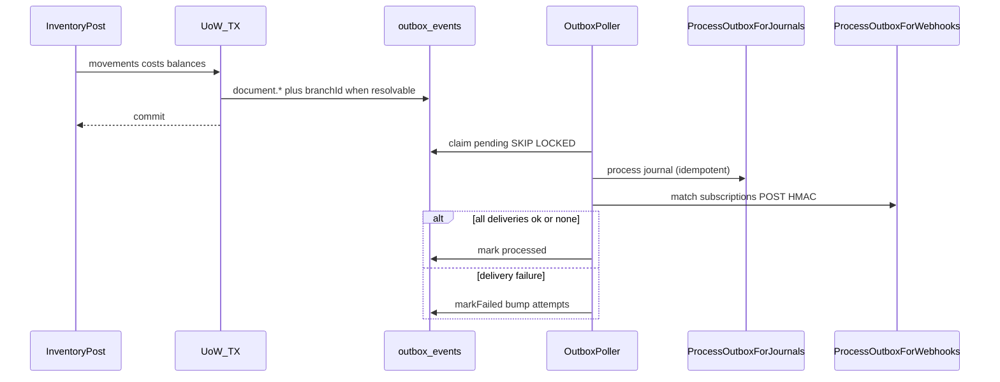

# Phase E3 — Webhooks / FEFO / Barcode Implementation Plan

> **For agentic workers:** REQUIRED SUB-SKILL: Use `superpowers:subagent-driven-development` (recommended) or `superpowers:executing-plans` to implement this plan task-by-task. Steps use checkbox (`- [ ]`) syntax for tracking.

**Prerequisite:** Phase **E1** and **E2** implemented (membership `branchIds` + request context ACL, transfer `fromBranchId`/`toBranchId`/`purpose`, approvals, reservation harden, outbox `branchId`). Do not start E3 code until E2 DoD is met. Deep E2: [`2026-07-26-phase-e2-ops-approvals.md`](./2026-07-26-phase-e2-ops-approvals.md).

**Goal:** Deliver signed webhook subscriptions/deliveries from the outbox (journal then webhook), FEFO + quarantine hard-block on issue/ship/commit, and barcode lookup + scan-first UX on GR/issue/count/transfer receive.

**Architecture:** Full Clean Architecture. Domain owns webhook entities, FEFO/quarantine asserts (`assertLotSellable`, `pickFefoLot`), and `webhook.admin` access. Application owns `WebhookPort`, `ProcessOutboxForWebhooks` (mockable `fetch`), HMAC-SHA256 signing, barcode lookup use case, and outbound sellability gates. Infrastructure: migration `0011_phase_e3_webhooks.sql`, Drizzle adapters, extend `apps/api/src/infrastructure/workers/outbox-poller.ts` to run journal then webhooks before mark processed. HTTP: webhook CRUD (org_admin) + `GET /products/by-barcode/:code`. Thin web: subscriptions admin + `BarcodeScanField` on inventory forms. **No** Phase F POS, camera SDK, or webhook transform DSL.

**Tech Stack:** Fastify, TypeScript, Drizzle, PostgreSQL, Zod (`packages/shared`), Vitest, Vite/React, TanStack Query/Router, Tailwind. Webhooks: Node `fetch` + `node:crypto` HMAC-SHA256.

**Spec:** `docs/superpowers/specs/2026-07-26-phase-e-multi-branch-design.md`  
**Master:** `docs/superpowers/plans/2026-07-26-phase-e-multi-branch.md`  
**Prior:** `docs/superpowers/plans/2026-07-26-phase-e1-branch-hardening.md`, `docs/superpowers/plans/2026-07-26-phase-e2-ops-approvals.md`  
**Wiki:** [[Phase E]] · [[POS Integration Boundary]] · [[Document-Driven Inventory]] · [[Feature Phases]] · [[Clean Architecture]]

## Global Constraints

- Full Clean Architecture — no `apps/api/src/modules/`
- Every tenant table / query includes `org_id`; branch ACL from E1 on top of org scope
- Document-driven qty only; immutable movements; void via reverse
- Auth stub: `X-Org-Id` + `X-User-Id` + optional `X-Branch-Id` (E1 context)
- Money/qty: Phase B/C `Number()` + string pattern; org currency only
- Outbox poller: **journal then webhook** for the same event; mark processed only after both succeed (or journal + no matching subscriptions)
- Webhook delivery idempotent on `(subscriptionId, outboxEventId)`; payload signed `X-Webhook-Signature: sha256=<hmac_hex>`
- FEFO: prefer earliest `expiryDate`; **hard-block** lots with `expiryDate < today` except quarantine **release** paths
- Quarantine: cannot sell/issue/commit from quarantine location or `lot.status === "quarantine"` without release (transfer/adjust out of quarantine)
- Webhook admin: `org_admin` only (`canPerform(role, "webhook.admin")`)
- Mock `fetch` in webhook unit tests — never hit real HTTP
- Coding standards: `docs/architecture/coding-standards.md`
- Features checklist: `docs/FEATURES.md` § Phase E (Webhooks, Quarantine/FEFO, Barcode scanning UX only)

---

## Decisions (locked for E3)

| Topic | Choice |
|-------|--------|
| Subscription match | Active + `orgId` + `eventTypes` includes `event.eventType`; optional `branchId` matches `payload.branchId` (skip if sub has branch filter and payload branch differs or is missing) |
| Event types subscribed | Outbox `eventType` strings: `document.posted`, `document.voided`, `stock.changed` (and any future outbox types). Subscription stores text array |
| HMAC | `createHmac("sha256", secret).update(rawBody, "utf8").digest("hex")` → header `X-Webhook-Signature: sha256=<hex>` |
| Body | JSON.stringify of `{ id, orgId, eventType, aggregateType, aggregateId, payload, createdAt }` where `id` is outbox event id |
| Delivery status | `pending` → `succeeded` \| `failed`; store `httpStatus`, `error` |
| Idempotency | Unique `(subscription_id, outbox_event_id)`; on retry skip POST if succeeded; re-attempt if failed |
| Poller order | Existing `processJournal` first; then `processWebhooks`; then `markProcessed`. Journal idempotent on retry (D1). Webhook failure → `markFailed` (retry later) |
| Fetch injector | `HttpPoster` port: `(url, init) => Promise<{ status: number; bodyText: string }>`; production uses `globalThis.fetch`; tests inject mock |
| FEFO prefer | `pickFefoLot` returns earliest non-null `expiryDate` among sellable lots (null expiry sorts last). Does **not** reject a later sellable lot chosen by the client |
| FEFO hard-block | `assertLotSellable` throws `LotExpiredError` when `expiryDate` calendar day `< today` unless `isQuarantineRelease` |
| Quarantine hard-block | Throws `LocationQuarantinedError` / `LotQuarantinedError` on issue / ship-from / reservation commit unless release path |
| Release path | `transfer_ship` from `location.type === "quarantine"` to non-quarantine **or** negative stock adjustment at quarantine location. Issue and reservation commit are **never** release paths |
| Today injection | Pass `today: Date` into asserts (UTC `YYYY-MM-DD` compare via `toISOString().slice(0, 10)`) for testability |
| Lot lookup | Extend `LotPort` with `findById(orgId, id)` |
| Barcode route | `GET /api/v1/products/by-barcode/:code` registered **before** `GET /products/:id`; returns product + barcodes or 404 |
| Secret on read | List/get return `secret` to org_admin (admin tool); no masking in E3 |
| UI scan | Shared `BarcodeScanField`: focusable text input; on Enter / blur-submit calls lookup; fills `productId` on parent line |
| Soft FEFO | Out of scope — hard-block only |

### Role matrix (E3 webhook admin)

| Action key | org_admin | branch_manager | warehouse | purchasing | accountant |
|------------|-----------|----------------|-----------|------------|------------|
| `webhook.admin` | Y | N | N | N | N |

E1/E2 actions unchanged.

## Out of scope (E3)

- JWT/OAuth
- Webhook transform DSL / payload templates beyond fixed envelope
- Camera SDK / hardware scanner drivers (keyboard-wedge scan into input is enough)
- Soft FEFO warn-only mode
- In-transit GL / intercompany accounting
- Phase F POS UI / channel availability
- Re-implementing E1 ACL or E2 approvals/reservations

## Consumes (E1 + E2 interfaces)

Implementers must treat these as already shipped:

```ts
// packages/domain — Membership.branchIds; access helpers (E1 + E2 document.approve)
assertBranchAccess(membership, branchId): void
resolveActiveBranch(membership, headerBranchId): string | null
canPerform(role, action): boolean
// E3 adds AccessAction "webhook.admin"

// apps/api/src/interfaces/plugins/context.ts
type RequestContext = {
  orgId: string;
  userId: string;
  role: MembershipRole;
  branchIds: string[];
  activeBranchId: string | null;
};

// Outbox poller (current) — apps/api/src/infrastructure/workers/outbox-poller.ts
type ProcessOutboxBatchDeps = {
  store: OutboxPollerStore;
  processJournal: (event: PendingOutboxEvent) => Promise<void>;
};

// Journal consumer — packages/application/src/use-cases/process-outbox-for-journals.ts
class ProcessOutboxForJournals {
  execute(event: OutboxLike): Promise<JournalWithLines | null>;
}

// Existing domain types used by FEFO
type LotStatus = "active" | "depleted" | "quarantine";
type LocationType = "storage" | "receiving" | "transit" | "quarantine";
type Lot = { id; orgId; productId; lotCode; expiryDate: Date | null; status: LotStatus; ... };
type Location = { id; orgId; branchId; code; name; type: LocationType; ... };
type ProductBarcode = { id; orgId; productId; barcode; ... };

// Outbound post sites (gates go here)
// packages/application/src/use-cases/stock-issue.ts — postStockIssueInCtx
// packages/application/src/use-cases/stock-transfer.ts — ship path (validateTransferLines / ship)
// packages/application/src/use-cases/commit-reservation.ts — via postStockIssueInCtx
```

## Outbox → journal → webhook flow



## File map

| Path | Responsibility |
|------|----------------|
| `packages/domain/src/entities.ts` | `WebhookSubscription`, `WebhookDelivery` |
| `packages/domain/src/types.ts` | `WebhookDeliveryStatus` |
| `packages/domain/src/errors.ts` | `LotExpiredError`, `LotQuarantinedError`, `LocationQuarantinedError`, `WebhookDeliveryError` |
| `packages/domain/src/access.ts` | Add `webhook.admin` to `AccessAction` / `canPerform` |
| `packages/domain/src/fefo.ts` | `isLotExpired`, `assertLotSellable`, `pickFefoLot`, `isQuarantineReleasePath` |
| `packages/domain/src/fefo.test.ts` | Domain unit tests |
| `packages/domain/src/webhooks.ts` | `subscriptionMatchesEvent` pure matcher |
| `packages/domain/src/webhooks.test.ts` | Matcher unit tests |
| `packages/application/src/ports/webhook.ts` | `WebhookPort`, `HttpPoster` |
| `packages/application/src/ports/inventory.ts` | `LotPort.findById` |
| `packages/application/src/ports/repositories.ts` | `ProductRepository.findByBarcode` |
| `packages/application/src/webhooks/hmac.ts` | `signWebhookBody`, `webhookSignatureHeader` |
| `packages/application/src/webhooks/hmac.test.ts` | HMAC unit tests |
| `packages/application/src/use-cases/process-outbox-for-webhooks.ts` | Deliver matched subscriptions |
| `packages/application/src/use-cases/process-outbox-for-webhooks.test.ts` | Mock fetch tests |
| `packages/application/src/use-cases/webhook-subscription.ts` | CRUD + list deliveries |
| `packages/application/src/use-cases/product.ts` | `findByBarcode` |
| `packages/application/src/use-cases/stock-issue.ts` | Call sellability assert before post movements |
| `packages/application/src/use-cases/stock-transfer.ts` | Sellability on ship (release path aware) |
| `packages/application/src/use-cases/stock-adjustment.ts` | Release-aware assert on negative lines |
| `packages/application/src/fefo/assert-outbound-sellable.ts` | Shared loader: location + lot → `assertLotSellable` |
| `packages/shared/src/webhooks.ts` | Zod DTOs |
| `packages/shared/src/index.ts` | Re-export |
| `apps/api/drizzle/0011_phase_e3_webhooks.sql` | `webhook_subscriptions`, `webhook_deliveries` |
| `apps/api/src/infrastructure/db/schema/index.ts` | Drizzle tables + enum |
| `apps/api/src/infrastructure/persistence/webhook.repository.ts` | `WebhookPort` |
| `apps/api/src/infrastructure/persistence/product.repository.ts` | `findByBarcode` |
| `apps/api/src/infrastructure/persistence/lot.repository.ts` | `findById` |
| `apps/api/src/infrastructure/workers/outbox-poller.ts` | `processWebhooks` after journal |
| `apps/api/src/infrastructure/workers/outbox-poller.test.ts` | Journal-then-webhook order + markFailed |
| `apps/api/src/interfaces/http/webhooks.routes.ts` | Subscriptions + deliveries |
| `apps/api/src/interfaces/http/webhooks.routes.test.ts` | HTTP tests |
| `apps/api/src/interfaces/http/products.routes.ts` | Barcode route before `:id` |
| `apps/api/src/interfaces/http/products.routes.test.ts` | Barcode 200/404 |
| `apps/api/src/main/composition-root.ts` | Wire ports + use cases |
| `apps/api/src/index.ts` | Pass `processWebhooks` into poller; register routes |
| `apps/web/src/components/BarcodeScanField.tsx` | Scan input |
| `apps/web/src/hooks/webhooks.ts` | Query/mutation hooks |
| `apps/web/src/hooks/masters.ts` | `useProductByBarcode` |
| `apps/web/src/api/client.ts` | Client methods |
| `apps/web/src/pages/WebhookSubscriptionsPage.tsx` | Admin CRUD |
| `apps/web/src/pages/GoodsReceiptsPage.tsx` | Scan field on lines |
| `apps/web/src/pages/StockIssuesPage.tsx` | Scan field |
| `apps/web/src/pages/StockCountsPage.tsx` | Scan field |
| `apps/web/src/pages/StockTransfersPage.tsx` | Scan on receive lines if editable |
| `apps/web/src/App.tsx` | Nav link (org_admin) |

Reuse: `OutboxPoller` lifecycle in `apps/api/src/index.ts`, `ProcessOutboxForJournals`, `product_barcodes` table, `LotStatus` / `LocationType` enums, E1 `canPerform` / context, composition root.

---

### Task 1: Domain — webhook entities + subscription matcher + access

**Files:**
- Modify: `packages/domain/src/types.ts`, `packages/domain/src/entities.ts`, `packages/domain/src/errors.ts`, `packages/domain/src/access.ts`, `packages/domain/src/access.test.ts`, `packages/domain/src/index.ts`
- Create: `packages/domain/src/webhooks.ts`, `packages/domain/src/webhooks.test.ts`

**Interfaces:**
- Consumes: E1/E2 `AccessAction` / `canPerform`
- Produces:

```ts
// types.ts
export type WebhookDeliveryStatus = "pending" | "succeeded" | "failed";

// entities.ts
export type WebhookSubscription = {
  id: string;
  orgId: string;
  url: string;
  secret: string;
  eventTypes: string[];
  branchId: string | null;
  active: boolean;
  createdAt: Date;
  updatedAt: Date;
};

export type WebhookDelivery = {
  id: string;
  orgId: string;
  subscriptionId: string;
  outboxEventId: string;
  status: WebhookDeliveryStatus;
  httpStatus: number | null;
  error: string | null;
  createdAt: Date;
  updatedAt: Date;
};

// errors.ts
export class WebhookDeliveryError extends DomainError {
  constructor(message: string) {
    super(message, "WEBHOOK_DELIVERY_FAILED");
    this.name = "WebhookDeliveryError";
  }
}

// access.ts — extend
export type AccessAction =
  | "masters.write"
  | "inventory.post"
  | "po.write"
  | "accounting.read"
  | "document.approve"
  | "webhook.admin";

// canPerform: webhook.admin → role === "org_admin" only

// webhooks.ts
export type OutboxEventLike = {
  orgId: string;
  eventType: string;
  payload: Record<string, unknown>;
};

export function subscriptionMatchesEvent(
  sub: Pick<WebhookSubscription, "orgId" | "active" | "eventTypes" | "branchId">,
  event: OutboxEventLike,
): boolean {
  if (!sub.active) return false;
  if (sub.orgId !== event.orgId) return false;
  if (!sub.eventTypes.includes(event.eventType)) return false;
  if (sub.branchId != null) {
    const branchId = event.payload.branchId;
    if (typeof branchId !== "string" || branchId !== sub.branchId) return false;
  }
  return true;
}
```

- [ ] **Step 1: Write the failing tests**

```ts
// packages/domain/src/webhooks.test.ts
import { describe, expect, it } from "vitest";
import { subscriptionMatchesEvent } from "./webhooks.js";

const baseSub = {
  orgId: "org-1",
  active: true,
  eventTypes: ["document.posted", "document.voided"],
  branchId: null as string | null,
};

describe("subscriptionMatchesEvent", () => {
  it("matches active org + event type with no branch filter", () => {
    expect(
      subscriptionMatchesEvent(baseSub, {
        orgId: "org-1",
        eventType: "document.posted",
        payload: { branchId: "b1" },
      }),
    ).toBe(true);
  });

  it("rejects inactive", () => {
    expect(
      subscriptionMatchesEvent(
        { ...baseSub, active: false },
        { orgId: "org-1", eventType: "document.posted", payload: {} },
      ),
    ).toBe(false);
  });

  it("rejects wrong org", () => {
    expect(
      subscriptionMatchesEvent(baseSub, {
        orgId: "org-2",
        eventType: "document.posted",
        payload: {},
      }),
    ).toBe(false);
  });

  it("rejects event type not in list", () => {
    expect(
      subscriptionMatchesEvent(baseSub, {
        orgId: "org-1",
        eventType: "stock.changed",
        payload: {},
      }),
    ).toBe(false);
  });

  it("requires payload.branchId when subscription filters by branch", () => {
    const sub = { ...baseSub, branchId: "b1" };
    expect(
      subscriptionMatchesEvent(sub, {
        orgId: "org-1",
        eventType: "document.posted",
        payload: {},
      }),
    ).toBe(false);
    expect(
      subscriptionMatchesEvent(sub, {
        orgId: "org-1",
        eventType: "document.posted",
        payload: { branchId: "b2" },
      }),
    ).toBe(false);
    expect(
      subscriptionMatchesEvent(sub, {
        orgId: "org-1",
        eventType: "document.posted",
        payload: { branchId: "b1" },
      }),
    ).toBe(true);
  });
});
```

```ts
// append to packages/domain/src/access.test.ts
import { canPerform } from "./access.js";

describe("canPerform webhook.admin", () => {
  it("allows org_admin only", () => {
    expect(canPerform("org_admin", "webhook.admin")).toBe(true);
    expect(canPerform("branch_manager", "webhook.admin")).toBe(false);
    expect(canPerform("warehouse", "webhook.admin")).toBe(false);
    expect(canPerform("purchasing", "webhook.admin")).toBe(false);
    expect(canPerform("accountant", "webhook.admin")).toBe(false);
  });
});
```

- [ ] **Step 2: Run tests to verify they fail**

```bash
pnpm --filter @stock-management/domain test -- src/webhooks.test.ts
pnpm --filter @stock-management/domain test -- src/access.test.ts
```

Expected: FAIL — `subscriptionMatchesEvent` / `webhook.admin` missing

- [ ] **Step 3: Minimal implementation**

1. Add types + entities + `WebhookDeliveryError`.
2. Extend `AccessAction` and `canPerform` matrix for `webhook.admin`.
3. Implement `subscriptionMatchesEvent` in `webhooks.ts`; export from `index.ts`.

- [ ] **Step 4: Run tests to verify they pass**

```bash
pnpm --filter @stock-management/domain test -- src/webhooks.test.ts src/access.test.ts
```

Expected: PASS

- [ ] **Step 5: Commit**

```bash
git add packages/domain/src/types.ts packages/domain/src/entities.ts \
  packages/domain/src/errors.ts packages/domain/src/access.ts \
  packages/domain/src/access.test.ts packages/domain/src/webhooks.ts \
  packages/domain/src/webhooks.test.ts packages/domain/src/index.ts
git commit -m "$(cat <<'EOF'
feat(domain): add webhook entities, matcher, and webhook.admin access

EOF
)"
```

---

### Task 2: Domain — FEFO + quarantine hard rules

**Files:**
- Modify: `packages/domain/src/errors.ts`, `packages/domain/src/index.ts`
- Create: `packages/domain/src/fefo.ts`, `packages/domain/src/fefo.test.ts`

**Interfaces:**
- Consumes: `Lot`, `LotStatus`, `Location`, `LocationType`
- Produces:

```ts
// errors.ts
export class LotExpiredError extends DomainError {
  constructor(message = "Lot is expired and cannot be sold or issued") {
    super(message, "LOT_EXPIRED");
    this.name = "LotExpiredError";
  }
}

export class LotQuarantinedError extends DomainError {
  constructor(message = "Lot is quarantined and cannot be sold or issued") {
    super(message, "LOT_QUARANTINED");
    this.name = "LotQuarantinedError";
  }
}

export class LocationQuarantinedError extends DomainError {
  constructor(
    message = "Cannot sell or issue from a quarantine location",
  ) {
    super(message, "LOCATION_QUARANTINED");
    this.name = "LocationQuarantinedError";
  }
}

// fefo.ts
export type SellableLot = Pick<Lot, "id" | "expiryDate" | "status">;
export type SellableLocation = Pick<Location, "id" | "type">;

export type SellableAssertOptions = {
  isQuarantineRelease?: boolean;
};

export function calendarDate(d: Date): string {
  return d.toISOString().slice(0, 10);
}

export function isLotExpired(
  expiryDate: Date | null,
  today: Date,
): boolean {
  if (expiryDate == null) return false;
  return calendarDate(expiryDate) < calendarDate(today);
}

export type OutboundOperation =
  | "issue"
  | "transfer_ship"
  | "reservation_commit"
  | "adjustment";

export function isQuarantineReleasePath(args: {
  operation: OutboundOperation;
  fromLocationType: LocationType;
  toLocationType?: LocationType;
}): boolean {
  if (args.operation === "issue" || args.operation === "reservation_commit") {
    return false;
  }
  if (args.operation === "transfer_ship") {
    return (
      args.fromLocationType === "quarantine" &&
      args.toLocationType != null &&
      args.toLocationType !== "quarantine"
    );
  }
  // adjustment: decreasing stock at quarantine counts as release
  return args.fromLocationType === "quarantine";
}

/**
 * Hard-block expired / quarantine unless release path.
 * Prefer FEFO is separate (pickFefoLot) — this only enforces hard rules.
 */
export function assertLotSellable(
  lot: SellableLot | null,
  location: SellableLocation,
  today: Date,
  options: SellableAssertOptions = {},
): void {
  const release = options.isQuarantineRelease === true;
  if (!release && location.type === "quarantine") {
    throw new LocationQuarantinedError();
  }
  if (lot == null) return; // non-lot-tracked ok if location ok
  if (!release && lot.status === "quarantine") {
    throw new LotQuarantinedError();
  }
  if (!release && isLotExpired(lot.expiryDate, today)) {
    throw new LotExpiredError();
  }
}

/**
 * Prefer earliest expiry among candidates that pass assertLotSellable.
 * Null expiry sorts after dated lots. Returns null if none sellable.
 */
export function pickFefoLot(
  lots: ReadonlyArray<SellableLot>,
  location: SellableLocation,
  today: Date,
  options: SellableAssertOptions = {},
): string | null {
  const sellable: SellableLot[] = [];
  for (const lot of lots) {
    try {
      assertLotSellable(lot, location, today, options);
      sellable.push(lot);
    } catch {
      // skip
    }
  }
  if (sellable.length === 0) return null;
  sellable.sort((a, b) => {
    if (a.expiryDate == null && b.expiryDate == null) return 0;
    if (a.expiryDate == null) return 1;
    if (b.expiryDate == null) return -1;
    return calendarDate(a.expiryDate).localeCompare(calendarDate(b.expiryDate));
  });
  return sellable[0]!.id;
}
```

- [ ] **Step 1: Write the failing test**

```ts
// packages/domain/src/fefo.test.ts
import { describe, expect, it } from "vitest";
import {
  assertLotSellable,
  isLotExpired,
  isQuarantineReleasePath,
  pickFefoLot,
} from "./fefo.js";
import {
  LocationQuarantinedError,
  LotExpiredError,
  LotQuarantinedError,
} from "./errors.js";

const today = new Date("2026-07-26T12:00:00.000Z");
const storage = { id: "loc-1", type: "storage" as const };
const quarantineLoc = { id: "loc-q", type: "quarantine" as const };

describe("isLotExpired", () => {
  it("false when no expiry", () => {
    expect(isLotExpired(null, today)).toBe(false);
  });
  it("false when expiry is today", () => {
    expect(isLotExpired(new Date("2026-07-26T00:00:00.000Z"), today)).toBe(
      false,
    );
  });
  it("true when expiry before today", () => {
    expect(isLotExpired(new Date("2026-07-25T00:00:00.000Z"), today)).toBe(
      true,
    );
  });
});

describe("isQuarantineReleasePath", () => {
  it("never for issue or reservation_commit", () => {
    expect(
      isQuarantineReleasePath({
        operation: "issue",
        fromLocationType: "quarantine",
        toLocationType: "storage",
      }),
    ).toBe(false);
    expect(
      isQuarantineReleasePath({
        operation: "reservation_commit",
        fromLocationType: "quarantine",
      }),
    ).toBe(false);
  });
  it("true for transfer quarantine → storage", () => {
    expect(
      isQuarantineReleasePath({
        operation: "transfer_ship",
        fromLocationType: "quarantine",
        toLocationType: "storage",
      }),
    ).toBe(true);
  });
  it("false for transfer quarantine → quarantine", () => {
    expect(
      isQuarantineReleasePath({
        operation: "transfer_ship",
        fromLocationType: "quarantine",
        toLocationType: "quarantine",
      }),
    ).toBe(false);
  });
  it("true for adjustment at quarantine", () => {
    expect(
      isQuarantineReleasePath({
        operation: "adjustment",
        fromLocationType: "quarantine",
      }),
    ).toBe(true);
  });
});

describe("assertLotSellable", () => {
  const activeLot = {
    id: "lot-1",
    expiryDate: new Date("2026-08-01T00:00:00.000Z"),
    status: "active" as const,
  };

  it("allows active non-expired at storage", () => {
    expect(() =>
      assertLotSellable(activeLot, storage, today),
    ).not.toThrow();
  });

  it("blocks expired lot", () => {
    expect(() =>
      assertLotSellable(
        { ...activeLot, expiryDate: new Date("2026-07-01T00:00:00.000Z") },
        storage,
        today,
      ),
    ).toThrow(LotExpiredError);
  });

  it("blocks quarantined lot", () => {
    expect(() =>
      assertLotSellable(
        { ...activeLot, status: "quarantine" },
        storage,
        today,
      ),
    ).toThrow(LotQuarantinedError);
  });

  it("blocks quarantine location", () => {
    expect(() =>
      assertLotSellable(activeLot, quarantineLoc, today),
    ).toThrow(LocationQuarantinedError);
  });

  it("allows expired on quarantine release", () => {
    expect(() =>
      assertLotSellable(
        {
          ...activeLot,
          expiryDate: new Date("2026-07-01T00:00:00.000Z"),
          status: "quarantine",
        },
        quarantineLoc,
        today,
        { isQuarantineRelease: true },
      ),
    ).not.toThrow();
  });
});

describe("pickFefoLot", () => {
  it("picks earliest expiry among sellable", () => {
    const id = pickFefoLot(
      [
        {
          id: "late",
          expiryDate: new Date("2026-09-01T00:00:00.000Z"),
          status: "active",
        },
        {
          id: "early",
          expiryDate: new Date("2026-08-01T00:00:00.000Z"),
          status: "active",
        },
        {
          id: "expired",
          expiryDate: new Date("2026-07-01T00:00:00.000Z"),
          status: "active",
        },
      ],
      storage,
      today,
    );
    expect(id).toBe("early");
  });

  it("returns null when none sellable", () => {
    expect(
      pickFefoLot(
        [
          {
            id: "q",
            expiryDate: new Date("2026-08-01T00:00:00.000Z"),
            status: "quarantine",
          },
        ],
        storage,
        today,
      ),
    ).toBeNull();
  });

  it("sorts null expiry after dated lots", () => {
    const id = pickFefoLot(
      [
        { id: "none", expiryDate: null, status: "active" },
        {
          id: "dated",
          expiryDate: new Date("2026-08-01T00:00:00.000Z"),
          status: "active",
        },
      ],
      storage,
      today,
    );
    expect(id).toBe("dated");
  });
});
```

- [ ] **Step 2: Run test to verify it fails**

```bash
pnpm --filter @stock-management/domain test -- src/fefo.test.ts
```

Expected: FAIL — module / exports missing

- [ ] **Step 3: Minimal implementation**

Implement `fefo.ts` + error classes; export from `index.ts`.

- [ ] **Step 4: Run test to verify it passes**

```bash
pnpm --filter @stock-management/domain test -- src/fefo.test.ts
```

Expected: PASS

- [ ] **Step 5: Commit**

```bash
git add packages/domain/src/fefo.ts packages/domain/src/fefo.test.ts \
  packages/domain/src/errors.ts packages/domain/src/index.ts
git commit -m "$(cat <<'EOF'
feat(domain): add FEFO pick and quarantine/expiry hard-block asserts

EOF
)"
```

---

### Task 3: Migration + Drizzle schema + WebhookPort repository

**Files:**
- Create: `apps/api/drizzle/0011_phase_e3_webhooks.sql`
- Modify: `apps/api/src/infrastructure/db/schema/index.ts`
- Create: `apps/api/src/infrastructure/persistence/webhook.repository.ts`
- Create: `packages/application/src/ports/webhook.ts`
- Modify: `packages/application/src/index.ts` (export port)

**Interfaces:**
- Produces:

```ts
// packages/application/src/ports/webhook.ts
import type {
  WebhookDelivery,
  WebhookSubscription,
} from "@stock-management/domain";

export type CreateWebhookSubscriptionInput = {
  url: string;
  secret: string;
  eventTypes: string[];
  branchId?: string | null;
  active?: boolean;
};

export type UpdateWebhookSubscriptionInput = Partial<{
  url: string;
  secret: string;
  eventTypes: string[];
  branchId: string | null;
  active: boolean;
}>;

export type HttpPoster = (
  url: string,
  init: {
    method: "POST";
    headers: Record<string, string>;
    body: string;
  },
) => Promise<{ status: number; bodyText: string }>;

export interface WebhookPort {
  listSubscriptions(orgId: string): Promise<WebhookSubscription[]>;
  findSubscription(
    orgId: string,
    id: string,
  ): Promise<WebhookSubscription | null>;
  listActiveSubscriptions(orgId: string): Promise<WebhookSubscription[]>;
  createSubscription(
    orgId: string,
    input: CreateWebhookSubscriptionInput,
  ): Promise<WebhookSubscription>;
  updateSubscription(
    orgId: string,
    id: string,
    input: UpdateWebhookSubscriptionInput,
  ): Promise<WebhookSubscription | null>;
  findDeliveryBySubscriptionAndEvent(
    orgId: string,
    subscriptionId: string,
    outboxEventId: string,
  ): Promise<WebhookDelivery | null>;
  insertDelivery(input: {
    orgId: string;
    subscriptionId: string;
    outboxEventId: string;
    status: WebhookDelivery["status"];
    httpStatus: number | null;
    error: string | null;
  }): Promise<WebhookDelivery>;
  updateDelivery(
    orgId: string,
    id: string,
    patch: {
      status: WebhookDelivery["status"];
      httpStatus: number | null;
      error: string | null;
    },
  ): Promise<WebhookDelivery>;
  listDeliveries(
    orgId: string,
    filters?: { subscriptionId?: string },
  ): Promise<WebhookDelivery[]>;
}
```

SQL sketch (`0011_phase_e3_webhooks.sql`):

```sql
CREATE TYPE webhook_delivery_status AS ENUM ('pending', 'succeeded', 'failed');

CREATE TABLE webhook_subscriptions (
  id uuid PRIMARY KEY DEFAULT gen_random_uuid(),
  org_id uuid NOT NULL REFERENCES organizations(id),
  url text NOT NULL,
  secret text NOT NULL,
  event_types text[] NOT NULL,
  branch_id uuid REFERENCES branches(id),
  active boolean NOT NULL DEFAULT true,
  created_at timestamptz NOT NULL DEFAULT now(),
  updated_at timestamptz NOT NULL DEFAULT now()
);

CREATE INDEX webhook_subscriptions_org_idx ON webhook_subscriptions (org_id);

CREATE TABLE webhook_deliveries (
  id uuid PRIMARY KEY DEFAULT gen_random_uuid(),
  org_id uuid NOT NULL REFERENCES organizations(id),
  subscription_id uuid NOT NULL REFERENCES webhook_subscriptions(id),
  outbox_event_id uuid NOT NULL REFERENCES outbox_events(id),
  status webhook_delivery_status NOT NULL DEFAULT 'pending',
  http_status integer,
  error text,
  created_at timestamptz NOT NULL DEFAULT now(),
  updated_at timestamptz NOT NULL DEFAULT now()
);

CREATE UNIQUE INDEX webhook_deliveries_sub_event_uidx
  ON webhook_deliveries (subscription_id, outbox_event_id);

CREATE INDEX webhook_deliveries_org_idx ON webhook_deliveries (org_id);
```

- [ ] **Step 1: Write a repository mapping smoke test (optional unit with fake DB skipped)** — prefer schema compile check:

```bash
pnpm --filter @stock-management/api typecheck
```

Expected before schema: may already pass; after adding imports that reference missing tables, typecheck fails until schema added.

- [ ] **Step 2: Add migration + Drizzle tables** mirroring SQL (`webhookDeliveryStatusEnum`, `webhookSubscriptions`, `webhookDeliveries`).

- [ ] **Step 3: Implement `DrizzleWebhookRepository` implementing `WebhookPort`.**

- [ ] **Step 4: Run typecheck**

```bash
pnpm --filter @stock-management/api typecheck
pnpm --filter @stock-management/application typecheck
```

Expected: PASS

- [ ] **Step 5: Commit**

```bash
git add apps/api/drizzle/0011_phase_e3_webhooks.sql \
  apps/api/src/infrastructure/db/schema/index.ts \
  apps/api/src/infrastructure/persistence/webhook.repository.ts \
  packages/application/src/ports/webhook.ts \
  packages/application/src/index.ts
git commit -m "$(cat <<'EOF'
feat(api): add webhook subscription and delivery schema

EOF
)"
```

---

### Task 4: HMAC helper + ProcessOutboxForWebhooks (mock fetch)

**Files:**
- Create: `packages/application/src/webhooks/hmac.ts`, `packages/application/src/webhooks/hmac.test.ts`
- Create: `packages/application/src/use-cases/process-outbox-for-webhooks.ts`
- Create: `packages/application/src/use-cases/process-outbox-for-webhooks.test.ts`
- Modify: `packages/application/src/index.ts`

**Interfaces:**
- Consumes: `WebhookPort`, `HttpPoster`, `subscriptionMatchesEvent`, `WebhookDeliveryError`
- Produces:

```ts
// hmac.ts
import { createHmac } from "node:crypto";

export function signWebhookBody(rawBody: string, secret: string): string {
  return createHmac("sha256", secret).update(rawBody, "utf8").digest("hex");
}

export function webhookSignatureHeader(rawBody: string, secret: string): string {
  return `sha256=${signWebhookBody(rawBody, secret)}`;
}

// process-outbox-for-webhooks.ts
export type OutboxWebhookEvent = {
  id: string;
  orgId: string;
  eventType: string;
  aggregateType: string;
  aggregateId: string;
  payload: Record<string, unknown>;
  createdAt?: Date;
};

export class ProcessOutboxForWebhooks {
  constructor(
    private readonly webhooks: WebhookPort,
    private readonly post: HttpPoster,
  ) {}

  /**
   * Match active subscriptions; deliver idempotently.
   * Throws WebhookDeliveryError if any matched delivery ends failed
   * (so poller markFailed / retry). Succeeded prior deliveries are skipped.
   */
  async execute(event: OutboxWebhookEvent): Promise<void> {
    const subs = await this.webhooks.listActiveSubscriptions(event.orgId);
    const matched = subs.filter((s) =>
      subscriptionMatchesEvent(s, event),
    );
    const failures: string[] = [];
    for (const sub of matched) {
      const existing =
        await this.webhooks.findDeliveryBySubscriptionAndEvent(
          event.orgId,
          sub.id,
          event.id,
        );
      if (existing?.status === "succeeded") continue;

      const envelope = {
        id: event.id,
        orgId: event.orgId,
        eventType: event.eventType,
        aggregateType: event.aggregateType,
        aggregateId: event.aggregateId,
        payload: event.payload,
        createdAt: (event.createdAt ?? new Date()).toISOString(),
      };
      const rawBody = JSON.stringify(envelope);
      const signature = webhookSignatureHeader(rawBody, sub.secret);

      let delivery =
        existing ??
        (await this.webhooks.insertDelivery({
          orgId: event.orgId,
          subscriptionId: sub.id,
          outboxEventId: event.id,
          status: "pending",
          httpStatus: null,
          error: null,
        }));

      try {
        const res = await this.post(sub.url, {
          method: "POST",
          headers: {
            "content-type": "application/json",
            "X-Webhook-Signature": signature,
          },
          body: rawBody,
        });
        if (res.status >= 200 && res.status < 300) {
          await this.webhooks.updateDelivery(event.orgId, delivery.id, {
            status: "succeeded",
            httpStatus: res.status,
            error: null,
          });
        } else {
          const err = `HTTP ${res.status}: ${res.bodyText.slice(0, 500)}`;
          await this.webhooks.updateDelivery(event.orgId, delivery.id, {
            status: "failed",
            httpStatus: res.status,
            error: err,
          });
          failures.push(`${sub.id}: ${err}`);
        }
      } catch (e) {
        const message = e instanceof Error ? e.message : String(e);
        await this.webhooks.updateDelivery(event.orgId, delivery.id, {
          status: "failed",
          httpStatus: null,
          error: message,
        });
        failures.push(`${sub.id}: ${message}`);
      }
    }
    if (failures.length > 0) {
      throw new WebhookDeliveryError(failures.join("; "));
    }
  }
}
```

- [ ] **Step 1: Write the failing tests**

```ts
// packages/application/src/webhooks/hmac.test.ts
import { describe, expect, it } from "vitest";
import { createHmac } from "node:crypto";
import { signWebhookBody, webhookSignatureHeader } from "./hmac.js";

describe("signWebhookBody", () => {
  it("matches node createHmac sha256 hex", () => {
    const body = '{"hello":"world"}';
    const secret = "s3cret";
    const expected = createHmac("sha256", secret)
      .update(body, "utf8")
      .digest("hex");
    expect(signWebhookBody(body, secret)).toBe(expected);
    expect(webhookSignatureHeader(body, secret)).toBe(`sha256=${expected}`);
  });
});
```

```ts
// packages/application/src/use-cases/process-outbox-for-webhooks.test.ts
import { describe, expect, it, vi } from "vitest";
import type {
  WebhookDelivery,
  WebhookSubscription,
} from "@stock-management/domain";
import { WebhookDeliveryError } from "@stock-management/domain";
import type { HttpPoster, WebhookPort } from "../ports/webhook.js";
import { ProcessOutboxForWebhooks } from "./process-outbox-for-webhooks.js";
import { webhookSignatureHeader } from "../webhooks/hmac.js";

function memPort(subs: WebhookSubscription[]): WebhookPort & {
  deliveries: WebhookDelivery[];
} {
  const deliveries: WebhookDelivery[] = [];
  return {
    deliveries,
    async listSubscriptions(orgId) {
      return subs.filter((s) => s.orgId === orgId);
    },
    async findSubscription(orgId, id) {
      return subs.find((s) => s.orgId === orgId && s.id === id) ?? null;
    },
    async listActiveSubscriptions(orgId) {
      return subs.filter((s) => s.orgId === orgId && s.active);
    },
    async createSubscription() {
      throw new Error("not used");
    },
    async updateSubscription() {
      return null;
    },
    async findDeliveryBySubscriptionAndEvent(orgId, subscriptionId, outboxEventId) {
      return (
        deliveries.find(
          (d) =>
            d.orgId === orgId &&
            d.subscriptionId === subscriptionId &&
            d.outboxEventId === outboxEventId,
        ) ?? null
      );
    },
    async insertDelivery(input) {
      const row: WebhookDelivery = {
        id: `del-${deliveries.length + 1}`,
        orgId: input.orgId,
        subscriptionId: input.subscriptionId,
        outboxEventId: input.outboxEventId,
        status: input.status,
        httpStatus: input.httpStatus,
        error: input.error,
        createdAt: new Date(),
        updatedAt: new Date(),
      };
      deliveries.push(row);
      return row;
    },
    async updateDelivery(orgId, id, patch) {
      const row = deliveries.find((d) => d.orgId === orgId && d.id === id)!;
      Object.assign(row, patch, { updatedAt: new Date() });
      return row;
    },
    async listDeliveries(orgId) {
      return deliveries.filter((d) => d.orgId === orgId);
    },
  };
}

const sub: WebhookSubscription = {
  id: "sub-1",
  orgId: "org-1",
  url: "https://example.test/hook",
  secret: "hook-secret",
  eventTypes: ["document.posted"],
  branchId: null,
  active: true,
  createdAt: new Date(),
  updatedAt: new Date(),
};

const event = {
  id: "evt-1",
  orgId: "org-1",
  eventType: "document.posted",
  aggregateType: "goods_receipt",
  aggregateId: "gr-1",
  payload: { branchId: "b1", documentType: "goods_receipt" },
  createdAt: new Date("2026-07-26T10:00:00.000Z"),
};

describe("ProcessOutboxForWebhooks", () => {
  it("POSTs signed JSON and records succeeded delivery", async () => {
    const port = memPort([sub]);
    const post = vi.fn<HttpPoster>(async (_url, init) => {
      expect(init.headers["content-type"]).toBe("application/json");
      expect(init.headers["X-Webhook-Signature"]).toBe(
        webhookSignatureHeader(init.body, sub.secret),
      );
      const parsed = JSON.parse(init.body);
      expect(parsed.id).toBe("evt-1");
      expect(parsed.eventType).toBe("document.posted");
      return { status: 200, bodyText: "ok" };
    });
    const uc = new ProcessOutboxForWebhooks(port, post);
    await uc.execute(event);
    expect(post).toHaveBeenCalledTimes(1);
    expect(port.deliveries[0]!.status).toBe("succeeded");
    expect(port.deliveries[0]!.httpStatus).toBe(200);
  });

  it("skips re-POST when prior delivery succeeded (idempotent)", async () => {
    const port = memPort([sub]);
    port.deliveries.push({
      id: "del-existing",
      orgId: "org-1",
      subscriptionId: "sub-1",
      outboxEventId: "evt-1",
      status: "succeeded",
      httpStatus: 200,
      error: null,
      createdAt: new Date(),
      updatedAt: new Date(),
    });
    const post = vi.fn(async () => ({ status: 200, bodyText: "ok" }));
    await new ProcessOutboxForWebhooks(port, post).execute(event);
    expect(post).not.toHaveBeenCalled();
  });

  it("throws WebhookDeliveryError on non-2xx and marks failed", async () => {
    const port = memPort([sub]);
    const post = vi.fn(async () => ({ status: 500, bodyText: "nope" }));
    await expect(
      new ProcessOutboxForWebhooks(port, post).execute(event),
    ).rejects.toBeInstanceOf(WebhookDeliveryError);
    expect(port.deliveries[0]!.status).toBe("failed");
    expect(port.deliveries[0]!.httpStatus).toBe(500);
  });

  it("does not call fetch when no subscriptions match", async () => {
    const port = memPort([
      { ...sub, eventTypes: ["document.voided"] },
    ]);
    const post = vi.fn(async () => ({ status: 200, bodyText: "ok" }));
    await new ProcessOutboxForWebhooks(port, post).execute(event);
    expect(post).not.toHaveBeenCalled();
    expect(port.deliveries).toHaveLength(0);
  });

  it("filters by subscription branchId", async () => {
    const port = memPort([{ ...sub, branchId: "b2" }]);
    const post = vi.fn(async () => ({ status: 200, bodyText: "ok" }));
    await new ProcessOutboxForWebhooks(port, post).execute(event);
    expect(post).not.toHaveBeenCalled();
  });
});
```

- [ ] **Step 2: Run tests to verify they fail**

```bash
pnpm --filter @stock-management/application test -- src/webhooks/hmac.test.ts src/use-cases/process-outbox-for-webhooks.test.ts
```

Expected: FAIL — modules missing

- [ ] **Step 3: Implement HMAC + `ProcessOutboxForWebhooks` exactly as Interfaces**

- [ ] **Step 4: Run tests to verify they pass**

```bash
pnpm --filter @stock-management/application test -- src/webhooks/hmac.test.ts src/use-cases/process-outbox-for-webhooks.test.ts
```

Expected: PASS

- [ ] **Step 5: Commit**

```bash
git add packages/application/src/webhooks/hmac.ts \
  packages/application/src/webhooks/hmac.test.ts \
  packages/application/src/use-cases/process-outbox-for-webhooks.ts \
  packages/application/src/use-cases/process-outbox-for-webhooks.test.ts \
  packages/application/src/index.ts
git commit -m "$(cat <<'EOF'
feat(application): deliver signed webhooks from outbox events

EOF
)"
```

---

### Task 5: Extend outbox poller — journal then webhook

**Files:**
- Modify: `apps/api/src/infrastructure/workers/outbox-poller.ts`
- Create: `apps/api/src/infrastructure/workers/outbox-poller.test.ts` (or extend existing)
- Modify: `apps/api/src/index.ts` (wire `ProcessOutboxForWebhooks` + `HttpPoster`)
- Modify: `apps/api/src/main/composition-root.ts` if services exported there
- Modify: any existing poller call sites (e.g. `outbox-journals.integration.test.ts`) to pass `processWebhooks`

**Interfaces:**
- Consumes: Task 4 `ProcessOutboxForWebhooks`; existing `ProcessOutboxForJournals`
- Produces:

```ts
// outbox-poller.ts — extend deps
export type ProcessOutboxBatchDeps = {
  store: OutboxPollerStore;
  processJournal: (event: PendingOutboxEvent) => Promise<void>;
  processWebhooks: (event: PendingOutboxEvent) => Promise<void>;
};

// inside loop:
await deps.processJournal(row);
await deps.processWebhooks(row);
await deps.store.markProcessed(row.id);
// on throw → markFailed (unchanged)
```

Production `HttpPoster`:

```ts
const httpPoster: HttpPoster = async (url, init) => {
  const res = await fetch(url, init);
  const bodyText = await res.text();
  return { status: res.status, bodyText };
};
```

- [ ] **Step 1: Write the failing poller order test**

```ts
// apps/api/src/infrastructure/workers/outbox-poller.test.ts
import { describe, expect, it, vi } from "vitest";
import {
  processOutboxBatch,
  type OutboxPollerStore,
  type PendingOutboxEvent,
} from "./outbox-poller.js";

describe("processOutboxBatch journal then webhook", () => {
  it("calls processJournal before processWebhooks then markProcessed", async () => {
    const order: string[] = [];
    const event: PendingOutboxEvent = {
      id: "e1",
      orgId: "o1",
      eventType: "document.posted",
      aggregateType: "goods_receipt",
      aggregateId: "gr1",
      payload: {},
    };
    const store: OutboxPollerStore = {
      async claimPending() {
        return [event];
      },
      async markProcessed(id) {
        order.push(`processed:${id}`);
      },
      async markFailed() {
        order.push("failed");
      },
    };
    await processOutboxBatch({
      log: { info() {}, error() {} },
      runInTransaction: async (fn) =>
        fn({
          store,
          processJournal: async () => {
            order.push("journal");
          },
          processWebhooks: async () => {
            order.push("webhook");
          },
        }),
    });
    expect(order).toEqual(["journal", "webhook", "processed:e1"]);
  });

  it("markFailed when webhooks throw after journal", async () => {
    const event: PendingOutboxEvent = {
      id: "e2",
      orgId: "o1",
      eventType: "document.posted",
      aggregateType: "goods_receipt",
      aggregateId: "gr1",
      payload: {},
    };
    const markFailed = vi.fn();
    await processOutboxBatch({
      log: { info() {}, error() {} },
      runInTransaction: async (fn) =>
        fn({
          store: {
            async claimPending() {
              return [event];
            },
            async markProcessed() {
              throw new Error("should not process");
            },
            markFailed,
          },
          processJournal: async () => {},
          processWebhooks: async () => {
            throw new Error("hook down");
          },
        }),
    });
    expect(markFailed).toHaveBeenCalledWith("e2", "hook down");
  });
});
```

- [ ] **Step 2: Run test to verify it fails**

```bash
pnpm --filter @stock-management/api test -- src/infrastructure/workers/outbox-poller.test.ts
```

Expected: FAIL — `processWebhooks` not in deps / not called

- [ ] **Step 3: Update `processOutboxBatch` + `apps/api/src/index.ts` wiring**

Update all existing call sites that construct `ProcessOutboxBatchDeps` (e.g. `outbox-journals.integration.test.ts`) to pass `processWebhooks: async () => {}` no-op or real processor.

- [ ] **Step 4: Run tests**

```bash
pnpm --filter @stock-management/api test -- src/infrastructure/workers/outbox-poller.test.ts src/infrastructure/workers/outbox-journals.integration.test.ts
```

Expected: PASS

- [ ] **Step 5: Commit**

```bash
git add apps/api/src/infrastructure/workers/outbox-poller.ts \
  apps/api/src/infrastructure/workers/outbox-poller.test.ts \
  apps/api/src/infrastructure/workers/outbox-journals.integration.test.ts \
  apps/api/src/index.ts apps/api/src/main/composition-root.ts
git commit -m "$(cat <<'EOF'
feat(api): run webhook delivery after journal in outbox poller

EOF
)"
```

---

### Task 6: Webhook CRUD use cases + Zod + HTTP (org_admin)

**Files:**
- Create: `packages/application/src/use-cases/webhook-subscription.ts`
- Create: `packages/application/src/use-cases/webhook-subscription.test.ts`
- Create: `packages/shared/src/webhooks.ts`
- Modify: `packages/shared/src/index.ts`
- Create: `apps/api/src/interfaces/http/webhooks.routes.ts`
- Create: `apps/api/src/interfaces/http/webhooks.routes.test.ts`
- Modify: `apps/api/src/index.ts`, `apps/api/src/main/composition-root.ts`
- Modify: `apps/api/src/interfaces/plugins/error-handler.ts` if needed for new error codes

**Interfaces:**
- Produces:

```ts
// packages/shared/src/webhooks.ts
import { z } from "zod";

export const CreateWebhookSubscriptionSchema = z.object({
  url: z.string().url(),
  secret: z.string().min(8),
  eventTypes: z.array(z.string().min(1)).min(1),
  branchId: z.string().uuid().nullable().optional(),
  active: z.boolean().optional(),
});

export const UpdateWebhookSubscriptionSchema = CreateWebhookSubscriptionSchema.partial();

// use-cases/webhook-subscription.ts
export class WebhookSubscriptionUseCases {
  constructor(private readonly repo: WebhookPort) {}
  list(orgId: string) { return this.repo.listSubscriptions(orgId); }
  async get(orgId: string, id: string) {
    const row = await this.repo.findSubscription(orgId, id);
    if (!row) throw new NotFoundError("Webhook subscription");
    return row;
  }
  create(orgId: string, input: CreateWebhookSubscriptionInput) {
    return this.repo.createSubscription(orgId, {
      ...input,
      active: input.active ?? true,
      branchId: input.branchId ?? null,
    });
  }
  async update(orgId: string, id: string, input: UpdateWebhookSubscriptionInput) {
    const row = await this.repo.updateSubscription(orgId, id, input);
    if (!row) throw new NotFoundError("Webhook subscription");
    return row;
  }
  listDeliveries(orgId: string, subscriptionId?: string) {
    return this.repo.listDeliveries(orgId, { subscriptionId });
  }
}
```

HTTP routes (`/api/v1`):

| Method | Path | Gate |
|--------|------|------|
| GET | `/webhook-subscriptions` | `webhook.admin` |
| POST | `/webhook-subscriptions` | `webhook.admin` |
| GET | `/webhook-subscriptions/:id` | `webhook.admin` |
| PATCH | `/webhook-subscriptions/:id` | `webhook.admin` |
| GET | `/webhook-deliveries` | `webhook.admin` (optional `?subscriptionId=`) |

```ts
// gate pattern in each handler
if (!canPerform(request.ctx.role, "webhook.admin")) {
  throw new ForbiddenError();
}
```

- [ ] **Step 1: Write failing use-case + route tests**

```ts
// packages/application/src/use-cases/webhook-subscription.test.ts
import { describe, expect, it } from "vitest";
import { NotFoundError } from "@stock-management/domain";
import type { WebhookPort } from "../ports/webhook.js";
import { WebhookSubscriptionUseCases } from "./webhook-subscription.js";

describe("WebhookSubscriptionUseCases", () => {
  it("create + get round trip via port", async () => {
    const created: Parameters<WebhookPort["createSubscription"]> extends [
      string,
      infer I,
    ]
      ? I
      : never = {
      url: "https://hooks.example/x",
      secret: "12345678",
      eventTypes: ["document.posted"],
      branchId: null,
      active: true,
    };
    const store = new Map();
    const port: WebhookPort = {
      async listSubscriptions(orgId) {
        return [...store.values()].filter((s) => s.orgId === orgId);
      },
      async findSubscription(orgId, id) {
        const s = store.get(id);
        return s?.orgId === orgId ? s : null;
      },
      async listActiveSubscriptions(orgId) {
        return [...store.values()].filter((s) => s.orgId === orgId && s.active);
      },
      async createSubscription(orgId, input) {
        const row = {
          id: "sub-1",
          orgId,
          url: input.url,
          secret: input.secret,
          eventTypes: input.eventTypes,
          branchId: input.branchId ?? null,
          active: input.active ?? true,
          createdAt: new Date(),
          updatedAt: new Date(),
        };
        store.set(row.id, row);
        return row;
      },
      async updateSubscription(orgId, id, input) {
        const row = store.get(id);
        if (!row || row.orgId !== orgId) return null;
        Object.assign(row, input, { updatedAt: new Date() });
        return row;
      },
      async findDeliveryBySubscriptionAndEvent() {
        return null;
      },
      async insertDelivery() {
        throw new Error("n/a");
      },
      async updateDelivery() {
        throw new Error("n/a");
      },
      async listDeliveries() {
        return [];
      },
    };
    const uc = new WebhookSubscriptionUseCases(port);
    const row = await uc.create("org-1", created);
    expect(row.url).toBe("https://hooks.example/x");
    expect(await uc.get("org-1", row.id)).toEqual(row);
    await expect(uc.get("org-1", "missing")).rejects.toBeInstanceOf(
      NotFoundError,
    );
  });
});
```

```ts
// apps/api/src/interfaces/http/webhooks.routes.test.ts
import Fastify from "fastify";
import { afterEach, describe, expect, it } from "vitest";
import type {
  Membership,
  MembershipRole,
  WebhookDelivery,
  WebhookSubscription,
} from "@stock-management/domain";
import {
  WebhookSubscriptionUseCases,
  type CreateWebhookSubscriptionInput,
  type MembershipAccessPort,
  type UpdateWebhookSubscriptionInput,
  type WebhookPort,
} from "@stock-management/application";
import { createContextPlugin } from "../plugins/context.js";
import { registerErrorHandler } from "../plugins/error-handler.js";
import { requestIdPlugin } from "../plugins/request-id.js";
import { webhooksRoutes } from "./webhooks.routes.js";

const ORG_ID = "00000000-0000-4000-8000-000000000001";
const ADMIN_USER = "00000000-0000-4000-8000-0000000000a1";
const WAREHOUSE_USER = "00000000-0000-4000-8000-0000000000w1";
const OUTBOX_EVENT_ID = "00000000-0000-4000-8000-0000000000e1";
const now = new Date("2026-07-26T12:00:00.000Z");

function membership(
  userId: string,
  role: MembershipRole,
): Membership {
  return {
    id: `m-${userId}`,
    orgId: ORG_ID,
    userId,
    role,
    status: "active",
    branchIds: [],
    createdAt: now,
    updatedAt: now,
  };
}

function createMemWebhookPort(): WebhookPort {
  const subs = new Map<string, WebhookSubscription>();
  const deliveries: WebhookDelivery[] = [];
  let seq = 0;
  return {
    async listSubscriptions(orgId) {
      return [...subs.values()].filter((s) => s.orgId === orgId);
    },
    async findSubscription(orgId, id) {
      const row = subs.get(id);
      return row?.orgId === orgId ? row : null;
    },
    async listActiveSubscriptions(orgId) {
      return [...subs.values()].filter((s) => s.orgId === orgId && s.active);
    },
    async createSubscription(orgId, input: CreateWebhookSubscriptionInput) {
      seq += 1;
      const row: WebhookSubscription = {
        id: `00000000-0000-4000-8000-${String(seq).padStart(12, "0")}`,
        orgId,
        url: input.url,
        secret: input.secret,
        eventTypes: input.eventTypes,
        branchId: input.branchId ?? null,
        active: input.active ?? true,
        createdAt: now,
        updatedAt: now,
      };
      subs.set(row.id, row);
      return row;
    },
    async updateSubscription(
      orgId,
      id,
      input: UpdateWebhookSubscriptionInput,
    ) {
      const row = subs.get(id);
      if (!row || row.orgId !== orgId) return null;
      Object.assign(row, input, { updatedAt: now });
      return row;
    },
    async findDeliveryBySubscriptionAndEvent(
      orgId,
      subscriptionId,
      outboxEventId,
    ) {
      return (
        deliveries.find(
          (d) =>
            d.orgId === orgId &&
            d.subscriptionId === subscriptionId &&
            d.outboxEventId === outboxEventId,
        ) ?? null
      );
    },
    async insertDelivery(input) {
      const row: WebhookDelivery = {
        id: `00000000-0000-4000-8000-${String(deliveries.length + 100).padStart(12, "0")}`,
        orgId: input.orgId,
        subscriptionId: input.subscriptionId,
        outboxEventId: input.outboxEventId,
        status: input.status,
        httpStatus: input.httpStatus,
        error: input.error,
        createdAt: now,
        updatedAt: now,
      };
      deliveries.push(row);
      return row;
    },
    async updateDelivery(orgId, id, patch) {
      const row = deliveries.find((d) => d.orgId === orgId && d.id === id)!;
      Object.assign(row, patch, { updatedAt: now });
      return row;
    },
    async listDeliveries(orgId, filters) {
      return deliveries.filter(
        (d) =>
          d.orgId === orgId &&
          (filters?.subscriptionId
            ? d.subscriptionId === filters.subscriptionId
            : true),
      );
    },
  };
}

function createMembershipAccess(): MembershipAccessPort {
  const byUser = new Map<string, Membership>([
    [ADMIN_USER, membership(ADMIN_USER, "org_admin")],
    [WAREHOUSE_USER, membership(WAREHOUSE_USER, "warehouse")],
  ]);
  return {
    async findActiveByUser(orgId, userId) {
      const row = byUser.get(userId);
      return row?.orgId === orgId ? row : null;
    },
  };
}

describe("webhooks routes", () => {
  const apps: ReturnType<typeof Fastify>[] = [];
  afterEach(async () => {
    await Promise.all(apps.splice(0).map((app) => app.close()));
  });

  async function buildApp(port = createMemWebhookPort()) {
    const app = Fastify();
    apps.push(app);
    registerErrorHandler(app);
    await app.register(requestIdPlugin);
    await app.register(createContextPlugin(createMembershipAccess()));
    const useCases = new WebhookSubscriptionUseCases(port);
    await app.register(webhooksRoutes(useCases), { prefix: "/api/v1" });
    return { app, port };
  }

  const createBody = {
    url: "https://hooks.example/inventory",
    secret: "12345678",
    eventTypes: ["document.posted"],
    active: true,
  };

  it("returns 403 for warehouse on POST and GET /webhook-subscriptions", async () => {
    const { app } = await buildApp();
    const headers = {
      "x-org-id": ORG_ID,
      "x-user-id": WAREHOUSE_USER,
    };

    const createRes = await app.inject({
      method: "POST",
      url: "/api/v1/webhook-subscriptions",
      headers,
      payload: createBody,
    });
    expect(createRes.statusCode).toBe(403);
    expect(createRes.json()).toMatchObject({ code: "FORBIDDEN" });

    const listRes = await app.inject({
      method: "GET",
      url: "/api/v1/webhook-subscriptions",
      headers,
    });
    expect(listRes.statusCode).toBe(403);
    expect(listRes.json()).toMatchObject({ code: "FORBIDDEN" });
  });

  it("creates subscription as org_admin with 201", async () => {
    const { app } = await buildApp();
    const res = await app.inject({
      method: "POST",
      url: "/api/v1/webhook-subscriptions",
      headers: { "x-org-id": ORG_ID, "x-user-id": ADMIN_USER },
      payload: createBody,
    });
    expect(res.statusCode).toBe(201);
    const body = res.json();
    expect(body).toMatchObject({
      orgId: ORG_ID,
      url: createBody.url,
      secret: createBody.secret,
      eventTypes: ["document.posted"],
      branchId: null,
      active: true,
    });
    expect(body.id).toMatch(
      /^[0-9a-f]{8}-[0-9a-f]{4}-[0-9a-f]{4}-[0-9a-f]{4}-[0-9a-f]{12}$/i,
    );
  });

  it("lists subscriptions and gets by id for org_admin", async () => {
    const { app } = await buildApp();
    const headers = { "x-org-id": ORG_ID, "x-user-id": ADMIN_USER };

    const created = await app.inject({
      method: "POST",
      url: "/api/v1/webhook-subscriptions",
      headers,
      payload: createBody,
    });
    expect(created.statusCode).toBe(201);
    const id = created.json().id as string;

    const list = await app.inject({
      method: "GET",
      url: "/api/v1/webhook-subscriptions",
      headers,
    });
    expect(list.statusCode).toBe(200);
    expect(list.json()).toHaveLength(1);
    expect(list.json()[0].id).toBe(id);

    const get = await app.inject({
      method: "GET",
      url: `/api/v1/webhook-subscriptions/${id}`,
      headers,
    });
    expect(get.statusCode).toBe(200);
    expect(get.json()).toMatchObject({
      id,
      url: createBody.url,
      eventTypes: ["document.posted"],
    });
  });

  it("lists webhook deliveries for org_admin", async () => {
    const port = createMemWebhookPort();
    const { app } = await buildApp(port);
    const headers = { "x-org-id": ORG_ID, "x-user-id": ADMIN_USER };

    const created = await app.inject({
      method: "POST",
      url: "/api/v1/webhook-subscriptions",
      headers,
      payload: createBody,
    });
    const subscriptionId = created.json().id as string;

    await port.insertDelivery({
      orgId: ORG_ID,
      subscriptionId,
      outboxEventId: OUTBOX_EVENT_ID,
      status: "succeeded",
      httpStatus: 200,
      error: null,
    });

    const all = await app.inject({
      method: "GET",
      url: "/api/v1/webhook-deliveries",
      headers,
    });
    expect(all.statusCode).toBe(200);
    expect(all.json()).toHaveLength(1);
    expect(all.json()[0]).toMatchObject({
      subscriptionId,
      outboxEventId: OUTBOX_EVENT_ID,
      status: "succeeded",
      httpStatus: 200,
    });

    const filtered = await app.inject({
      method: "GET",
      url: `/api/v1/webhook-deliveries?subscriptionId=${subscriptionId}`,
      headers,
    });
    expect(filtered.statusCode).toBe(200);
    expect(filtered.json()).toHaveLength(1);

    const warehouse = await app.inject({
      method: "GET",
      url: "/api/v1/webhook-deliveries",
      headers: { "x-org-id": ORG_ID, "x-user-id": WAREHOUSE_USER },
    });
    expect(warehouse.statusCode).toBe(403);
  });
});
```

Route handler sketch (implement in Step 3 — POST returns **201**):

```ts
// apps/api/src/interfaces/http/webhooks.routes.ts
import type { FastifyPluginAsync } from "fastify";
import { canPerform, ForbiddenError } from "@stock-management/domain";
import type { WebhookSubscriptionUseCases } from "@stock-management/application";
import {
  CreateWebhookSubscriptionSchema,
  UpdateWebhookSubscriptionSchema,
  UuidSchema,
} from "@stock-management/shared";

function assertWebhookAdmin(role: Parameters<typeof canPerform>[0]): void {
  if (!canPerform(role, "webhook.admin")) throw new ForbiddenError();
}

export function webhooksRoutes(
  useCases: WebhookSubscriptionUseCases,
): FastifyPluginAsync {
  return async (app) => {
    app.get("/webhook-subscriptions", async (request) => {
      assertWebhookAdmin(request.ctx.role);
      return useCases.list(request.ctx.orgId);
    });

    app.post("/webhook-subscriptions", async (request, reply) => {
      assertWebhookAdmin(request.ctx.role);
      const body = CreateWebhookSubscriptionSchema.parse(request.body);
      const row = await useCases.create(request.ctx.orgId, body);
      return reply.code(201).send(row);
    });

    app.get<{ Params: { id: string } }>(
      "/webhook-subscriptions/:id",
      async (request) => {
        assertWebhookAdmin(request.ctx.role);
        const id = UuidSchema.parse(request.params.id);
        return useCases.get(request.ctx.orgId, id);
      },
    );

    app.patch<{ Params: { id: string } }>(
      "/webhook-subscriptions/:id",
      async (request) => {
        assertWebhookAdmin(request.ctx.role);
        const id = UuidSchema.parse(request.params.id);
        const body = UpdateWebhookSubscriptionSchema.parse(request.body);
        return useCases.update(request.ctx.orgId, id, body);
      },
    );

    app.get("/webhook-deliveries", async (request) => {
      assertWebhookAdmin(request.ctx.role);
      const q = request.query as { subscriptionId?: string };
      const subscriptionId = q.subscriptionId
        ? UuidSchema.parse(q.subscriptionId)
        : undefined;
      return useCases.listDeliveries(request.ctx.orgId, subscriptionId);
    });
  };
}
```

- [ ] **Step 2: Run to verify fail**

```bash
pnpm --filter @stock-management/application test -- src/use-cases/webhook-subscription.test.ts
pnpm --filter @stock-management/api test -- src/interfaces/http/webhooks.routes.test.ts
```

Expected: FAIL — `webhooksRoutes` / `WebhookSubscriptionUseCases` / `createContextPlugin` wiring missing

- [ ] **Step 3: Implement use cases, Zod, routes (201 on create), wire composition root + register plugin**

Ensure `CreateWebhookSubscriptionInput` / `UpdateWebhookSubscriptionInput` are exported from `@stock-management/application` (re-export from `ports/webhook.ts`).

- [ ] **Step 4: Run tests — PASS**

```bash
pnpm --filter @stock-management/application test -- src/use-cases/webhook-subscription.test.ts
pnpm --filter @stock-management/api test -- src/interfaces/http/webhooks.routes.test.ts
```

Expected: PASS

- [ ] **Step 5: Commit**

```bash
git add packages/application/src/use-cases/webhook-subscription.ts \
  packages/application/src/use-cases/webhook-subscription.test.ts \
  packages/shared/src/webhooks.ts packages/shared/src/index.ts \
  apps/api/src/interfaces/http/webhooks.routes.ts \
  apps/api/src/interfaces/http/webhooks.routes.test.ts \
  apps/api/src/main/composition-root.ts apps/api/src/index.ts \
  apps/api/src/interfaces/plugins/error-handler.ts
git commit -m "$(cat <<'EOF'
feat(api): add org_admin webhook subscription and delivery APIs

EOF
)"
```

---

### Task 7: Wire FEFO/quarantine into issue / transfer ship / adjustment / commit

**Files:**
- Modify: `packages/application/src/ports/inventory.ts` — `LotPort.findById`
- Modify: lot repository Drizzle adapter — implement `findById`
- Create: `packages/application/src/fefo/assert-outbound-sellable.ts`
- Create: `packages/application/src/fefo/assert-outbound-sellable.test.ts`
- Modify: `packages/application/src/use-cases/stock-issue.ts` (`postStockIssueInCtx`)
- Modify: `packages/application/src/use-cases/stock-transfer.ts` (ship validation)
- Modify: `packages/application/src/use-cases/stock-adjustment.ts` (post negative lines)
- Extend existing outbound tests (or new focused tests) for expired/quarantine blocks

**Interfaces:**
- Produces:

```ts
// packages/application/src/fefo/assert-outbound-sellable.ts
import {
  assertLotSellable,
  isQuarantineReleasePath,
  NotFoundError,
  type LocationType,
  type OutboundOperation,
} from "@stock-management/domain";
import type { UowContext } from "../ports/unit-of-work.js";

export async function assertOutboundSellable(
  ctx: Pick<UowContext, "lots" | "locations">,
  args: {
    orgId: string;
    locationId: string;
    lotId: string | null;
    operation: OutboundOperation;
    toLocationId?: string;
    today?: Date;
  },
): Promise<void> {
  if (!ctx.locations) throw new Error("Location lookup is not configured");
  const location = await ctx.locations.findById(args.orgId, args.locationId);
  if (!location) throw new NotFoundError("Location");

  let toType: LocationType | undefined;
  if (args.toLocationId) {
    const to = await ctx.locations.findById(args.orgId, args.toLocationId);
    if (!to) throw new NotFoundError("Location");
    toType = to.type;
  }

  const release = isQuarantineReleasePath({
    operation: args.operation,
    fromLocationType: location.type,
    toLocationType: toType,
  });

  let lot = null;
  if (args.lotId) {
    // LotPort.findById required
    const found = await ctx.lots.findById?.(args.orgId, args.lotId);
    // Prefer findById; if list fallback:
    // const found = (await ctx.lots.list(args.orgId)).find(l => l.id === args.lotId) ?? null;
    if (!found) throw new NotFoundError("Lot");
    lot = found;
  }

  assertLotSellable(lot, location, args.today ?? new Date(), {
    isQuarantineRelease: release,
  });
}
```

**Wire sites:**

1. `postStockIssueInCtx` — before stock checks, for each line:

```ts
await assertOutboundSellable(ctx, {
  orgId,
  locationId: issue.locationId,
  lotId: line.lotId,
  operation: "issue",
});
```

2. Transfer ship — in `validateTransferLines` / ship path, pass `operation: "transfer_ship"`, `toLocationId: transfer.toLocationId` (destination location type for release detection; from = `fromLocationId`).

3. `postStockAdjustment` — for lines with negative qty delta (outbound), `operation: "adjustment"` at adjustment location.

4. Reservation commit — covered by `postStockIssueInCtx` (`operation: "issue"`). Optionally pass `reservation_commit` if you add a thin wrapper; either is fine as both are non-release. Prefer calling assert in `CommitReservation` with `operation: "reservation_commit"` **before** creating the draft issue for clearer errors — still also gated inside post.

- [ ] **Step 1: Write failing tests**

```ts
// packages/application/src/fefo/assert-outbound-sellable.test.ts
import { describe, expect, it } from "vitest";
import {
  LocationQuarantinedError,
  LotExpiredError,
  LotQuarantinedError,
} from "@stock-management/domain";
import { assertOutboundSellable } from "./assert-outbound-sellable.js";

const today = new Date("2026-07-26T12:00:00.000Z");

function ctx(opts: {
  locationType?: "storage" | "quarantine";
  lot?: {
    id: string;
    expiryDate: Date | null;
    status: "active" | "quarantine";
  } | null;
  toLocationType?: "storage" | "quarantine";
}) {
  const locationType = opts.locationType ?? "storage";
  return {
    locations: {
      async findById(_org: string, id: string) {
        if (id === "to") {
          return {
            id: "to",
            orgId: "o",
            branchId: "b",
            code: "T",
            name: "To",
            type: opts.toLocationType ?? "storage",
            status: "active" as const,
            createdAt: new Date(),
            updatedAt: new Date(),
          };
        }
        return {
          id: "from",
          orgId: "o",
          branchId: "b",
          code: "F",
          name: "From",
          type: locationType,
          status: "active" as const,
          createdAt: new Date(),
          updatedAt: new Date(),
        };
      },
    },
    lots: {
      async upsert() {
        throw new Error("n/a");
      },
      async list() {
        return [];
      },
      async findById() {
        if (!opts.lot) return null;
        return {
          id: opts.lot.id,
          orgId: "o",
          productId: "p",
          lotCode: "L1",
          expiryDate: opts.lot.expiryDate,
          status: opts.lot.status,
          createdAt: new Date(),
          updatedAt: new Date(),
        };
      },
    },
  };
}

describe("assertOutboundSellable", () => {
  it("blocks expired lot on issue", async () => {
    await expect(
      assertOutboundSellable(ctx({
        lot: {
          id: "lot-1",
          expiryDate: new Date("2026-07-01T00:00:00.000Z"),
          status: "active",
        },
      }), {
        orgId: "o",
        locationId: "from",
        lotId: "lot-1",
        operation: "issue",
        today,
      }),
    ).rejects.toBeInstanceOf(LotExpiredError);
  });

  it("blocks quarantine location on issue", async () => {
    await expect(
      assertOutboundSellable(ctx({ locationType: "quarantine", lot: null }), {
        orgId: "o",
        locationId: "from",
        lotId: null,
        operation: "issue",
        today,
      }),
    ).rejects.toBeInstanceOf(LocationQuarantinedError);
  });

  it("allows transfer ship quarantine → storage with expired quarantined lot", async () => {
    await expect(
      assertOutboundSellable(
        ctx({
          locationType: "quarantine",
          toLocationType: "storage",
          lot: {
            id: "lot-1",
            expiryDate: new Date("2026-07-01T00:00:00.000Z"),
            status: "quarantine",
          },
        }),
        {
          orgId: "o",
          locationId: "from",
          lotId: "lot-1",
          operation: "transfer_ship",
          toLocationId: "to",
          today,
        },
      ),
    ).resolves.toBeUndefined();
  });

  it("blocks quarantined lot on issue", async () => {
    await expect(
      assertOutboundSellable(
        ctx({
          lot: {
            id: "lot-1",
            expiryDate: new Date("2026-08-01T00:00:00.000Z"),
            status: "quarantine",
          },
        }),
        {
          orgId: "o",
          locationId: "from",
          lotId: "lot-1",
          operation: "issue",
          today,
        },
      ),
    ).rejects.toBeInstanceOf(LotQuarantinedError);
  });
});
```

Also add one integration-style test in `outbound-documents.test.ts` or `stock-issue` harness proving post issue throws `LotExpiredError` when balance exists but lot expired.

- [ ] **Step 2: Run — expect FAIL** (findById / assert helper missing)

```bash
pnpm --filter @stock-management/application test -- src/fefo/assert-outbound-sellable.test.ts
```

- [ ] **Step 3: Implement `LotPort.findById`, helper, wire three use cases; map errors in HTTP error-handler (`LOT_EXPIRED` → 409 or 422 — use 409 Conflict to match other inventory blocks, or 422; lock **409**)**

- [ ] **Step 4: Run tests — PASS**

```bash
pnpm --filter @stock-management/application test -- src/fefo/assert-outbound-sellable.test.ts
pnpm --filter @stock-management/application test -- src/use-cases/outbound-documents.test.ts
```

- [ ] **Step 5: Commit**

```bash
git commit -m "$(cat <<'EOF'
feat(application): hard-block expired and quarantine lots on outbound

EOF
)"
```

---

### Task 8: Barcode lookup API

**Files:**
- Modify: `packages/application/src/ports/repositories.ts` — `findByBarcode`
- Modify: `packages/application/src/use-cases/product.ts`
- Modify: `apps/api/src/infrastructure/persistence/product.repository.ts`
- Modify: `apps/api/src/interfaces/http/products.routes.ts` — register barcode route **first**
- Create/Modify: `apps/api/src/interfaces/http/products.routes.test.ts`

**Interfaces:**
- Produces:

```ts
// ProductRepository
findByBarcode(orgId: string, barcode: string): Promise<Product | null>;

// ProductUseCases
async findByBarcode(orgId: string, code: string) {
  const product = await this.repo.findByBarcode(orgId, code);
  if (!product) throw new NotFoundError("Product");
  const barcodes = await this.repo.listBarcodes(orgId, product.id);
  return { ...product, barcodes };
}
```

```ts
// products.routes.ts — order matters
app.get<{ Params: { code: string } }>(
  "/products/by-barcode/:code",
  async (request) => {
    const code = z.string().min(1).parse(request.params.code);
    return useCases.findByBarcode(request.ctx.orgId, decodeURIComponent(code));
  },
);

app.get("/products", ...);
app.get("/products/:id", ...);
```

Drizzle:

```ts
async findByBarcode(orgId: string, barcode: string) {
  const [row] = await this.db
    .select({ product: products })
    .from(productBarcodes)
    .innerJoin(products, eq(productBarcodes.productId, products.id))
    .where(
      and(
        eq(productBarcodes.orgId, orgId),
        eq(productBarcodes.barcode, barcode),
      ),
    )
    .limit(1);
  return row?.product ?? null;
}
```

- [ ] **Step 1: Write failing route/use-case test**

```ts
import { describe, expect, it, vi } from "vitest";
import { NotFoundError } from "@stock-management/domain";
import { ProductUseCases } from "@stock-management/application";

describe("ProductUseCases.findByBarcode", () => {
  it("returns product with barcodes", async () => {
    const repo = {
      list: vi.fn(),
      findById: vi.fn(),
      listBarcodes: vi.fn(async () => [
        {
          id: "bc1",
          orgId: "o",
          productId: "p1",
          barcode: "012345",
          createdAt: new Date(),
          updatedAt: new Date(),
        },
      ]),
      create: vi.fn(),
      update: vi.fn(),
      findByBarcode: vi.fn(async () => ({
        id: "p1",
        orgId: "o",
        sku: "SKU-1",
        name: "Widget",
        uom: "EA",
        categoryId: null,
        trackLot: false,
        trackSerial: false,
        trackExpiry: false,
        costingMethod: "fifo" as const,
        reorderMin: null,
        reorderMax: null,
        status: "active" as const,
        createdAt: new Date(),
        updatedAt: new Date(),
      })),
    };
    const uc = new ProductUseCases(repo);
    const result = await uc.findByBarcode("o", "012345");
    expect(result.id).toBe("p1");
    expect(result.barcodes[0]!.barcode).toBe("012345");
  });

  it("throws NotFoundError when missing", async () => {
    const uc = new ProductUseCases({
      list: vi.fn(),
      findById: vi.fn(),
      listBarcodes: vi.fn(),
      create: vi.fn(),
      update: vi.fn(),
      findByBarcode: vi.fn(async () => null),
    });
    await expect(uc.findByBarcode("o", "nope")).rejects.toBeInstanceOf(
      NotFoundError,
    );
  });
});
```

- [ ] **Step 2: Run — FAIL**

```bash
pnpm --filter @stock-management/application test -- src/use-cases/product-barcode.test.ts
```

(Create `product-barcode.test.ts` with the above.)

- [ ] **Step 3: Implement port + use case + route + repository**

- [ ] **Step 4: PASS tests + typecheck**

- [ ] **Step 5: Commit**

```bash
git commit -m "$(cat <<'EOF'
feat(api): add product lookup by barcode

EOF
)"
```

---

### Task 9: Thin web — webhook admin + BarcodeScanField

**Files:**
- Create: `apps/web/src/components/BarcodeScanField.tsx`
- Create: `apps/web/src/hooks/webhooks.ts`
- Modify: `apps/web/src/hooks/masters.ts` — `useProductByBarcode`
- Modify: `apps/web/src/api/client.ts`
- Create: `apps/web/src/pages/WebhookSubscriptionsPage.tsx`
- Modify: `apps/web/src/pages/GoodsReceiptsPage.tsx`
- Modify: `apps/web/src/pages/StockIssuesPage.tsx` (or equivalent issue form page)
- Modify: `apps/web/src/pages/StockCountsPage.tsx`
- Modify: `apps/web/src/pages/StockTransfersPage.tsx` (receive / line product entry)
- Modify: `apps/web/src/App.tsx` — nav link for org_admin webhooks

**Interfaces:**
- Client methods:

```ts
getProductByBarcode: (ctx, code: string) =>
  request(`/api/v1/products/by-barcode/${encodeURIComponent(code)}`, ctx),
listWebhookSubscriptions: (ctx) =>
  request("/api/v1/webhook-subscriptions", ctx),
createWebhookSubscription: (ctx, body) =>
  request("/api/v1/webhook-subscriptions", ctx, { method: "POST", body }),
patchWebhookSubscription: (ctx, id, body) =>
  request(`/api/v1/webhook-subscriptions/${id}`, ctx, { method: "PATCH", body }),
listWebhookDeliveries: (ctx, subscriptionId?: string) =>
  request(
    `/api/v1/webhook-deliveries${subscriptionId ? `?subscriptionId=${subscriptionId}` : ""}`,
    ctx,
  ),
```

`BarcodeScanField` sketch (Enter submit **and** blur-submit — matches Decisions):

```tsx
// apps/web/src/components/BarcodeScanField.tsx
import { useState, type FormEvent, type FocusEvent } from "react";
import { toast } from "sonner";
import { useProductByBarcode } from "../hooks/masters";
import { formatApiError } from "../lib/errors";

type Props = {
  onProduct: (productId: string) => void;
  placeholder?: string;
};

export function BarcodeScanField({ onProduct, placeholder }: Props) {
  const [code, setCode] = useState("");
  const lookup = useProductByBarcode();

  async function lookupCode() {
    const trimmed = code.trim();
    if (!trimmed || lookup.isPending) return;
    try {
      const product = await lookup.mutateAsync(trimmed);
      onProduct(product.id);
      setCode("");
    } catch (err) {
      toast.error(formatApiError(err));
    }
  }

  async function submit(event: FormEvent) {
    event.preventDefault();
    await lookupCode();
  }

  async function onBlur(_event: FocusEvent<HTMLInputElement>) {
    await lookupCode();
  }

  return (
    <form onSubmit={submit} className="flex gap-2">
      <input
        aria-label="Scan barcode"
        className="border px-2 py-1"
        value={code}
        placeholder={placeholder ?? "Scan barcode…"}
        onChange={(e) => setCode(e.target.value)}
        onBlur={onBlur}
        autoComplete="off"
      />
      <button type="submit" className="border px-2 py-1" disabled={lookup.isPending}>
        Find
      </button>
    </form>
  );
}
```

On GR/issue/count/transfer line editors: place `BarcodeScanField` above the product select; `onProduct` sets that line’s `productId`.

Webhook page: list subscriptions; form for url/secret/eventTypes (comma-separated)/optional branchId/active; patch active toggle; read-only deliveries table.

- [ ] **Step 1: Typecheck-first — add client + component + page; `pnpm --filter @stock-management/web typecheck` expected FAIL until wired**

- [ ] **Step 2: Implement hooks + pages + integrate scan fields**

- [ ] **Step 3: Typecheck PASS**

```bash
pnpm --filter @stock-management/web typecheck
```

- [ ] **Step 4: Manual smoke checklist (dev)**

1. Create subscription as org_admin; warehouse user gets 403.
2. Post a GR; with poller on, delivery row `succeeded` against mock receiver (or local `httpbin`/test server).
3. Issue with expired lot → 409 LOT_EXPIRED.
4. Scan barcode on GR form → product selected.

- [ ] **Step 5: Commit**

```bash
git commit -m "$(cat <<'EOF'
feat(web): webhook admin page and barcode scan fields

EOF
)"
```

---

### Task 10: E3 verification gate + wiki note (after code ships)

**Files:** `wiki/features/Phase E.md`, `wiki/concepts/POS Integration Boundary.md`, `wiki/index.md`, `wiki/log.md`, `TASKS.md`, `docs/FEATURES.md`

> Note: Run when **implementation** of E3 completes — not during plan-only work.

- [ ] **Step 1: Full verification**

```bash
pnpm --filter @stock-management/domain test
pnpm --filter @stock-management/application test
pnpm --filter @stock-management/api test
pnpm --filter @stock-management/api typecheck
pnpm --filter @stock-management/web typecheck
```

- [ ] **Step 2: Manual smoke** (dev)

1. Webhook CRUD as org_admin; 403 as branch_manager.
2. Outbox: journal created then webhook delivery with valid HMAC header.
3. Retry: second poll skips succeeded delivery; failed delivery re-POSTs.
4. Issue / ship / commit: expired lot blocked; quarantine location blocked; quarantine→storage transfer allowed.
5. `GET /products/by-barcode/:code` 200/404; scan field fills product on GR/issue/count/transfer.

- [ ] **Step 3: Mark E3 / Phase E done** in `TASKS.md`

- [ ] **Step 4: Update wiki** [[Phase E]] with webhooks / FEFO / barcode notes

- [ ] **Step 5: Append** `wiki/log.md`

- [ ] **Step 6: Commit** `docs: mark Phase E3 complete`

---

## Definition of done (E3)

- [ ] `WebhookSubscription` / `WebhookDelivery` persisted with unique `(subscription_id, outbox_event_id)`
- [ ] `ProcessOutboxForWebhooks` after journals; HMAC-SHA256 `X-Webhook-Signature`; mock fetch in unit tests
- [ ] Outbox poller marks processed only after journal + webhook success (or no matches)
- [ ] HTTP: `GET/POST/PATCH /webhook-subscriptions`, `GET /webhook-deliveries` — `org_admin` only
- [ ] `assertLotSellable` / `pickFefoLot` / quarantine release path; hard-block on issue/ship/commit
- [ ] `GET /products/by-barcode/:code` + scan UX on GR/issue/count/transfer receive
- [ ] No Phase F / camera SDK / soft FEFO / transform DSL
- [ ] `pnpm` domain/application/api tests + api/web typecheck green

## Self-review checklist

- [x] Spec E3 rows: webhooks, quarantine/FEFO, barcode scanning UX
- [x] Outbox order: journal then webhook (matches design sequence + master plan)
- [x] HMAC-SHA256 header format locked; mock `HttpPoster` for tests
- [x] Hard-block expired lots; quarantine release via transfer/adjust only
- [x] Consumes E1/E2 interfaces explicitly
- [x] Real paths cited: `outbox-poller.ts`, `process-outbox-for-journals.ts`, `stock-issue.ts`, `stock-transfer.ts`, `commit-reservation.ts`, `product_barcodes`
- [x] Migration after E2 `0010` → `0011_phase_e3_webhooks.sql`
- [x] No TBD / TODO / `/* ... */` stub test bodies
- [x] Task 6 HTTP tests: full Fastify/Vitest bodies (403 warehouse, 201 create, list/get/deliveries)
- [x] Types consistent: `WebhookSubscription`, `WebhookDelivery`, `WebhookDeliveryStatus`, `webhook.admin`, FEFO errors
- [x] Barcode route registered before `:id`; BarcodeScanField Enter + blur-submit
- [x] Poller order covered by `outbox-poller.test.ts` (no orphaned integration file)
- [x] Spec + master + E1/E2 links correct
- [x] Test commands use `pnpm --filter @stock-management/{domain,application,api,web}`

---

**Plan complete.** Implementation options when the user starts E3:

1. **Subagent-Driven (recommended)** — fresh subagent per task + review between tasks  
2. **Inline Execution** — `executing-plans` with checkpoints  

Do **not** start coding until the user explicitly starts the E3 slice.
