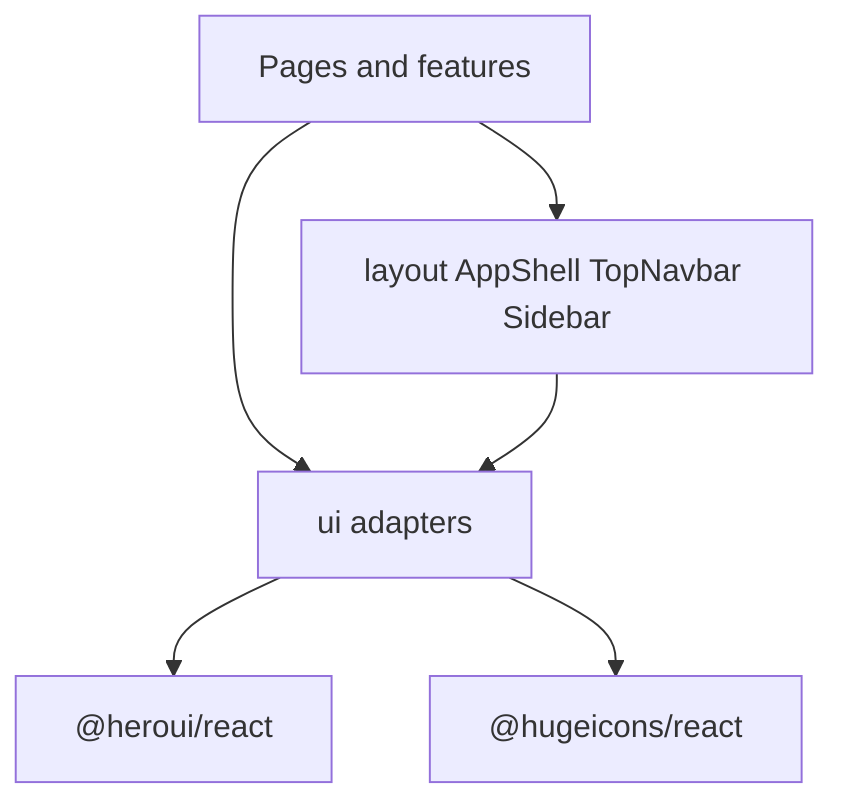

# Web UI Shell Redesign

## Decisions locked

- Keep left sidebar for page nav; add top navbar for brand / notifications / language / avatar
- Phase 1 = design-system adapters + responsive shell only; migrate pages later
- Notifications = UI placeholder (empty popover), no backend
- Avatar = localStorage-backed stub (initials from `userId` / org context)

## Architecture



**Import rule:** anything outside `apps/web/src/ui/` must not import `@heroui/*` or `@hugeicons/*`. ESLint `no-restricted-imports` will enforce this.

## Target file structure

```
apps/web/src/
  ui/                          # design-system public API
    index.ts
    provider/UiProvider.tsx    # HeroUI provider if required by chosen version
    button/Button.tsx
    avatar/Avatar.tsx
    dropdown/Dropdown.tsx      # language + account menus
    popover/Popover.tsx        # notifications panel
    drawer/Drawer.tsx          # mobile nav
    icon/Icon.tsx              # Hugeicons adapter + typed icon names
    input/Input.tsx            # for org bootstrap / branch select later
    select/Select.tsx
  layout/
    AppShell.tsx               # top bar + sidebar + main
    TopNavbar.tsx
    AppSidebar.tsx             # wraps existing SidebarNav
    NotificationBell.tsx       # placeholder empty state
    AccountMenu.tsx
    LanguageMenu.tsx           # replaces LanguageSwitcher UI
  components/
    SidebarNav.tsx             # keep nav data logic; restyle via ui adapters
    LanguageSwitcher.tsx       # deprecate or thin-reexport to LanguageMenu
  App.tsx                      # Shell → AppShell; move BranchSwitcher into sidebar footer
```

Also write short design note during implementation: [`docs/superpowers/specs/2026-07-27-web-ui-shell-design.md`](docs/superpowers/specs/2026-07-27-web-ui-shell-design.md) and save the detailed plan under [`docs/superpowers/plans/`](docs/superpowers/plans/).

## Dependencies

In `apps/web`:

- `@heroui/react`, `@heroui/styles`
- `@hugeicons/react`, `@hugeicons/core-free-icons`

CSS in [`apps/web/src/index.css`](apps/web/src/index.css):

```css
@import "tailwindcss";
@import "@heroui/styles";
```

Keep existing teal-leaning operational palette (not purple/cream AI defaults); tokens live in CSS variables + Tailwind utilities so adapters stay themeable.

## Shell UX

**Desktop (`md+`):**
- Sticky top navbar: brand left; actions right (notifications, language, avatar)
- Fixed/collapsible left sidebar under the navbar with `SidebarNav`, branch switcher, org bootstrap
- Main content scrolls independently

**Mobile (`<md`):**
- Top navbar with hamburger (opens drawer containing sidebar content)
- Brand still visible; same right-side actions
- Drawer closes on route change

**Navbar pieces:**
- Brand → `t("brand.name")`, links to `/`
- Notifications → icon button + popover “No notifications” (i18n)
- Language → dropdown EN / ไทย via existing `setLocale`
- Avatar → initials dropdown: show org id snippet, stub “Account” (no logout API yet)

## Adapter pattern (example)

```tsx
// apps/web/src/ui/button/Button.tsx
import { Button as HeroButton } from "@heroui/react";
import type { ComponentProps } from "react";

export type ButtonProps = /* our stable props, mapped to HeroUI */;

export function Button(props: ButtonProps) {
  return <HeroButton {...mapProps(props)} />;
}
```

```tsx
// apps/web/src/ui/icon/Icon.tsx
import { HugeiconsIcon } from "@hugeicons/react";
import { Notification03Icon /* ... */ } from "@hugeicons/core-free-icons";

const icons = { notification: Notification03Icon, /* ... */ } as const;
export type IconName = keyof typeof icons;

export function Icon({ name, size = 20 }: { name: IconName; size?: number }) {
  return <HugeiconsIcon icon={icons[name]} size={size} color="currentColor" />;
}
```

Consumers use `<Icon name="notification" />` only — never HugeIcons packs directly.

## Minimum adapter set for this phase

Enough to build the shell without leaking libs:

- `UiProvider` (if HeroUI v3 needs it; skip if zero-provider)
- `Button`, `Icon`, `Avatar`, `Dropdown` (+ items), `Popover`, `Drawer`, `Select` (branch + language if not pure Dropdown)

Do **not** wrap every HeroUI component yet — add adapters when a feature needs them.

## Changes to existing code

- Refactor [`Shell`](apps/web/src/App.tsx) into `layout/AppShell.tsx` (extract from the 800+ line `App.tsx` shell section only; routes stay)
- Restyle [`SidebarNav`](apps/web/src/components/SidebarNav.tsx) with adapter `Button`/link styles; keep [`sidebarNav.ts`](apps/web/src/nav/sidebarNav.ts) data model
- Move language control into top navbar; keep branch switcher in sidebar footer
- Add i18n keys in [`en/common.json`](apps/web/src/i18n/locales/en/common.json) + [`th/common.json`](apps/web/src/i18n/locales/th/common.json) for notifications empty state, account menu, open/close nav
- ESLint restrict imports of `@heroui/*` and `@hugeicons/*` outside `src/ui/**`

## Out of scope (explicit)

- Restyling all CRUD pages/forms onto adapters
- Real notifications domain/API
- Real auth/session/logout
- Dark mode

## Verification

- `pnpm --filter @stock-management/web typecheck`
- `pnpm --filter @stock-management/web test` (i18n parity still green)
- Manual: desktop shell, mobile drawer open/close + nav, language switch, notifications empty popover, avatar menu
