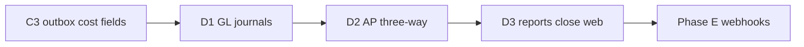
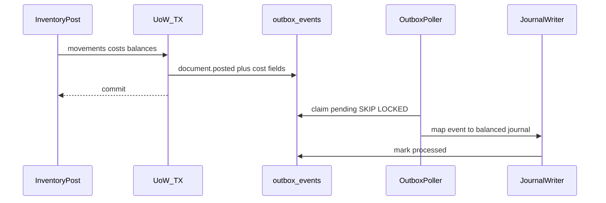

# Phase D Design — Accounting

**Date:** 2026-07-26  
**Status:** Complete (2026-07-26). D1–D3 implemented.  
**Features:** `docs/FEATURES.md` § Phase D  
**Wiki:** [[Phase D]], [[Inventory Accounting]], [[Feature Phases]]

## Summary

Phase D ties inventory money events to **double-entry books**: chart of accounts, account mappings, monthly accounting periods, and journals created **asynchronously** from Phase C–enriched outbox payloads. Inventory post/void transactions stay unchanged except optional void outbox cost enrichment; the outbox poller maps money fields to balanced journals. Phase D also adds supplier invoices with **exact** 3-way match (PO ↔ receipt ↔ invoice), GRNI→AP match journals, AP aging, financial reports, period-close checklist, and thin accountant web.

**User locks:** Slice **1A**: D1 GL → D2 AP/3-way/aging → D3 reports/close/web. AP **2A**: bills + 3-way match + AP aging; **no payments / bank / remittance**.

## Slices

| Slice | Focus | Plan |
|-------|--------|------|
| **D1** | CoA, account mapping, monthly periods, outbox→journals, journal browser API, void/reverse journals | `docs/superpowers/plans/2026-07-26-phase-d1-gl-journals.md` |
| **D2** | Supplier invoices, 3-way match (PO↔receipt↔invoice), match journals (GRNI→AP), AP aging | `docs/superpowers/plans/2026-07-26-phase-d2-ap-three-way.md` |
| **D3** | Trial balance, P&L, balance sheet (optional branch), period-close checklist, thin web | `docs/superpowers/plans/2026-07-26-phase-d3-reports-close-web.md` |

Master index: `docs/superpowers/plans/2026-07-26-phase-d-accounting.md`

## Locked decisions (all slices)

| Topic | Choice |
|-------|--------|
| Slice order | **1A**: D1 GL → D2 AP/3-way/aging → D3 reports/close/web |
| AP scope | **2A**: bills + 3-way match + AP aging; **no payments / bank / remittance** |
| Architecture | Full Clean Architecture; inventory post UoW unchanged except optional void outbox enrichment; journals async from poller; invoice post has its own UoW |
| Journal timing | **Async via outbox poller** — not inside inventory post TX |
| Journal immutability | Never UPDATE/DELETE lines; void → **reversing journal** linked to source |
| Idempotency | One journal per `(orgId, sourceOutboxEventId)` unique; retries safe |
| Period grain | **Monthly** periods from `organizations.fiscal_year_start_month` |
| Period close | **Hard close**: reject new journals dated in closed period; reopen is explicit admin action |
| Close checklist | Soft warnings (unposted docs, unmatched GRNI, failed outbox) — does not auto-close |
| CoA seed | `EnsureDefaultChartOfAccounts` seeds Inventory, GRNI, AP, COGS, InventoryAdjExpense, LandedCostClearing, RevaluationReserve (equity/contra as needed) + default `AccountMapping` rows |
| Event → account | `AccountMapping` keyed by `orgId + journalEventType` → debitAccountId + creditAccountId |
| Money | Same as B/C: string decimals via `Number()`; org currency only |
| Branch on journals | Optional `branchId` on journal header from source document when present; reports filterable |
| 3-way match | Line-level: inventory invoice lines **require** `purchaseOrderLineId` + `goodsReceiptLineId`; qty/amount must not exceed unmatched remaining; **exact** qty and unit-cost match (no % tolerance) |
| Invoice lifecycle | `draft` → `posted` (creates AP + match journals) → `voided` (reversing journals); no `paid` state |
| AP aging | Buckets 0–30 / 31–60 / 61–90 / 90+ by invoice date vs as-of; open = entire posted balance (no payments) |
| Payments / bank | **Out of scope** (Phase D and not on A–F roadmap until later) |
| Void cost fields | D1 enriches `document.voided` payloads with reverse money deltas (mirror C3 field names) so reverse journals need no recompute from ledger |
| Manual journals | **No manual journals in D** (read-only journal browser only) |
| Inventory AP bills | Phase D requires PO+receipt links for inventory bills; non-inventory / expense-only AP deferred |
| Auth | Existing stub `X-Org-Id` + `X-User-Id`; accountant role documented but not enforced beyond stub |
| Transfer ship/receive | **No GL** in D (qty move preserves cost; not COGS) — poller skips or no-ops when no money fields |

## Journal posting matrix (D1 + D2)

| Trigger | Debit | Credit | Amount field |
|---------|-------|--------|--------------|
| GR `document.posted` | Inventory | GRNI | `inventoryValueDelta` |
| Issue / supplier return / −adjust / −count | COGS or InvAdjExpense | Inventory | `cogsTotal` |
| +adjust / +count / customer return | Inventory | InvAdjExpense (or gain mapping) | `inventoryValueDelta` |
| Landed cost posted | Inventory | LandedCostClearing | `landedAmount` |
| Cost revaluation | Inventory or Reval (sign-aware) | opposite | `revaluationValueDelta` |
| Invoice posted (matched) | GRNI | AP | matched amount |
| Any `document.voided` / invoice void | Reverse of original | Reverse of original | void payload deltas |

Cost field names already on outbox (Phase C): `inventoryValueDelta`, `cogsTotal`, `landedAmount`, `revaluationValueDelta` (`packages/application/src/costing/outbox-cost-fields.ts`).

## Domain entities and invariants

Add to `packages/domain` (pure types + invariants):

| Entity | Notes |
|--------|--------|
| `Account` | `type: asset\|liability\|equity\|income\|expense`, code, name, active |
| `AccountMapping` | `journalEventType` → debit/credit account ids |
| `AccountingPeriod` | `orgId`, `year`, `month`, `status: open\|closed`, date bounds |
| `JournalEntry` | Header: source refs (`sourceDocumentType`, `sourceDocumentId`, `outboxEventId?`), `periodId`, `branchId?`, `postedAt`, `reversesJournalId?` |
| `JournalLine` | `accountId`, `debit`, `credit` (one side non-zero); balanced entry invariant |
| `SupplierInvoice` / `SupplierInvoiceLine` | Supplier, dates, lines with PO/GR links, status |
| `InvoiceMatch` | Links invoice line ↔ PO line ↔ GR line + matched qty/amount |

**Invariants:**

- Journals must balance (Σ debit = Σ credit)
- Post journals only into an **open** period (hard close)
- Match qty/amount ≤ remaining unmatched on PO/GR line; exact unit-cost match
- Cannot void an already-voided invoice; void writes reversing journals only
- Cannot post inventory invoice without PO+receipt match links
- Never UPDATE/DELETE journal lines; reverse via linked reversing entry
- Idempotent journal create: unique `(orgId, sourceOutboxEventId)`

## Schema sketch

### `accounts`

| Column | Notes |
|--------|--------|
| `id` | uuid PK |
| `org_id` | tenant |
| `code`, `name` | unique per org on code |
| `type` | `asset` / `liability` / `equity` / `income` / `expense` |
| `active` | boolean |
| `created_at` | |

### `account_mappings`

| Column | Notes |
|--------|--------|
| `id`, `org_id` | |
| `journal_event_type` | string key |
| `debit_account_id`, `credit_account_id` | FK → accounts |
| Unique | `(org_id, journal_event_type)` |

### `accounting_periods`

| Column | Notes |
|--------|--------|
| `id`, `org_id` | |
| `year`, `month` | monthly grain from fiscal year start |
| `starts_on`, `ends_on` | date bounds |
| `status` | `open` / `closed` |
| Unique | `(org_id, year, month)` |

### `journal_entries`

| Column | Notes |
|--------|--------|
| `id`, `org_id` | |
| `period_id` | FK |
| `branch_id` | optional |
| `source_document_type`, `source_document_id` | provenance |
| `outbox_event_id` | nullable; unique with org when set |
| `reverses_journal_id` | nullable FK → journal_entries |
| `posted_at` | timestamptz |
| `created_at` | |

Unique: `(org_id, outbox_event_id)` where `outbox_event_id IS NOT NULL`.

### `journal_lines`

| Column | Notes |
|--------|--------|
| `id`, `org_id` | |
| `journal_entry_id` | FK |
| `account_id` | FK |
| `debit`, `credit` | numeric(18,4); one side non-zero |
| `line_no` | ordering |

### `supplier_invoices` (D2)

| Column | Notes |
|--------|--------|
| `id`, `org_id` | |
| `supplier_id` | FK |
| `invoice_number`, `invoice_date`, `due_date?` | |
| `status` | `draft` / `posted` / `voided` |
| `branch_id?` | optional |
| `posted_at?`, `voided_at?` | |
| Idempotency | `external_system` + `external_id` optional |

### `supplier_invoice_lines` (D2)

| Column | Notes |
|--------|--------|
| `id`, `org_id`, `supplier_invoice_id` | |
| `product_id?` | |
| `qty`, `unit_cost`, `amount` | string/numeric pattern as B/C |
| `purchase_order_line_id` | required for inventory bills |
| `goods_receipt_line_id` | required for inventory bills |

### `invoice_matches` (D2)

| Column | Notes |
|--------|--------|
| `id`, `org_id` | |
| `supplier_invoice_line_id` | |
| `purchase_order_line_id`, `goods_receipt_line_id` | |
| `matched_qty`, `matched_amount` | |

## Outbox → journal flow

1. Inventory (or costing) post commits in UoW with movements, balances, layers, and `outbox_events` row whose payload includes Phase C cost fields when money moved.
2. Outbox poller claims pending rows (`SKIP LOCKED`), same worker Phase E will extend for webhooks.
3. For `document.posted` / `document.voided` with money fields: `JournalEventMapper` resolves `AccountMapping` by `journalEventType`, asserts open period, inserts balanced `journal_entries` + `journal_lines` idempotently on `outbox_event_id`.
4. Events with no money fields (e.g. transfer ship/receive, `stock.changed`): skip / no-op journal write; mark processed.
5. Failures leave outbox in failed status for retry/ops; do not mutate inventory.
6. Document void enriches `document.voided` with reverse deltas (`inventoryValueDelta`, `cogsTotal`, etc.); poller writes reversing journal with `reverses_journal_id`.
7. D2 invoice post may write match journals in its own UoW and/or enqueue `ap.invoice.posted` for the same poller path.

## Application / infra shape

| Layer | Additions |
|-------|-----------|
| Ports | `AccountingPort` (accounts, mappings, periods, journals); `ApPort` (invoices, matches); extend outbox consumer port |
| Use cases D1 | Ensure defaults, CRUD accounts/mappings, generate/open/close periods, `ProcessOutboxForJournals`, list journals by document, get journal |
| Use cases D2 | Create/update/post/void supplier invoice, run 3-way match validation, AP aging query |
| Use cases D3 | Trial balance, P&L, balance sheet, period-close checklist |
| Infra | Drizzle tables + repos; **extend** `apps/api/src/infrastructure/workers/outbox-poller.ts` to call journal handler before mark processed |
| Shared | Zod DTOs in `packages/shared/src/accounting.ts` |
| Web D3 | Thin pages: CoA, periods, journal browser, invoices, aging, TB/P&L/BS (page → hook → API client only) |

Reuse: composition root, UoW pattern for invoice post, existing suppliers/PO/GR.

## HTTP surface sketch (`/api/v1/...`)

| Area | Routes (sketch) |
|------|-----------------|
| CoA | `GET/POST /accounts`, `PATCH /accounts/:id` |
| Mappings | `GET/PUT /account-mappings` |
| Periods | `GET/POST /accounting-periods`, `POST .../:id/open`, `POST .../:id/close` |
| Close checklist | `GET /accounting-periods/:id/close-checklist` |
| Journals | `GET /journals/:id`, `GET /journals?sourceDocumentType=&sourceDocumentId=` |
| AP | `GET/POST /supplier-invoices`, `GET/PATCH .../:id`, `POST .../:id/post`, `POST .../:id/void` |
| Reports | `GET /reports/trial-balance`, `/reports/pnl`, `/reports/balance-sheet`, `/reports/ap-aging` |

Auth: stub `X-Org-Id` + `X-User-Id`. Post/void accept idempotency where documents already do (`external_system` + `external_id`).

## Out of scope (whole Phase D)

- AP payments, remittance, bank reconciliation
- Multi-currency / FX
- Tax/VAT engines
- Manual journal create UI/API (**lock: no manual journals in D**)
- Webhook HTTP delivery (Phase E)
- Moving average, per-serial cost
- Match % tolerances
- Non-inventory / expense-only AP without PO
- Decimal.js / money library migration (keep B/C `Number()` + string pattern)

## Definition of done (whole Phase D)

- All `docs/FEATURES.md` Phase D rows implemented and tested
- Outbox-driven journals for inventory money events + invoice match; voids reverse
- Hard period close enforced; checklist warns (does not auto-close)
- Thin web for core accountant flows
- Design + deep plans reflected in wiki; Phase E unblocked

## Wiki / Features links

- Features checklist: `docs/FEATURES.md` § Phase D
- Wiki: [[Phase D]], [[Inventory Accounting]], [[Feature Phases]], [[Clean Architecture]]
- Prior costing prep: `docs/superpowers/specs/2026-07-26-phase-c-costing-design.md`, [[FIFO Costing]]
- Domain overview: `docs/architecture/domain-model.md` (Accounting)
- CA / outbox: `docs/architecture/coding-standards.md`

## Review gate

Wrong CA layer = slice not done. Spec: `docs/superpowers/specs/2026-07-26-clean-architecture-design.md`.
