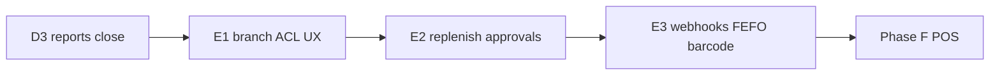
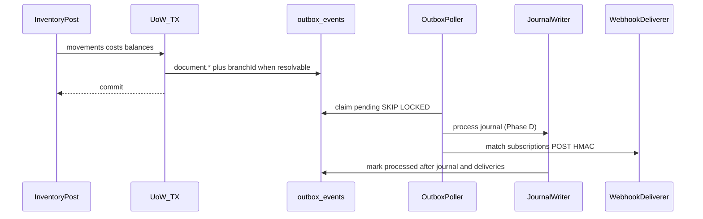

# Phase E Design — Multi-branch Hardening

**Date:** 2026-07-26  
**Status:** Draft (plans ready)  
**Features:** `docs/FEATURES.md` § Phase E  
**Wiki:** [[Phase E]], [[Org Branch Location]], [[POS Integration Boundary]], [[Feature Phases]], [[Clean Architecture]]

## Summary

Phase E makes multi-branch retail ops real on top of Phase A–D foundations: enforce branch membership ACL and HQ vs branch UX/reports, harden inter-branch replenishment and approvals without inventing a new ledger document type, then deliver signed webhooks from the outbox plus FEFO/quarantine hard rules and barcode scan UX. Inventory remains document-driven; auth stays the header stub with membership loaded from the DB.

**User locks:** Slice **E1 → E2 → E3**.

## Slices

| Slice | Focus | Plan |
|-------|--------|------|
| **E1** | Membership→context ACL, branch-filtered lists, web branch switcher, HQ vs branch reports, outbox `branchId` attribution | `docs/superpowers/plans/2026-07-26-phase-e1-branch-hardening.md` |
| **E2** | Cross-branch replenishment transfers, reservation locking/expiry, approval policies for PO + adjustments | `docs/superpowers/plans/2026-07-26-phase-e2-ops-approvals.md` |
| **E3** | Webhook subscriptions + HMAC delivery via outbox, FEFO/quarantine hard rules, barcode lookup + scan UX | `docs/superpowers/plans/2026-07-26-phase-e3-webhooks-fefo-barcode.md` |

Master index: `docs/superpowers/plans/2026-07-26-phase-e-multi-branch.md`

## Locked decisions (all slices)

| Topic | Choice |
|-------|--------|
| Slice order | **E1** ACL/UX/attribution → **E2** replenishment/reservations/approvals → **E3** webhooks/FEFO/barcode |
| HQ access | Membership with **no** `membership_branches` rows = all branches (HQ). `org_admin` typically HQ; branch roles should have ≥1 branch |
| Active branch | Optional `X-Branch-Id`. Branch users: must be in grant list (or omitted → first grant). HQ: omit = consolidated; set = act as that branch |
| Roles (existing enum) | `org_admin`, `branch_manager`, `warehouse`, `purchasing`, `accountant` — enforce create/post/approve matrices in E1/E2 |
| List filtering | Branch-scoped users only see docs/locations for granted branches; HQ sees all unless `X-Branch-Id` set |
| Journal `branchId` | E1: every inventory outbox money/`document.*` payload includes `branchId` when resolvable |
| Inter-branch move | **No new document type** — extend stock-transfer with `purpose: standard \| replenishment`, derive/store `fromBranchId`/`toBranchId` from locations |
| Supplier→branch | Existing PO `branchId` + GR; E2 enforces ACL + UX |
| Approvals | PO `submitted` → approved before GR path; adjustments require approved before post. Approvers: `org_admin` or `branch_manager` with branch access. Policy table defaults on |
| Reservation harden | Row-lock balance on reserve; expire open past `expiresAt` |
| Webhooks | Subscriptions + delivery log; outbox poller runs **journal then webhook**; HMAC-SHA256 signature header |
| FEFO | Prefer earliest expiry; **hard-block** expired lots (except quarantine rules) |
| Quarantine | Cannot sell/issue from quarantine location/lot without release path |
| Barcode | `GET /products/by-barcode/:code`; scan-first UX on GR/issue/count/transfer receive |
| Auth | Keep stub `X-Org-Id` + `X-User-Id`; resolve membership from DB |
| Architecture | Full Clean Architecture for all slices |

## Role matrix

| Action | org_admin | branch_manager | warehouse | purchasing | accountant |
|--------|-----------|----------------|-----------|------------|------------|
| Masters CRUD | Y | branch locs only | N | suppliers N | N |
| Post GR/issue/transfer/count | Y | Y (branch) | Y (branch) | N | N |
| Create/submit PO | Y | Y | N | Y | N |
| Approve PO / adjustment | Y | Y (branch) | N | N | N |
| Accounting / reports | Y | own branch | N | N | Y |
| Webhook admin | Y | N | N | N | N |

E1 enforces create/post/list matrices minimally; E2 refines approve gates. Accountant may see HQ-wide or branch-filtered reports per active branch context.

## Domain entities and invariants

Extend / add in `packages/domain` (pure types + invariants):

| Entity / type | Slice | Notes |
|---------------|-------|--------|
| `Membership` | E1 | Add `branchIds: string[]` — **empty = HQ / all branches** |
| Access helpers | E1 | `assertBranchAccess`, `resolveActiveBranch`, `canPerform(role, action)` |
| `StockTransfer` | E1/E2 | `fromBranchId`, `toBranchId` (denormalized from locations); `purpose: standard \| replenishment` |
| `ApprovalPolicy` | E2 | `orgId`, `documentType: purchase_order \| stock_adjustment`, `required: boolean` (defaults on) |
| Document approval status | E2 | PO: `submitted` → `approved` before GR; adjustment: draft → pending_approval → approved → posted |
| `WebhookSubscription` | E3 | `url`, `secret`, `eventTypes[]`, optional `branchId`, `active` |
| `WebhookDelivery` | E3 | Links subscription + outbox event; status, httpStatus, error |
| Lot / location sellability | E3 | `assertLotSellable`, `pickFefoLot` — FEFO pick + hard-block expired / quarantine |

**Invariants:**

- Branch-scoped membership cannot act outside granted `branchIds`
- HQ (empty `branchIds`) may omit `X-Branch-Id` for consolidated views or set it to act as one branch
- List/query scope is server-enforced from context — clients cannot widen branch access
- Inter-branch moves use existing stock-transfer document; no new ledger document type
- When approval policy `required`, PO must be approved before GR against it; adjustments must be approved before post
- Approvers: `org_admin` or `branch_manager` with branch access to the document’s branch
- Reserve: lock balance row before `assertCanReserve`; open reservations past `expiresAt` expire
- Outbox poller: process **journal then webhook** for the same event
- Webhook delivery idempotent on `(subscriptionId, outboxEventId)`; payload signed HMAC-SHA256
- Outbound issue / transfer ship / reservation commit: prefer earliest `expiryDate`; hard-block lots with `expiryDate < today` (except quarantine release paths)
- Cannot sell/issue from quarantine location or `lot.status === quarantine` without release (transfer/adjust to non-quarantine)

## Schema sketches

### Membership domain shape (E1)

Existing tables `memberships` + `membership_branches` stay. Domain/API type gains:

| Field | Notes |
|-------|--------|
| `branchIds` | `string[]` loaded from `membership_branches`; **empty array = HQ (all branches)** |

Request context expands to `{ orgId, userId, role, branchIds, activeBranchId: string \| null }` via optional `X-Branch-Id`.

### `stock_transfers` extensions (E1 / E2)

| Column | Notes |
|--------|--------|
| `from_branch_id` | FK → branches; set from `from_location`’s branch on create/update |
| `to_branch_id` | FK → branches; set from `to_location`’s branch |
| `purpose` | `standard` \| `replenishment` (default `standard`) |

Ship/receive mechanics unchanged; list filters use `from_branch_id` / `to_branch_id` intersection with grants.

### `approval_policies` (E2)

| Column | Notes |
|--------|--------|
| `id`, `org_id` | |
| `document_type` | `purchase_order` \| `stock_adjustment` |
| `required` | boolean; seed `true` for both types |
| Unique | `(org_id, document_type)` |

Document status fields / `document_approvals` as needed for submit → approve → post/receive gates.

### `webhook_subscriptions` (E3)

| Column | Notes |
|--------|--------|
| `id`, `org_id` | |
| `url` | HTTPS endpoint |
| `secret` | HMAC key |
| `event_types` | text[] / jsonb list of outbox event types |
| `branch_id` | optional filter |
| `active` | boolean |
| `created_at`, `updated_at` | |

### `webhook_deliveries` (E3)

| Column | Notes |
|--------|--------|
| `id`, `org_id` | |
| `subscription_id` | FK → webhook_subscriptions |
| `outbox_event_id` | FK / ref to outbox event |
| `status` | pending / succeeded / failed |
| `http_status` | nullable |
| `error` | nullable text |
| `created_at`, `updated_at` | |
| Unique | `(subscription_id, outbox_event_id)` idempotency |

## Outbox → journal → webhook flow

1. Inventory (or document) post commits with outbox payload including `branchId` when resolvable (E1).
2. Outbox poller claims pending rows (`SKIP LOCKED`).
3. Run journal handler first (existing D1 path).
4. Then match active webhook subscriptions by `orgId` + event type (+ optional branch); POST JSON with `X-Webhook-Signature: sha256=<hmac_hex>`.
5. Mark outbox processed when journal succeeds and all matched deliveries succeed (or no subscriptions). Failures bump attempts / `available_at`.

## Application / infra shape

| Layer | Additions |
|-------|-----------|
| Domain | Membership `branchIds`, access helpers, transfer purpose/branch fields, approval + webhook entities, FEFO/quarantine asserts |
| Ports | `MembershipAccessPort`; extend document list ports with branch filters; `ApprovalPolicyPort`; `WebhookPort`; product `findByBarcode` |
| Use cases E1 | Resolve context access; branch-scoped lists; transfer branch denormalization; outbox `branchId` enrichment |
| Use cases E2 | Replenishment transfer create; reserve with row-lock; expire reservations; submit/approve PO & adjustment |
| Use cases E3 | CRUD webhook subscriptions; `ProcessOutboxForWebhooks`; FEFO pick + quarantine gates; barcode lookup |
| Infra | Drizzle migrations/repos; extend `outbox-poller.ts` (journal then webhook); optional expiry worker tick |
| Shared | Zod DTOs for membership branches, transfer purpose, approvals, webhooks, barcode |
| Web | Branch switcher + `X-Branch-Id`; replenish wizard; approve actions; scan-first inputs on GR/issue/count/transfer receive |

Reuse: composition root, existing membership_branches table, stock-transfer/reservation/PO/adjustment use cases, Phase D outbox→journal poller, report `branchId?` filters.

## HTTP surface sketch (`/api/v1/...`)

| Area | Routes (sketch) |
|------|-----------------|
| Context | Existing stubs + membership APIs return `branchIds`; clients send optional `X-Branch-Id` |
| Transfers | Existing transfer CRUD + `purpose`; lists respect branch ACL |
| Approvals | `POST .../purchase-orders/:id/submit`, `.../approve`; same for adjustments |
| Policies | `GET/PUT /approval-policies` |
| Webhooks | `GET/POST/PATCH /webhook-subscriptions`; `GET /webhook-deliveries` (read-only) |
| Barcode | `GET /products/by-barcode/:code` |
| Reports | Existing TB/P&L/BS/aging — default active branch for branch users; HQ omit = consolidated |

Auth: stub `X-Org-Id` + `X-User-Id`; membership resolved from DB. Webhook admin: `org_admin` only.

## Out of scope (whole Phase E)

- JWT/OAuth (keep header stub)
- Webhook transform DSL beyond eventTypes + optional branch
- Camera SDK
- In-transit GL / intercompany accounting
- Phase F POS UI
- Soft FEFO warn-only mode

## FEATURES.md coverage map

| Feature area | Slice |
|--------------|-------|
| Branch-scoped UX (managers vs HQ) | E1 |
| Consolidated vs branch reports | E1 |
| Inter-branch replenishment (HQ→branch, supplier→branch) | E2 |
| Reservation discipline / no oversell | E2 |
| Approval policies (adjustments & POs) | E2 |
| Webhooks | E3 |
| Quarantine / FEFO | E3 |
| Barcode scanning UX | E3 |

## Definition of done (whole Phase E)

- All `docs/FEATURES.md` Phase E rows implemented and tested
- Branch ACL enforced on lists/posts; HQ consolidated vs branch views work
- Replenishment transfers + approvals + reservation harden ship
- Signed webhook delivery from outbox; FEFO/quarantine hard-block; barcode scan UX
- Design + deep plans reflected in wiki; Phase F unblocked

## Wiki / Features links

- Features checklist: `docs/FEATURES.md` § Phase E
- Wiki: [[Phase E]], [[Org Branch Location]], [[POS Integration Boundary]], [[Feature Phases]], [[Clean Architecture]]
- Prior accounting: `docs/superpowers/specs/2026-07-26-phase-d-accounting-design.md`, [[Inventory Accounting]]
- Domain overview: `docs/architecture/domain-model.md`
- CA / outbox: `docs/architecture/coding-standards.md`

## Review gate

Wrong CA layer = slice not done. Spec: `docs/superpowers/specs/2026-07-26-clean-architecture-design.md`.
