# Notifications Design

**Date:** 2026-07-27  
**Status:** Approved (brainstorming)  
**Approach:** Outbox → dispatcher; channels as Decorators (Approach A)  
**Plan:** `docs/superpowers/plans/2026-07-27-auth-and-notifications.md`  
**Depends on:** `docs/superpowers/specs/2026-07-27-authentication-design.md`  
**Wiki:** [[Notifications]], [[Authentication]], [[Tech Stack]], [[Clean Architecture]]

## Summary

Ship an extensible notification system: **in-app inbox + email**, driven by domain/use-case events enqueued on the Postgres **outbox**. A worker resolves **event policies** (Strategy) and delivers through a **decorator channel chain** (`InApp` → `Email` → future Push/SMS). Realtime fan-out over Fastify **WebSocket**. Approvals and membership invites support **server-executed actions** via signed action tokens from email or the bell.

## Goals

1. In-app notifications with bell badge, list, read/dismiss
2. Email channel for important events (shared `Mailer` port)
3. Decorator channel pipeline so future channels plug in without rewriting core
4. Event policy registry for v1 auth, membership, ops, and approval events
5. Outbox-first dispatch (`notification.dispatch`)
6. WebSocket realtime updates for created/read/unread-count
7. Signed server actions: approval approve/reject + invite accept/decline
8. Per-user channel preferences with policy defaults

## Non-goals

- Push / SMS channels (decorator seam only)
- Digest / batched emails
- Arbitrary server actions beyond approvals + invites
- Replacing external webhook pipeline (Phase E3 remains separate)
- Full `/notifications` history page (v1 = shell popover; page optional later)

## Locked decisions

| Topic | Choice |
|-------|--------|
| Channels v1 | In-app + email |
| Pattern | Decorator channel chain + Strategy event policies |
| Delivery | Outbox-first (`notification.dispatch`) |
| Realtime | Fastify WebSocket |
| Server actions | Approvals approve/reject + invites accept/decline (signed tokens) |
| Sequence | After auth (real users/sessions) |

## Architecture

```mermaid
flowchart LR
  DomainEvent[Domain_or_use_case] --> Outbox[Outbox_notification_intent]
  Outbox --> Worker[Notification_worker]
  Worker --> Policy[EventPolicy_resolves_recipients_and_channels]
  Policy --> Base[NotificationDispatcher]
  Base --> InApp[InAppChannelDecorator]
  InApp --> Email[EmailChannelDecorator]
  Email --> Future[Future_Push_SMS_decorators]
```

### Decorator pattern

- `NotificationChannel` interface: `deliver(ctx) → void` (or Promise)
- Base/null dispatcher orchestrates only
- Each channel **Decorator** wraps the next: check preferences → perform channel work → call inner `deliver`
- Composition root builds: `Email(InApp(Base))` (order: innermost first for write, or document explicit wrap order so InApp persists before Email reads the row id for CTAs)
- Adding a channel = new decorator + wire in composition root
- Adding an event = new **EventPolicy** registration — no core rewrite

### Event policies (Strategy)

Each policy maps `eventType` →:

- Recipient resolver (org members, approvers, invitee, actor, …)
- Title/body template (or i18n keys + interpolation data)
- Default channels (`in_app`, `email`)
- Optional actions: deep-link `open`, and/or server actions (`approve`, `reject`, `accept`, `decline`)
- Entity refs for deepLink and action tokens

### Outbox

- Use cases enqueue `notification.dispatch` on existing `outbox_events` (or same family) with payload: `eventType`, `orgId`, `actorId`, entity refs, optional recipient hints
- Worker (extended outbox poller handler) loads policy → expands recipients → runs decorator chain
- Retries follow outbox failure semantics; channel failures should not lose the outbox claim without recording error
- Auth verify/reset mails may stay **sync Mailer** for UX; notification welcome/etc. still prefer outbox when fired from auth use cases

### Clean Architecture shape

| Layer | Responsibility |
|-------|----------------|
| Domain | Notification entity, preference rules, action invariants, errors |
| Application | Ports (`NotificationRepository`, `PreferenceRepository`, `EnqueueNotification`, `NotificationPublisher`, `ActionTokenSigner`); use cases; `NotificationChannel` + policy interfaces |
| Infrastructure | Drizzle repos, InApp writer, Email decorator (Mailer), WS publisher, outbox handler |
| HTTP | REST list/read/dismiss/preferences; WS plugin; action execute |
| Web | `NotificationBell` + preferences UI; WS client; page → hook → API |

## v1 events

| Event type | Typical recipients | Notes |
|------------|-------------------|--------|
| `user.welcome` | New user | After signup |
| `user.email_verified` | User | After verify |
| `auth.password_changed` | User | After reset/change |
| `membership.invite_received` | Invitee email / user | Create invite |
| `membership.invite_accepted` | Inviter / org admins | Accept invite |
| `membership.invite_declined` | Inviter (optional) | Decline invite |
| `document.posted` | Org/branch stakeholders per policy | From existing document post |
| `document.voided` | Same | From void |
| `stock.low` | Purchasing / managers with branch access | Reorder min breach |
| `approval.assigned` | Eligible approvers | PO / adjustment pending approval |

Aliases in product copy may shorten names (`welcome`, `invite_*`); persisted `eventType` uses the dotted forms above.

## Channel defaults

Policy defaults; user may override via preferences. Missing preference row → policy default.

| Event | In-app | Email |
|-------|--------|-------|
| `user.welcome`, `user.email_verified`, `auth.password_changed` | yes | yes |
| `membership.invite_received` / `invite_accepted` / `invite_declined` | yes | yes |
| `approval.assigned` | yes | yes |
| `document.posted` / `document.voided` | yes | **no** (opt-in) |
| `stock.low` | yes | yes |

## Schema

### `notifications`

| Column | Notes |
|--------|--------|
| `id` | UUID PK |
| `org_id` | FK → organizations |
| `user_id` | FK → users (recipient) |
| `event_type` | Text / enum string |
| `title` | Display title (resolved language or default EN at write time) |
| `body` | Short body |
| `data` | JSON: `deepLink`, `entityIds`, extras |
| `actions` | JSON: `[{ id, label, kind: 'open' \| 'server', ... }]` |
| `read_at` | Nullable |
| `dismissed_at` | Nullable (soft-hide from bell) |
| `created_at` | Timestamp |

Indexes: `(user_id, org_id, created_at desc)`, partial unread `(user_id, org_id) WHERE read_at IS NULL`.

### `notification_preferences`

| Column | Notes |
|--------|--------|
| `id` | UUID PK |
| `user_id` | FK |
| `org_id` | FK |
| `event_type` | Same catalog |
| `channel` | `in_app` \| `email` |
| `enabled` | Boolean |
| Unique | `(user_id, org_id, event_type, channel)` |

## HTTP API

Bearer + `X-Org-Id` (except action execute with signed token — see below).

| Method | Path | Purpose |
|--------|------|---------|
| GET | `/api/v1/notifications` | List (unread first); pagination; exclude dismissed by default |
| GET | `/api/v1/notifications/unread-count` | Badge count |
| POST | `/api/v1/notifications/:id/read` | Mark one read |
| POST | `/api/v1/notifications/read-all` | Mark all read for org |
| POST | `/api/v1/notifications/:id/dismiss` | Soft-hide |
| GET | `/api/v1/notification-preferences` | List effective prefs (defaults merged) |
| PUT | `/api/v1/notification-preferences` | Upsert per-event channel toggles |
| POST | `/api/v1/notification-actions/execute` | Execute signed action (session optional) |
| GET | `/api/v1/notifications/ws` | WebSocket upgrade |

### WebSocket

- Path: `/api/v1/notifications/ws`
- Auth: access JWT on connect (query `?access_token=` or first message — prefer **Sec-WebSocket protocol / query token** documented in impl; must not rely on cookies alone if Bearer-only clients connect)
- Room: `userId` + `orgId` (org from query or membership default)
- Server → client messages:
  - `{ type: 'notification.created', notification }`
  - `{ type: 'notification.read', id }` / `{ type: 'notifications.read_all' }`
  - `{ type: 'unread-count', count }`
- After InApp channel inserts a row → publish to recipient’s room
- Web: connect when authed; reconnect with exponential backoff; **fall back to unread-count poll (~30s)** only if WS down

### Server-executed actions

| Action id | Event | Dispatches to |
|-----------|-------|----------------|
| `approve` / `reject` | `approval.assigned` | Existing approval use cases |
| `accept` / `decline` | `membership.invite_received` | Invite accept/decline use cases |

**Signed action token** (HMAC/JWT with `ACTION_TOKEN_SECRET`):

Payload: `notificationId`, `actionId`, `userId`, `orgId`, `entityRef`, `exp` (default **7 days** for email CTAs).

`POST /notification-actions/execute` body: `{ token }` (and optional Bearer if present).

Handler:

1. Verify signature + expiry
2. Load notification; assert recipient `userId` matches token
3. Enforce RBAC inside the target use case (approver role / invite email match)
4. Execute; mark notification read; emit WS updates
5. Idempotent on already-handled approval/invite state

Other events: **deep-link only** (`open` / navigate `data.deepLink`). Email templates include CTA: signed execute URL for server actions, or app deep link otherwise.

## Bell UX

Existing shell `NotificationBell` slot:

- Live unread badge via WS (poll fallback)
- Popover: recent items (title, relative time, action buttons); keep empty state copy
- Footer: “Mark all read”
- Item click → mark read + navigate `deepLink` when no server action
- Action buttons → `execute` endpoint (or navigate when `kind === 'open'`)
- Dismiss on hover/focus control
- Preferences: account submenu or settings page (Task 8)

i18n EN/TH for bell, preferences, and action labels.

## Enqueue points (v1 wiring)

| Source | Events |
|--------|--------|
| Auth use cases | welcome, email_verified, password_changed |
| Membership invites | invite_received, invite_accepted, invite_declined |
| Document post/void | document.posted, document.voided |
| Low-stock detection | stock.low (hook where reorder check already exists or thin scheduled/check on balance change) |
| Approval submit | approval.assigned |

Do not duplicate Phase E3 webhook payloads; notifications are a parallel consumer of domain outcomes via outbox intents.

## Error codes

| Code | HTTP | When |
|------|------|------|
| `UNAUTHORIZED` | 401 | Missing Bearer / WS auth |
| `FORBIDDEN` | 403 | Wrong org or cannot act |
| `NOT_FOUND` | 404 | Notification id |
| `TOKEN_EXPIRED` / `TOKEN_INVALID` | 401 | Action token |
| `INVALID_STATE` | 409 | Action already applied / doc not pending |
| `VALIDATION_ERROR` | 400 | Bad body |

## Testing

- Unit: decorator preference short-circuit; policy recipient resolution; action token verify/execute idempotency
- Worker: outbox `notification.dispatch` creates in-app row + invokes Mailer in tests
- HTTP: list/read/dismiss/preferences; execute approve/invite
- WS: auth required; created event pushed after in-app write (integration or harness)

## Env

| Variable | Purpose |
|----------|---------|
| `ACTION_TOKEN_SECRET` | Sign notification action tokens |
| `ACTION_TOKEN_TTL_SECONDS` | Optional (default 7 days) |
| Shared `Mailer` / SMTP | Same as auth |
| `APP_PUBLIC_URL` | Deep links + email CTAs |

## Out of scope follow-ups

- Push / SMS decorators
- Email digests
- Broad action registry beyond approvals + invites
- Full notification history page
- Per-locale email templates beyond EN/TH app strings

## Sources

- Planning conversation 2026-07-27 (auth + notifications brainstorming; WS + server actions added)
- Plan: `docs/superpowers/plans/2026-07-27-auth-and-notifications.md`
- Auth design: `docs/superpowers/specs/2026-07-27-authentication-design.md`
- Existing outbox poller + empty `NotificationBell`
- Phase E2 approvals / E3 webhooks (parallel, not replaced)
